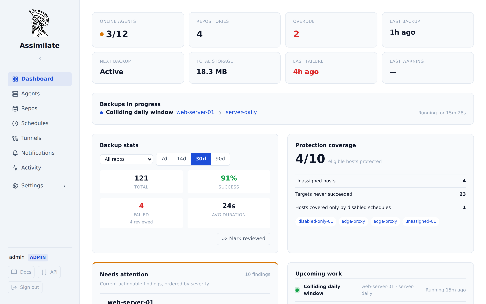

<!-- markdownlint-disable MD041 -->
<p align="center">
  
</p>

# Assimilate

[](https://github.com/alexmohr/assimilate/actions/workflows/ci.yml)
[](https://coveralls.io/github/alexmohr/assimilate?branch=main)
[](https://alexmohr.github.io/assimilate/)

**Self-hosted BorgBackup for every machine you run.** One dashboard, one scheduler, and SSH keys that stay on the server.

A small Rust agent runs on each machine and dials out to the server. The server schedules backups, checks and prunes, indexes every archive, and lends its SSH key to agents through an ssh-agent relay for the duration of a job.



## Why Assimilate

- **Keys stay on the server.** Agents sign SSH connections through a relay to the server's ssh-agent, so backup machines do not need a repository key. See [SSH agent forwarding](docs/ssh-agent-forwarding.md).
- **No inbound ports on clients.** Agents connect outward over WebSocket and work behind NAT and firewalls. A reverse SSH tunnel covers hosts that cannot reach the server. See [architecture](docs/architecture.md).
- **Schedules that fit real fleets.** One schedule backs up many hosts to several repositories, each marked required or best effort. See [scheduling](docs/scheduling.md).
- **Find any file.** Every archive is indexed: browse, search across archives, diff, stream a download, or restore to the host. See [archive browsing](docs/archives.md).

## Built for

### Homelabs

- Wake the NAS with Wake-on-LAN, back up, shut it down again ([power management](docs/power-management.md))
- Incremental libvirt VM snapshots with restore and rebuild ([VM snapshots](docs/vm-snapshots.md))
- Quotas that warn, block backups, or pause a schedule ([quotas](docs/quotas.md))

### Laptops and desktops

- Catch-up runs for hosts that are not always online
- Browser push, email, and webhook notifications ([notifications](docs/notifications.md))
- A missed-backup threshold that flags and disables a failing schedule

### Teams

- Built-in and custom roles, groups, and per-repository permissions ([access control](docs/access-control.md))
- Searchable, exportable audit log ([audit log](docs/audit-log.md))
- REST API with an OpenAPI specification and API tokens ([API reference](docs/api-reference.md))

**Everything else:** cron schedules with retention, compact, and integrity checks; pre/post hook commands; global excludes and bandwidth limits; importing existing repositories; AES-256-GCM encrypted passphrases; TOTP two-factor login; brute-force lockout; Docker images for amd64 and arm64.

See the [comparison](docs/comparison.md) for how Assimilate relates to Borg Backup Server, borgmatic, and Vorta, including what it does not do yet.

## Quick Start

```bash
export ASSIMILATE_SECRET_KEY=$(openssl rand -hex 32)
docker compose up -d postgres server
```

Open `http://localhost:8080` and log in with `admin` / `admin` (password change required on first login).

See the full [Getting Started guide](docs/getting-started.md) for adding hosts, repositories, and scheduling your first backup.

## Documentation

The documentation is published at **[alexmohr.github.io/assimilate](https://alexmohr.github.io/assimilate/)** and served by the app at `/docs/`. Source files:

| Topic | File |
|---|---|
| Getting Started | [docs/getting-started.md](docs/getting-started.md) |
| Comparison | [docs/comparison.md](docs/comparison.md) |
| How It's Built | [docs/how-its-built.md](docs/how-its-built.md) |
| Configuration | [docs/configuration.md](docs/configuration.md) |
| Hosts & Agent Management | [docs/agents.md](docs/agents.md) |
| Repository Management | [docs/repositories.md](docs/repositories.md) |
| Scheduling & Retention | [docs/scheduling.md](docs/scheduling.md) |
| Archives | [docs/archives.md](docs/archives.md) |
| SSH Agent Forwarding | [docs/ssh-agent-forwarding.md](docs/ssh-agent-forwarding.md) |
| SSH Reverse Tunnels | [docs/ssh-tunnels.md](docs/ssh-tunnels.md) |
| Security | [docs/security.md](docs/security.md) |
| API Reference | [docs/api-reference.md](docs/api-reference.md) |
| Architecture | [docs/architecture.md](docs/architecture.md) |
| Contributing | [docs/contributing/](docs/contributing/) |

## Development

```bash
cargo build --workspace
cd frontend && npm install && npm run dev
```

The project includes a devcontainer with PostgreSQL and a borg repository server pre-configured. See [Getting Started → Devcontainer Setup](docs/getting-started.md#devcontainer-setup).

## License

<!--
SPDX-License-Identifier: Apache-2.0
SPDX-FileCopyrightText: 2026 Alexander Mohr
-->

Licensed under the [Apache License, Version 2.0](LICENSE).
