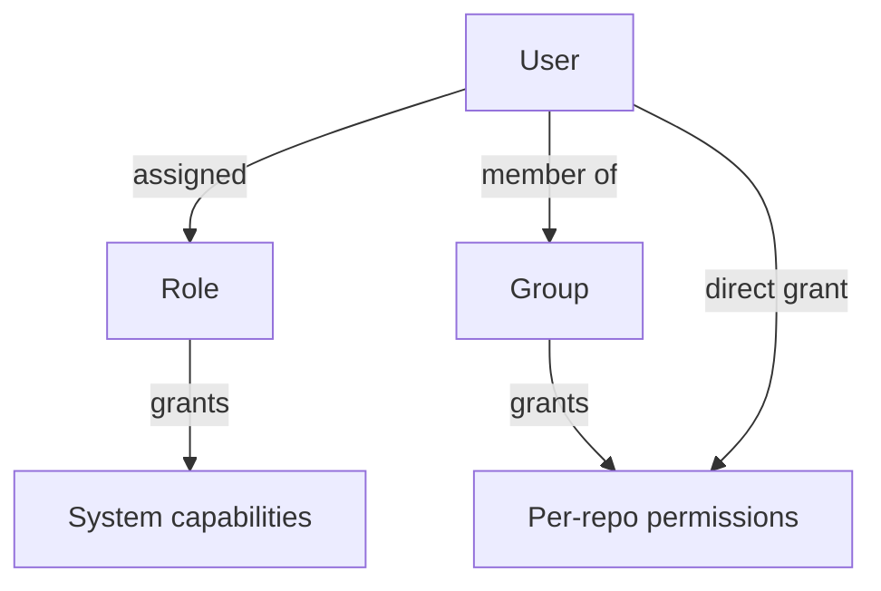
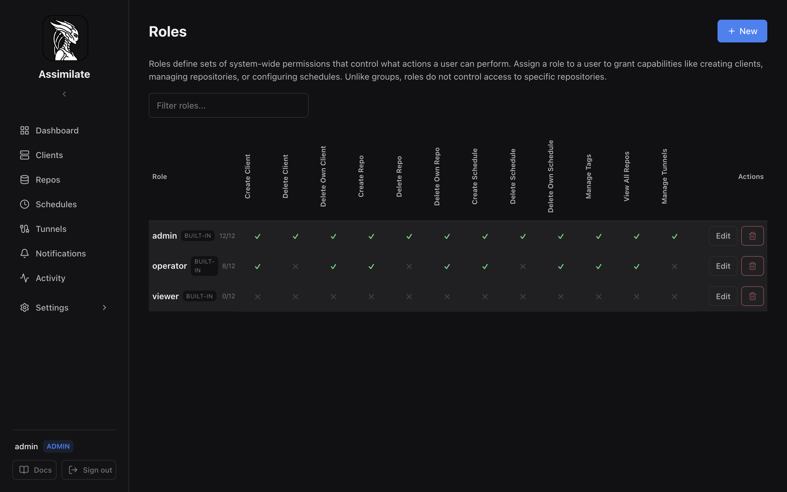
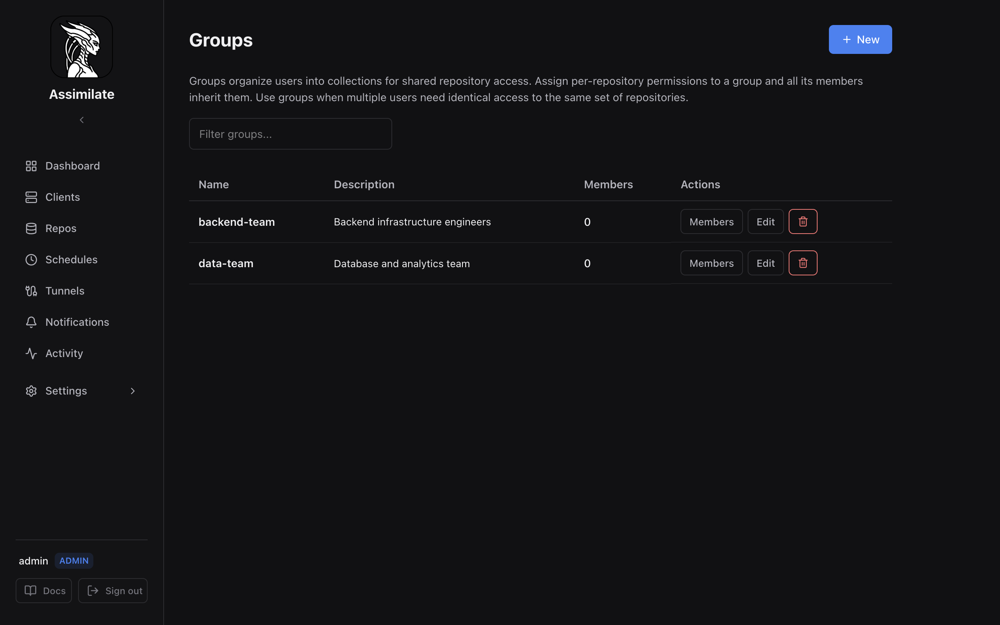
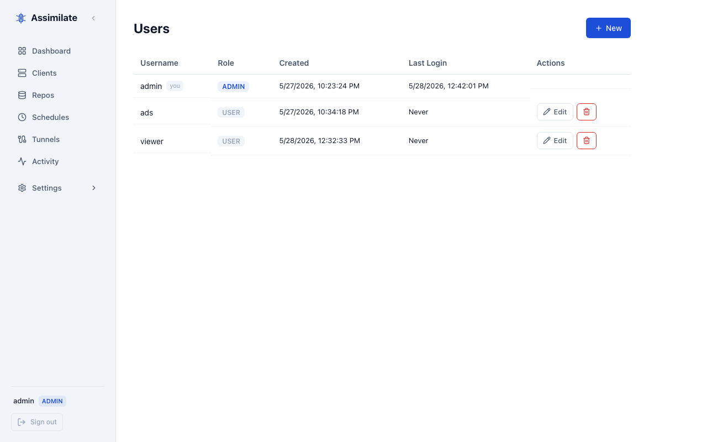

# Access Control

Assimilate uses a layered access-control model with **roles**, **groups**, and **per-repository permissions**. This page explains how they interact and when to use each.

## Overview

| Concept | Purpose | Scope |
|---------|---------|-------|
| **Role** | Defines what actions a user can perform | System-wide capabilities |
| **Group** | Organizes users for shared repository access | Per-repository permissions |
| **Per-repo permission** | Grants specific operations on a single repository | Individual repository |

## Roles

A role is a named bundle of **system-wide capabilities**. Each user is assigned exactly one role. Roles control whether a user can create agents, manage repositories, configure schedules, and similar administrative actions.

Roles do **not** control which specific repositories a user can see or interact with — that is the job of groups and per-repo permissions.

### Built-in Roles

Assimilate ships with three built-in roles that cannot be deleted:

| Role | Description |
|------|-------------|
| **admin** | Full access to everything. Bypasses all permission checks. |
| **operator** | Can create and manage agents, repos, and schedules but cannot manage users or system settings. |
| **viewer** | Read-only access. Cannot create or modify resources. |

### Custom Roles

Admins can create custom roles with any combination of these capabilities:

| Capability | Effect |
|------------|--------|
| Create Agent | Create new backup agents |
| Delete Agent | Delete any agent |
| Delete Own Agent | Delete only agents the user created |
| Create Repo | Register new borg repositories |
| Delete Repo | Delete any repository |
| Delete Own Repo | Delete only repositories the user created |
| Create Schedule | Create backup schedules |
| Delete Schedule | Delete any schedule |
| Delete Own Schedule | Delete only schedules the user created |
| Manage Tags | Create and assign tags |
| View All Repos | See all repositories regardless of per-repo permissions |
| Manage Tunnels | Configure SSH reverse tunnels |

### When to Use Roles

Use roles when you need to control **what kind of actions** a user can perform across the system:

- A new team member who should only monitor backups → assign the **viewer** role.
- A DevOps engineer who manages infrastructure but should not administer users → create an **operator** role or a custom role with appropriate capabilities.
- A service account that only triggers backups → create a minimal custom role with no create/delete capabilities and use an API token.

## Groups

A group is a collection of users that share the same **per-repository permissions**. When you grant a group access to a repository, every member of that group gains that access.

Groups do **not** grant system capabilities — they only control which repositories their members can access and what operations they can perform on those repositories.

### Per-Repository Permissions

The following permissions can be granted to a group (or directly to a user) for each repository:

| Permission | Effect |
|------------|--------|
| `can_view` | See the repository and its archives |
| `can_backup` | Trigger a backup run |
| `can_modify_schedules` | Create and edit backup schedules for this repository |
| `can_extract` | Browse and extract archive contents |
| `can_delete` | Delete archives from this repository |

### When to Use Groups

Use groups when you need to control **which repositories** a set of users can access:

- A "backend-team" group that can view and backup the production database repositories.
- A "developers" group that has full access to development environment repositories but read-only access to production.
- An "auditors" group that can view all repositories but cannot modify or delete anything.

### Permission Resolution

When evaluating whether a user can perform an action on a repository:

1. **Admin role** — admins bypass all permission checks (always allowed).
2. **Direct user grant** — if the user has been granted the permission directly on the repository, it is allowed.
3. **Group membership** — if any group the user belongs to has been granted the permission on the repository, it is allowed.
4. **Deny by default** — if none of the above apply, the action is denied.

## Roles vs Groups — Decision Guide

| Question | Answer |
|----------|--------|
| "Should this user be able to create new agents?" | **Role** — this is a system capability |
| "Should this user see repository X?" | **Group** (or direct grant) — this is per-repo access |
| "Should this team share the same repo access?" | **Group** — add all team members to one group |
| "Should this user be able to delete schedules?" | **Role** — this is a system capability |
| "Should this user trigger backups on repo Y?" | **Group** (or direct grant) — per-repo `can_backup` |

!!! tip "Rule of thumb"
    **Roles** answer "what can they do?" — **Groups** answer "where can they do it?"

## Managing Access in the UI

All access-control settings are under **Settings → Access Control** in the sidebar:

- **Users** — create accounts, assign roles, and grant direct per-repo permissions.
- **Groups** — create groups, manage membership, and assign per-repo permissions to the group.
- **Roles** — view and create roles with custom capability sets.

## API Endpoints

| Endpoint | Method | Description |
|----------|--------|-------------|
| `/api/roles` | GET | List all roles |
| `/api/roles` | POST | Create a new role |
| `/api/roles/:id` | PUT | Update a role's permissions |
| `/api/roles/:id` | DELETE | Delete a custom role |
| `/api/groups` | GET | List all groups |
| `/api/groups` | POST | Create a new group |
| `/api/groups/:id` | PUT | Update a group |
| `/api/groups/:id` | DELETE | Delete a group |
| `/api/groups/:id/members` | GET | List group members |
| `/api/groups/:id/members` | PUT | Set group membership |

See the full [API Reference](api-reference.md) for request/response schemas.

<!--
SPDX-License-Identifier: Apache-2.0
SPDX-FileCopyrightText: 2026 Alexander Mohr
-->
