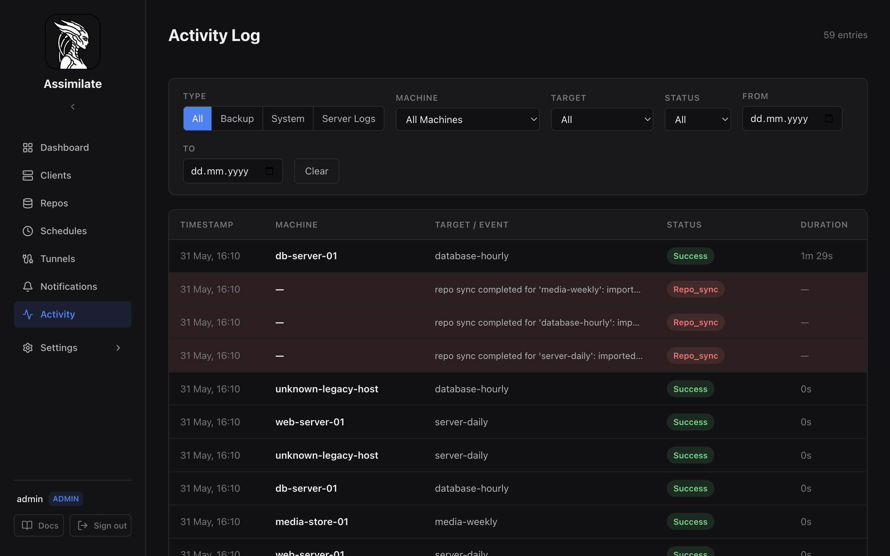

# Activity Log

The Activity Log provides a unified timeline of backup runs, system events, and server logs. Access it from the **Activity** item in the sidebar.

## Categories

The Activity page has four tabs that filter the timeline by event type:

| Tab | Content |
|-----|---------|
| **All** | Interleaved view of backup activity and system events, sorted by timestamp |
| **Backup** | Backup run history only (success, warning, failed) |
| **System** | System events — agent connections, disconnections, errors |
| **Server Logs** | Real-time server log output with level and text filtering |

## Backup Activity

The Backup tab (and the "All" view) shows one row per backup run:

| Column | Description |
|--------|-------------|
| Timestamp | When the backup started |
| Machine | Hostname of the agent that ran the backup |
| Target | Repository name the backup targeted |
| Status | `success`, `warning`, or `failed` |
| Duration | Elapsed time for the run |

Click any row to expand it and see detailed statistics:

- **Timing** — start, finish, and duration
- **Sizes** — original, compressed, and deduplicated
- **Stats** — files processed, borg version
- **Error** — error message (if the run failed)

## Filters

When viewing Backup or All activity, the following filters are available:

| Filter | Description |
|--------|-------------|
| Machine | Show only runs from a specific host |
| Target | Show only runs targeting a specific repository |
| Status | Filter by outcome (success, warning, failed) |
| From / To | Date range filter |

Click **Clear** to reset all filters.

## System Events

System events record significant server-side occurrences:

- Agent connected / disconnected
- Backup failures and warnings
- Configuration changes

Each event row shows a timestamp, hostname (if applicable), message, and event type badge.

## Server Logs

The Server Logs tab streams the server's internal log buffer. Use it for debugging connectivity issues, SSH errors, or scheduler problems without needing shell access to the server.

| Filter | Description |
|--------|-------------|
| Level | Filter by severity: Error, Warn, Info, Debug, Trace |
| Search | Free-text filter across log messages |

Log entries display:

| Column | Description |
|--------|-------------|
| Timestamp | When the log entry was recorded |
| Level | Severity badge (ERROR, WARN, INFO, DEBUG, TRACE) |
| Target | Rust module path that emitted the log |
| Message | Log message content |

Error and warning rows are highlighted for visibility.

!!! note
    The server keeps a rolling buffer of recent log entries in memory. Logs older than the buffer size are not available through the UI. For persistent log storage, configure your deployment's log collection system (journald, Docker logging driver, etc.).

## Real-Time Updates

The activity feed updates automatically via WebSocket. When a backup completes or an agent connects/disconnects, new entries appear without a page refresh.

## Pagination

The activity view loads entries in pages. Click **Load More** at the bottom to fetch older entries. The entry count is shown in the page header.

## API Endpoints

| Method | Path | Description |
|--------|------|-------------|
| `GET` | `/api/stats/activity` | List backup activity entries |
| `GET` | `/api/stats/system-events` | List system events |
| `GET` | `/api/logs` | Retrieve server log entries |
| `GET` | `/api/agents/:hostname/reports` | List backup reports for an agent |

See the full [API Reference](api-reference.md) for request/response schemas.

## Related Pages

- [Scheduling & Retention](scheduling.md) — configure when backups run
- [Agent Management](agents.md) — manage agents that produce activity
- [Dashboard](dashboard.md) — summary view with success rates and health

<!--
SPDX-License-Identifier: Apache-2.0
SPDX-FileCopyrightText: 2026 Alexander Mohr
-->
