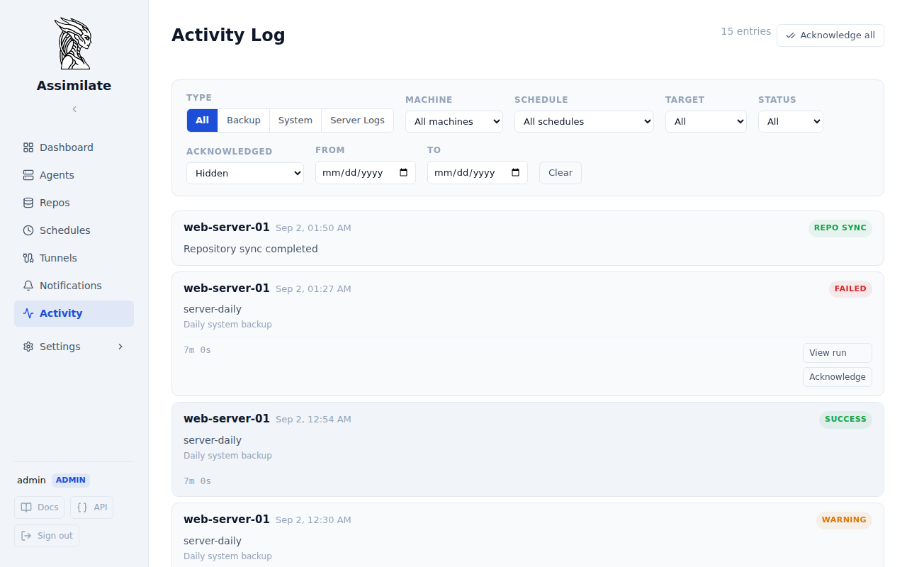

# Activity Log

The Activity Log provides a unified timeline of backup runs, system events, and server logs. Access it from the **Activity** item in the sidebar.

## Categories

The Activity page has four tabs that filter the timeline by event type:

| Tab | Content |
|-----|---------|
| **All** | Interleaved view of backup activity and system events, sorted by timestamp |
| **Backup** | Backup run history only (success, warning, failed) |
| **System** | System events — agent connections, disconnections, errors |
| **Server Logs** | Real-time server log output with level and text filtering |

## Backup Activity

The Backup tab (and the "All" view) shows one card per backup run, with the start timestamp, hostname of the agent that ran the backup, target repository name, status (`success`, `warning`, or `failed`), and duration.

Click any card to expand it and see detailed statistics:

- **Timing** — start, finish, and duration
- **Sizes** — original, compressed, and deduplicated
- **Stats** — files processed, borg version
- **Warnings** — a list of warning messages (if the run completed with warnings). borg's own `terminating with warning status, rc 1` footer is left out: it restates the exit code without saying what caused it. If borg ends a run with a warning status but reports no message at all, the entry says exactly that and carries the last output borg produced, so a flagged run always states a reason — see [File Change Patterns](file-change-patterns.md) for suppressing the warnings you have already decided to live with
- **Error** — error message, shown only for a failed run — a warning-only run's message already appears in the Warnings section above, so it isn't duplicated here

### Acknowledging a warning or failure

A warning or failed run's card carries an **Acknowledge** button. Acknowledging marks the run as reviewed: the entry drops out of the feed (the **Acknowledged** filter brings it back, see [Filters](#filters)) and stops counting towards the dashboard. Nothing is deleted. **Unacknowledge** reverses it. Acknowledgment is shared across every user, not tied to whoever clicked it — like the run itself.

A successful run has no Acknowledge button; there is nothing on it to review.

Acknowledging a run also removes it from the dashboard:

- it stops counting towards the **Failed** tile in Backup Stats, which reports only runs still awaiting review
- its **Needs attention** finding disappears, so the finding count drops
- the **Last failure** / **Last warning** tiles fall back to the most recent run still awaiting review
- an acknowledged failure no longer leaves the schedule target flagged as overdue or never-succeeded — the target is muted until its next run, whose fresh report is flagged again if it fails too. The mute is bounded: if that run never happens, the target is overdue on a new cycle and returns to the dashboard, so a host that goes silent after a review cannot stay hidden

The success-rate ring is history rather than a to-do list, so it keeps counting every run, acknowledged or not.

### Acknowledging everything at once

**Acknowledge all**, in the page header, marks every outstanding warning and failure as reviewed in one step. It reaches exactly as far as acknowledging each entry by hand would: backup runs only in repositories you may modify schedules for, and system events only if you are an admin.

It appears whenever anything is left for you to acknowledge — deliberately regardless of the tab and filters in effect, since it acts on the same unfiltered set. A narrow filter showing nothing acknowledgeable does not mean there is nothing left, so gating the button on what happens to be on screen would hide it exactly when it is most useful.

The dashboard's Backup Stats panel carries a narrower version of the same action, **Mark reviewed**, which clears only the runs in the repository and range that panel is showing and leaves system events untouched. See [Resetting the failed count](dashboard.md#resetting-the-failed-count).

### Acknowledging a system event

A system event that reports a problem — a failed or slow periodic repository sync, an auto-disabled schedule, a locked account — can be acknowledged the same way. System events are global rather than repository-scoped, so only an admin can acknowledge one. Events that report normal operation (a completed sync, a cancelled sync) have no Acknowledge button, and the API rejects an attempt to acknowledge or unacknowledge one.

## Filters

When viewing Backup or All activity, the following filters are available:

| Filter | Description |
|--------|-------------|
| Machine | Show only runs from a specific host |
| Schedule | Show only runs of a specific schedule |
| Target | Show only runs targeting a specific repository |
| Status | Filter by outcome (success, warning, failed) |
| Acknowledged | `Hidden` (the default) leaves out everything already reviewed, `Shown` includes it, `Only acknowledged` shows nothing else |
| From / To | Date range filter |

Click **Clear** to reset all filters, including putting **Acknowledged** back to `Hidden`.

!!! note
    Because acknowledged entries are hidden by default, acknowledging an entry makes it disappear from the list straight away. Switch **Acknowledged** to `Shown` or `Only acknowledged` to find it again and undo it.

## System Events

System events record significant server-side occurrences:

- Agent connected / disconnected
- Backup failures and warnings
- Configuration changes
- A schedule auto-disabled after repeated failures to reach its agent, and its automatic re-enable once that agent reconnects (see [Agents](agents.md))

Each event row shows a timestamp, hostname (if applicable), message, and event type badge. The badge colour comes from the event's severity: green for a completed operation, amber for something degraded, red for a failure, grey for a purely informational record. Anything amber or red can be acknowledged — see [Acknowledging a system event](#acknowledging-a-system-event).

## Server Logs

The Server Logs tab streams the server's internal log buffer. Use it for debugging connectivity issues, SSH errors, or scheduler problems without needing shell access to the server.

| Filter | Description |
|--------|-------------|
| Level | Filter by severity: Error, Warn, Info, Debug, Trace |
| Search | Free-text filter across log messages |

Log entries display:

| Column | Description |
|--------|-------------|
| Timestamp | When the log entry was recorded |
| Level | Severity badge (ERROR, WARN, INFO, DEBUG, TRACE) |
| Target | Rust module path that emitted the log |
| Message | Log message content |

Error and warning rows are highlighted for visibility.

!!! note
    The server keeps a rolling buffer of recent log entries in memory. Logs older than the buffer size are not available through the UI. For persistent log storage, configure your deployment's log collection system (journald, Docker logging driver, etc.).

## Real-Time Updates

The activity feed updates automatically via WebSocket. When a backup completes or an agent connects/disconnects, new entries appear without a page refresh.

## Pagination

The activity view loads entries in pages. Click **Load more** at the bottom to fetch older entries. The entry count is shown in the page header.

## API Endpoints

| Method | Path | Description |
|--------|------|-------------|
| `GET` | `/api/stats/activity` | List backup activity entries (`?acknowledged=all\|unacknowledged\|acknowledged`, default `all`) |
| `POST` | `/api/stats/activity/:id/acknowledge` | Acknowledge a backup run's warning or failure |
| `DELETE` | `/api/stats/activity/:id/acknowledge` | Clear a run's acknowledgment |
| `POST` | `/api/stats/activity/acknowledge-all` | Acknowledge every outstanding warning and failure the caller may act on |
| `GET` | `/api/stats/activity/outstanding` | Count what the caller could still acknowledge, ignoring feed filters |
| `GET` | `/api/stats/system-events` | List system events (same `?acknowledged=` filter) |
| `POST` | `/api/stats/system-events/:id/acknowledge` | Acknowledge a system event that reports a problem (admin only) |
| `DELETE` | `/api/stats/system-events/:id/acknowledge` | Clear a system event's acknowledgment (admin only) |
| `GET` | `/api/logs` | Retrieve server log entries |
| `GET` | `/api/agents/:hostname/reports` | List backup reports for an agent |

See the full [API Reference](api-reference.md) for request/response schemas.

## Related Pages

- [Scheduling & Retention](scheduling.md) — configure when backups run
- [Agent Management](agents.md) — manage agents that produce activity
- [Dashboard](dashboard.md) — summary view with success rates and health

<!--
SPDX-License-Identifier: Apache-2.0
SPDX-FileCopyrightText: 2026 Alexander Mohr
-->
