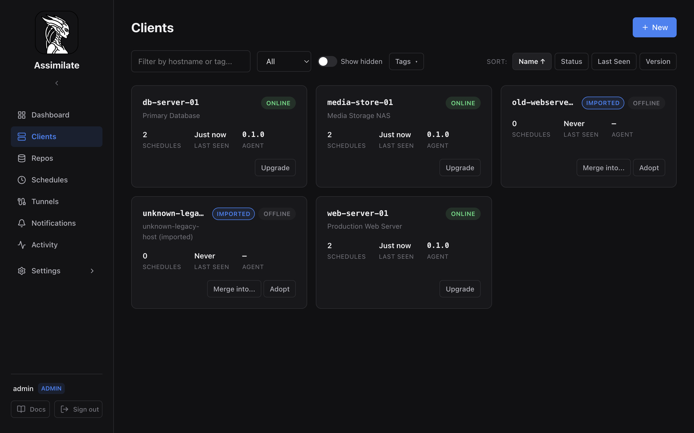
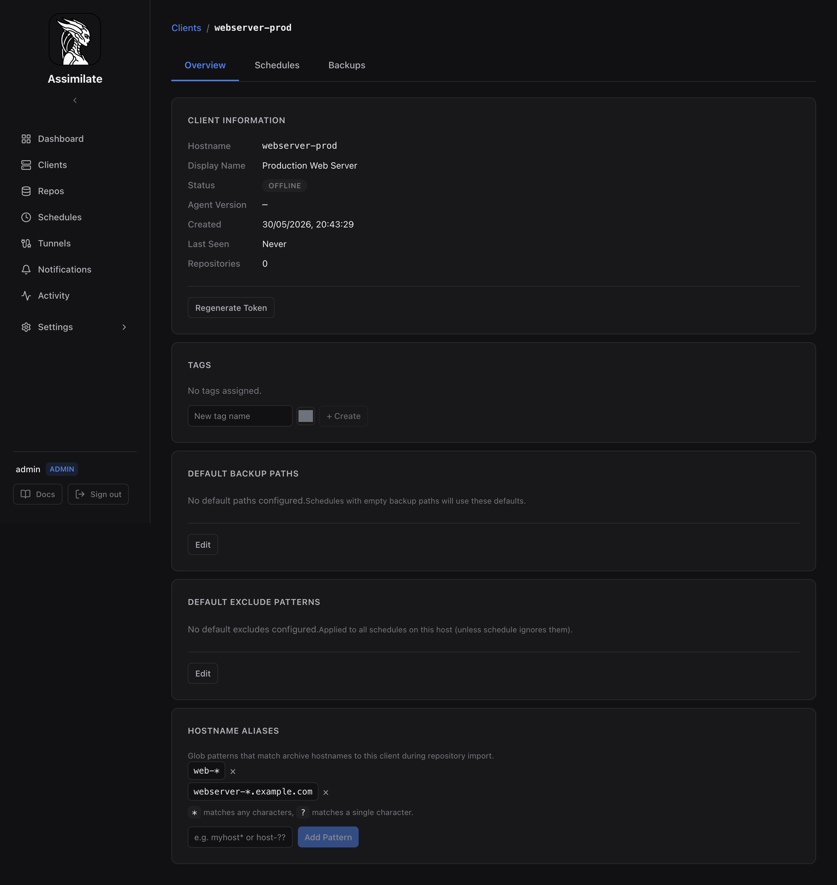

# Agent Management

An *agent* is a machine running the Assimilate agent binary. The server tracks each agent by its hostname, issues it a cryptographically random token, and communicates with it over a persistent WebSocket connection.

See [Getting Started](getting-started.md) for initial setup instructions.

## Adding an Agent

1. Navigate to **Agents** in the sidebar.
2. Click **Add Agent**.
3. Enter the machine's hostname (must be unique).
4. Optionally set a display name.
5. Click **Create** — the server generates a 32-byte random token and shows it once.
6. Copy the token immediately; it is not shown again.

Pass the token to the agent via the `BORG_AGENT_TOKEN` environment variable:

```bash
BORG_SERVER_URL=https://your-server BORG_AGENT_TOKEN=<token> assimilate-agent
```



The Agents list page provides:

- **Text filter** — search by hostname or tag
- **Status filter** — show All, Online only, or Offline only
- **Coverage filter** — show protected, unassigned, never-succeeded, or disabled-only agents; dashboard coverage links set this filter automatically
- **Show hidden toggle** — reveal hidden imported agents (admin-only)
- **Tag filter** — filter by one or more tags
- **Sort buttons** — sort by Name, Status, Last Seen, or Agent Version

Each agent card shows the hostname, display name, online/offline status, schedule count, last seen time, agent version, and overdue indicators. Imported agents show **Merge into...** and **Adopt** buttons for managing unmatched archive agents.

## Agent Deployment

### Manual

Download the `assimilate-agent` binary for your platform and install it on the target machine:

```bash
install -m 755 assimilate-agent /usr/local/bin/assimilate-agent
```

Create a systemd unit at `/etc/systemd/system/assimilate-agent.service`:

```ini
[Unit]
Description=Assimilate backup agent
After=network.target

[Service]
Environment=BORG_SERVER_URL=https://your-server
Environment=BORG_AGENT_TOKEN=<token>
ExecStart=/usr/local/bin/assimilate-agent
Restart=on-failure
RestartSec=10

[Install]
WantedBy=multi-user.target
```

```bash
systemctl daemon-reload
systemctl enable --now assimilate-agent
```

### Docker

```bash
docker run -d \
  --name assimilate-agent \
  --restart unless-stopped \
  -e BORG_SERVER_URL=https://your-server \
  -e BORG_AGENT_TOKEN=<token> \
  ghcr.io/your-org/assimilate-agent:latest
```

### SSH Deploy from Dashboard

The dashboard can push the agent binary and install a systemd unit on a remote machine over SSH — no manual steps required on the target machine.

**Prerequisites:**

- The server's SSH public key must be in `~/.ssh/authorized_keys` on the remote machine. The key is shown under **System** in the admin UI (see [Security](security.md)).
- The remote user must have write access to the install path (default `/usr/local/bin`) and permission to manage systemd units.

**Steps:**

1. Open the agent detail page and click **Deploy Agent**.
2. Fill in the SSH connection fields:

    | Field | Description |
    |-------|-------------|
    | SSH Host | Hostname or IP of the remote machine |
    | SSH User | SSH user on the remote machine (prefilled with the username last used to deploy this agent, defaulting to `root` the first time) |
    | SSH Port | SSH port (default: 22) |
    | Server URL | URL the agent will use to connect back to the server |
    | Install Path | Binary destination (default: `/usr/local/bin/assimilate-agent`) |

3. Click **Deploy**. The server copies the binary, writes the systemd unit, and regenerates the agent token automatically.

If the agent is already at the latest version, the deploy is skipped and the existing token is preserved. The SSH user entered is remembered for this agent and prefilled the next time the dialog is opened.

!!! note
    SSH deploy requires admin privileges. The server uses the same Ed25519 key pair used for [SSH Agent Forwarding](ssh-agent-forwarding.md).

### Existing Systemd Unit

Whenever the dialog is opened, the server automatically attempts to read an existing `assimilate-agent.service` unit from the remote host over SSH and, if found, loads it into the **Systemd Service Unit** field so custom settings (e.g. resource limits, extra environment variables) are preserved across upgrades. A **Load from remote** button lets you re-fetch it after changing the SSH connection fields.

If the existing unit contains a `BORG_AGENT_TOKEN` value, the server redacts it to `[REDACTED]` before it is ever sent to the browser — the real token is never exposed in the API response or displayed in the UI. A newly generated token is injected automatically when you click **Deploy**, regardless of what is shown in the field.

## Token Management

Each agent has exactly one active token. Tokens are stored as bcrypt hashes — the plaintext is never persisted.

To regenerate a token:

1. Open the agent detail page.
2. Click **Regenerate Token**.
3. Copy the new token immediately.

!!! warning
    Regenerating a token **immediately invalidates the old one**. The running agent will be disconnected and will fail to reconnect until it is restarted with the new token. Update `BORG_AGENT_TOKEN` in the agent's environment or systemd unit before restarting.

SSH deploy automatically regenerates the token as part of the deployment process.

## Agent Restart

The dashboard can send a remote restart command to a connected agent.

**Requirements:**

- The agent must be currently connected (online).
- The agent must report the `supports_restart` capability. This is available when the agent is managed by systemd and can signal its own service manager.

To restart:

1. Open the agent detail page.
2. Click **Restart Agent**.

If restart is not supported, the button is disabled and a reason is shown (e.g., "not running under systemd"). The server returns HTTP 400 in this case.

## Agent Status

Each agent card and detail page shows a live connection indicator:

| Status | Meaning |
|--------|---------|
| **Online** | Agent has an active WebSocket connection to the server |
| **Offline** | No active connection; `last_seen` shows when the agent last disconnected |

The server tracks liveness via WebSocket pings. If the agent stops responding to pings, the connection is closed and the agent transitions to **Offline**. `last_seen` is updated whenever the agent disconnects cleanly or times out.

"Disconnected" does not mean the agent is deleted or its data is lost — it simply means the agent is not currently reachable. Scheduled backups for that agent will fail until the agent reconnects.

## Agent Detail View

The agent detail page shows:

- **Connection status** and last seen timestamp
- **Agent version** (populated after the first connection or SSH deploy)
- **Hostname Aliases** — glob patterns for archive matching (see below)
- **Repositories** associated with this agent — see [Repositories](repositories.md)
- **Backup reports** — recent backup run history and warnings
- **Schedules** — schedules whose target list includes this agent — see [Scheduling](scheduling.md)



## Hostname Aliases (Glob Patterns)

When importing an existing borg repository, archives may have hostnames that don't match the registered agent name (e.g. the machine was renamed, or borg was configured with a custom hostname). Hostname aliases let you define glob patterns so these archives are automatically matched to the correct agent.

### Adding a Pattern

1. Open the agent detail page.
2. Scroll to the **Hostname Aliases** section.
3. Enter a glob pattern (e.g. `webserver-*`, `prod-web-??.example.com`).
4. Click **Add**.

Patterns use standard glob syntax:

| Pattern | Matches |
|---------|---------|
| `web-*` | `web-01`, `web-prod`, `web-anything` |
| `srv-?.local` | `srv-1.local`, `srv-a.local` (single character) |
| `*-backup` | `agent1-backup`, `my-machine-backup` |

### How Matching Works

During repository import (and re-scan), each archive's hostname is resolved in order:

1. **Exact match** — hostname equals a registered agent's hostname
2. **Pattern match** — hostname matches a glob pattern attached to an agent
3. **Unmatched** — a placeholder agent is created with an "(imported)" suffix

Patterns are evaluated across all agents. The first matching pattern wins.

### Re-scanning Unmatched Archives

After adding patterns, you can re-scan a repository to match previously unmatched archives. See [Repositories — Re-scan](repositories.md#re-scanning-unmatched-archives).

## Merging Imported Agents

When a repository is imported, placeholder agents are created for archive hostnames that don't match any existing agent. These appear in the Agents list with an **Imported** badge.

To merge a placeholder into a real agent:

1. On the **Agents** list, click the **Merge** button on the imported agent row.
2. Select the target agent from the dropdown.
3. Optionally check **Save as hostname alias** to automatically create a glob pattern (pre-filled with the placeholder's hostname followed by `*`).
4. Click **Merge**.

Merging transfers all backup reports from the placeholder to the target agent and deletes the placeholder. If you saved a pattern, future imports will match automatically.

## Agent Tags

Tags let you organize agents for filtering on the Agents list page.

- Add tags when creating or editing an agent.
- Filter the agent list by one or more tags using the tag filter bar.
- Tags are free-form strings; no predefined taxonomy is enforced.

## Deleting an Agent

1. Open the agent detail page.
2. In the **Danger Zone** section, click **Delete Agent** and confirm in the dialog.

**What is removed:**

- The agent record and its token hash
- Any SSH reverse tunnel configured for this agent (the tunnel is stopped immediately)

**What is retained:**

- Repositories, schedules, and backup reports are **not** automatically deleted. They become orphaned and should be cleaned up manually from the [Repositories](repositories.md) page.

!!! warning
    Deleting an agent does not remove borg archives from the repository server. Use `borg delete` or the [Archives](archives.md) page to remove archive data.

## Hiding Imported Agents

When repositories are scanned, placeholder "imported" agent entries are created for hostnames found in existing archives. If you don't need to see these agents in the UI, you can hide them.

Hidden agents are excluded from:

- The agents list (default view)
- Dashboard statistics and storage aggregations
- Activity feed and health summary
- Scheduled backup targets
- Calendar events

### Hiding an Agent

1. Open the imported agent's detail page.
2. In the **Danger Zone** section, click **Hide**.
3. The agent disappears from all views immediately.

### Viewing and Unhiding Hidden Agents

1. Navigate to **Agents** in the sidebar.
2. Enable the **Show hidden** toggle (admin-only).
3. Hidden agents appear with reduced opacity and a "Hidden" badge.
4. Click **Unhide** on a hidden agent to restore it to normal visibility.

!!! note
    Hiding is non-destructive — all archive data remains intact on disk. The agent will not reappear on the next repository scan because the database record is preserved with the hidden flag.

## Deleting Archives & Removing Imported Agents

For imported agents whose archive data is no longer needed, you can permanently delete all borg archives and remove the agent record.

1. Open the imported agent's detail page.
2. In the **Danger Zone** section, click **Delete Archives & Remove**.
3. Confirm in the dialog — this action is irreversible.

The server sends `borg delete` commands to connected agents for each repository containing archives from this agent. Once all archives are deleted, the agent record is removed from the database.

!!! danger
    This permanently destroys backup data. All borg archives belonging to this agent are deleted from disk across all repositories. This cannot be undone.

**Requirements:**

- At least one agent with access to each relevant repository must be connected.
- If no agent is available for a repository, those archives are skipped and reported as errors.

<!--
SPDX-License-Identifier: Apache-2.0
SPDX-FileCopyrightText: 2026 Alexander Mohr
-->
