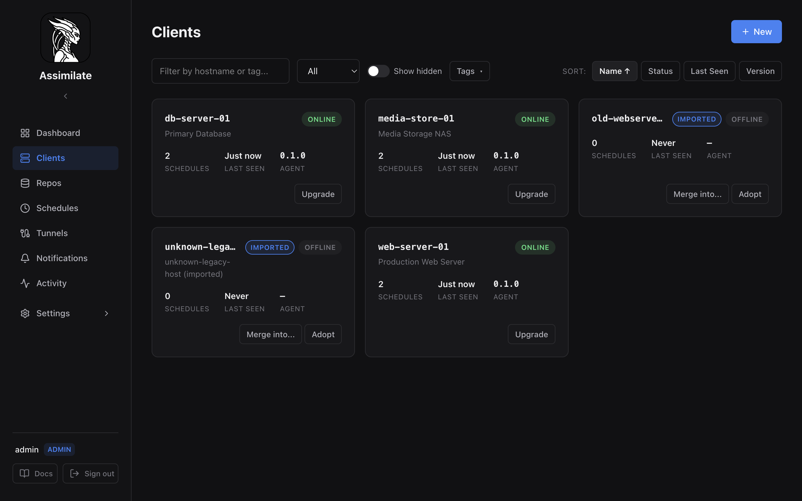
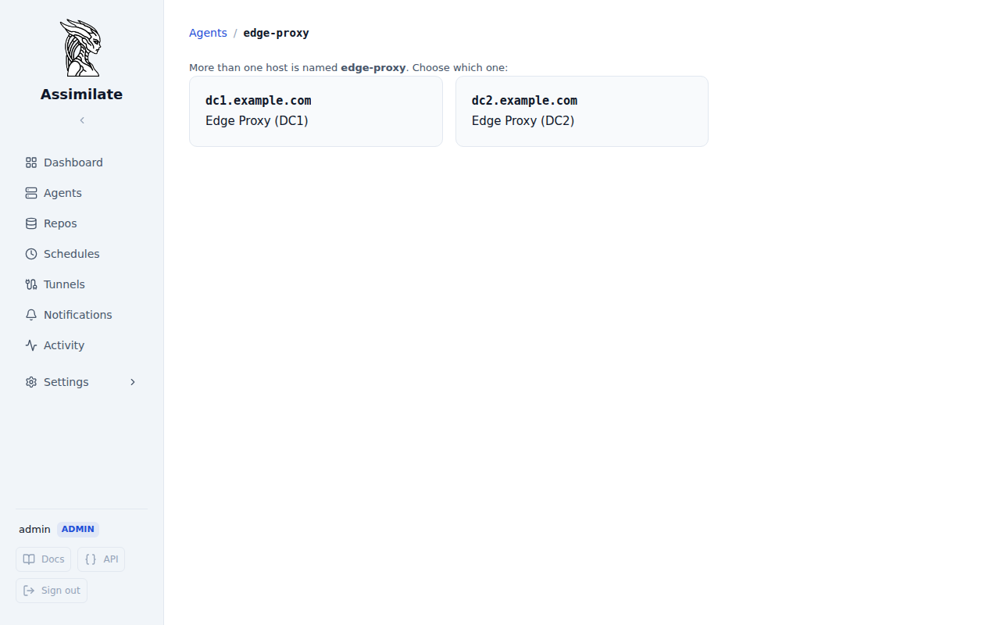
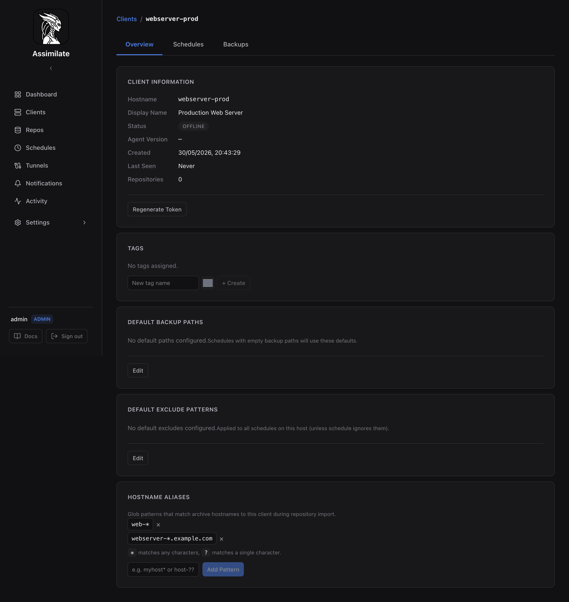

# Agent Management

An *agent* is a machine running the Assimilate agent binary. The server tracks each agent by its hostname (and, when two hosts share a hostname, its domain — see [Duplicate Hostnames](#duplicate-hostnames)), issues it a cryptographically random token, and communicates with it over a persistent WebSocket connection.

See [Getting Started](getting-started.md) for initial setup instructions.

## Adding an Agent

1. Navigate to **Agents** in the sidebar.
2. Click **New agent**.
3. Enter the machine's hostname.
4. Optionally set a domain — only needed if another host already uses this hostname (see [Duplicate Hostnames](#duplicate-hostnames) below).
5. Optionally set a display name.
6. Click **Create** — the server generates a 32-byte random token and shows it once.
7. Copy the token immediately; it is not shown again.

Pass the token to the agent via the `BORG_AGENT_TOKEN` environment variable:

```bash
BORG_SERVER_URL=https://your-server BORG_AGENT_TOKEN=<token> assimilate-agent
```



The Agents list page provides:

- **Text filter** — search by hostname or tag
- **Status filter** — show All, Online only, or Offline only
- **Coverage filter** — show protected, unassigned, never-succeeded, or disabled-only agents; dashboard coverage links set this filter automatically
- **Show hidden toggle** — reveal hidden imported agents (admin-only)
- **Tag filter** — filter by one or more tags
- **Sort buttons** — sort by Name, Status, Last seen, or Version

A fleet summary band above the list rolls up the whole fleet: total agent count, how many are online, total schedule count, and a breakdown of agent versions in use, with the version matching the server's available binary marked current.

Each agent card shows the hostname, display name, a coverage meter, schedule count, last seen time, and agent version. The coverage meter compares how long it has been since the agent's most recent completed backup against the shortest cadence among its own enabled backup schedules, so a card reads **On time**, **Due soon**, or **Overdue** without needing to open it; an agent with no enabled backup schedule shows **No cadence** instead. An offline agent tints the card and adds an **Offline** pill; a **Failed** or **Overdue** chip appears when a backup on that agent needs attention — click it to jump straight to the filtered backup history or schedule that needs a look. Imported agents show **Merge into...** and **Adopt** buttons for managing unmatched archive agents.

## Duplicate Hostnames

An OS hostname is not always globally unique — the same short hostname (e.g. `web-01`) can exist on two different networks or sites, each in its own DNS domain. Assimilate normally identifies an agent by hostname alone, so a second host reusing an already-registered hostname needs a **domain** to tell them apart. When a hostname resolves to more than one agent, the UI never guesses which one you mean — following a link that only carries a hostname (e.g. from search, or an old bookmark) shows a picker instead of a detail page:



Selecting a candidate adds `?domain=` to the URL so the link becomes unambiguous from then on. Every hostname-keyed API call the UI makes on that page — settings, hostname aliases, tags, danger-zone actions — carries the same `domain` query parameter, so it always affects the correct agent even when its hostname is shared.

The domain isn't detected automatically: it's a DNS-level fact about where a host sits on the network, not something the agent process running on the machine can determine about itself. Set it by hand instead, either when adding the agent or later:

1. Open the agent detail page.
2. Open **Settings > Identity** and click **Edit**.
3. Enter the **Domain** field (e.g. `dc1.example.com`).
4. Save.

Leave the domain unset for the common case — a single host with that hostname. Two agents are only required to have different domains when they share a hostname; uniqueness is enforced on the *(hostname, domain)* pair, not on hostname alone.

## Agent Deployment

### Manual

Download the `assimilate-agent` binary for your platform and install it on the target machine:

```bash
install -m 755 assimilate-agent /usr/local/bin/assimilate-agent
```

Create a systemd unit at `/etc/systemd/system/assimilate-agent.service`:

```ini
[Unit]
Description=Assimilate backup agent
After=network.target

[Service]
Environment=BORG_SERVER_URL=https://your-server
Environment=BORG_AGENT_TOKEN=<token>
ExecStart=/usr/local/bin/assimilate-agent
Restart=on-failure
RestartSec=10

[Install]
WantedBy=multi-user.target
```

```bash
systemctl daemon-reload
systemctl enable --now assimilate-agent
```

### Docker

```bash
docker run -d \
  --name assimilate-agent \
  --restart unless-stopped \
  -e BORG_SERVER_URL=https://your-server \
  -e BORG_AGENT_TOKEN=<token> \
  ghcr.io/your-org/assimilate-agent:latest
```

### SSH Deploy from Dashboard

The dashboard can push the agent binary and install a systemd unit on a remote machine over SSH — no manual steps required on the target machine.

**Prerequisites:**

- The server's SSH public key must be in `~/.ssh/authorized_keys` on the remote machine. The key is shown under **System** in the admin UI (see [Security](security.md)).
- The remote user must have write access to the install path (default `/usr/local/bin`) and permission to manage systemd units.

**Steps:**

1. Open the agent detail page and click **Deploy agent** in the header.
2. Fill in the SSH connection fields:

    | Field | Description |
    |-------|-------------|
    | SSH Host | Hostname or IP of the remote machine |
    | SSH User | SSH user on the remote machine (prefilled with the username last used to deploy this agent, defaulting to `root` the first time) |
    | SSH Port | SSH port (default: 22) |
    | Server URL | URL the agent will use to connect back to the server |
    | Install path | Binary destination (default: `/usr/local/bin/assimilate-agent`) |

3. Click **Deploy**. The server copies the binary, writes the systemd unit, and regenerates the agent token automatically.

If the agent is already at the latest version, the deploy is skipped and the existing token is preserved. The SSH user entered is remembered for this agent and prefilled the next time the dialog is opened.

!!! note
    SSH deploy requires admin privileges. The server uses the same Ed25519 key pair used for [SSH Agent Forwarding](ssh-agent-forwarding.md).

### Existing Systemd Unit

Whenever the dialog is opened, the server automatically attempts to read an existing `assimilate-agent.service` unit from the remote host over SSH and, if found, loads it into the **Systemd Service Unit** field so custom settings (e.g. resource limits, extra environment variables) are preserved across upgrades. A **Load from remote** button lets you re-fetch it after changing the SSH connection fields.

If the existing unit contains a `BORG_AGENT_TOKEN` value, the server redacts it to `[REDACTED]` before it is ever sent to the browser — the real token is never exposed in the API response or displayed in the UI. A newly generated token is injected automatically when you click **Deploy**, regardless of what is shown in the field.

### Redeploying an Agent

Once an agent is already running the latest version, the header no longer offers **Upgrade agent** — there is nothing newer to install. The host it runs on can still lose its installation, though (a reimage, a wiped disk, a systemd unit that was hand-edited into a broken state), and reconnecting it needs the same SSH push used for the original install.

1. Open the agent detail page and choose **Redeploy agent** from the header's **...** menu.
2. Fill in the SSH connection fields as for a normal deploy.
3. Click **Redeploy agent**. The server reinstalls the binary and systemd unit and regenerates the token, exactly as an upgrade would — the only difference is that it proceeds even though the agent already reports the current version.

## Token Management

Each agent has exactly one active token. Tokens are stored as bcrypt hashes — the plaintext is never persisted.

To regenerate a token:

1. Open the agent detail page.
2. Choose **Regenerate token** from the header's **...** menu, or open **Settings > Identity** and click **Regenerate token**.
3. Copy the new token immediately.

!!! warning
    Regenerating a token **immediately invalidates the old one**. The running agent will be disconnected and will fail to reconnect until it is restarted with the new token. Update `BORG_AGENT_TOKEN` in the agent's environment or systemd unit before restarting.

SSH deploy automatically regenerates the token as part of the deployment process.

## Agent Restart

The dashboard can send a remote restart command to a connected agent.

**Requirements:**

- The agent must be currently connected (online).
- The agent must report the `supports_restart` capability. This is available when the agent is managed by systemd and can signal its own service manager.

To restart:

1. Open the agent detail page.
2. Choose **Restart agent** from the header's **...** menu.

If restart is not supported, the menu item is replaced by the reason (e.g., "not running under systemd") instead of offering an action that cannot succeed. The server returns HTTP 400 if the call is made anyway.

## Agent Status

Each agent card and detail page shows a live connection indicator:

| Status | Meaning |
|--------|---------|
| **Online** | Agent has an active WebSocket connection to the server |
| **Offline** | No active connection; `last_seen` shows when the agent last disconnected |

The server tracks liveness via WebSocket pings. If the agent stops responding to pings, the connection is closed and the agent transitions to **Offline**. `last_seen` is updated whenever the agent disconnects cleanly or times out.

"Disconnected" does not mean the agent is deleted or its data is lost — it simply means the agent is not currently reachable. Scheduled backups for that agent will fail until the agent reconnects.

Each schedule backs off after a failed attempt: instead of retrying on the next 30-second scheduler tick, it waits until its next normal cron occurrence. Each missed attempt below the schedule's **Mark as failed after** threshold (Settings → General, `missed_backup_threshold`, default 3) shows as a warning on the schedule; once consecutive misses reach that threshold, the schedule is automatically disabled rather than retried again — so a long outage produces a handful of failures, not an unbounded stream of them. It is re-enabled automatically, with its failure count reset, the moment the agent reconnects; no manual action is needed. This only ever applies to schedules the scheduler disabled itself for this reason — a schedule you disable by hand, or one disabled by [quota enforcement](quotas.md), is left untouched.

The failure count is tracked per schedule, not per target agent. For a schedule with multiple target agents, one agent staying permanently offline will eventually auto-disable the *whole* schedule — including its other, perfectly healthy targets — rather than just skipping the unreachable one. Retargeting the schedule away from the broken agent clears its stale failure count (so it starts fresh against its new targets instead of carrying over failures that had nothing to do with them), but does *not* itself flip the schedule back on — it still needs the broken agent to reconnect (if it's still a target elsewhere), or a manual re-enable.

A schedule can also back off and auto-disable for a local/data problem unrelated to connectivity — for example a corrupted encrypted repo passphrase that fails to decrypt on every attempt. That case is *not* cleared by the agent reconnecting, since reconnecting says nothing about whether the underlying problem was fixed: it stays disabled until you fix the cause and re-enable it yourself.

A schedule the scheduler disabled itself is never just labeled "Disabled" — its status pill on the schedules list and its detail page reads "Auto-disabled · agent unreachable" or "Auto-disabled · error", so it's distinguishable at a glance from a schedule you (or [quota enforcement](quotas.md)) turned off. Both the auto-disable and the later reconnect re-enable are also recorded on the [Activity page](activity.md)'s System Events tab.

Before a schedule reaches its threshold, each miss shows as a `N/threshold missed` warning chip on its schedule card, so a struggling agent is visible well before the schedule actually goes down. See [Schedule Configuration](configuration.md#schedule-configuration) for the `missed_backup_threshold` field.

While a backup is running for an agent, its card on the Agents list shows a **Running** pill naming the target repository. This reflects persisted running-operation state, so it appears immediately on page load rather than only after a live event.

## Agent Detail View

The agent detail page opens on a persistent header — hostname, connection status, and a meta strip carrying the agent version, revision, build time, registration date and last-seen time — followed by five tabs.



### Header actions

Actions are graded by how often and how safely they are used:

| Placement | Actions |
|-----------|---------|
| Primary button | **Deploy agent** / **Upgrade agent**, when a newer build is available. On an imported host, **Adopt** and **Merge into...** instead |
| Secondary button | **Activity log** |
| Overflow menu (**...**) | **Edit identity**, **Deploy SSH key**, **Regenerate token**, **Restart agent** |

Edit identity and Deploy SSH key open dialogs rather than expanding inline, so the page below them does not move.

### Overview

The landing tab answers the questions an agent page is usually opened for — is it up, did the last backup work, when does the next one run, and is anything overdue:

- A **progress card** for each backup currently running on this agent, linking to the target repository and offering a **Cancel backup** action. Files/data processed and the current file are shown as they stream in; the current-file path is clamped to two lines and ellipsized if it still doesn't fit, so the card stays a fixed size.
- A **needs-attention** strip, shown only when there is something to report: an overdue schedule, a failed last run, or an offline agent.
- Four tiles: **Last backup** with its outcome, **Next run** across every enabled schedule, **Repositories**, and **Recent runs**.
- Previews of this agent's schedules and its most recent backups, each linking through to the full tab.

Every row in the **Recent backups** preview leads somewhere. A run that produced an archive links to it from the repository name — browsing straight to that archive's contents. A run that finished with warnings or failed carries **View warnings** / **View error** instead, which opens the run on the **Backups** tab with its output already expanded, so a failure noticed on the landing tab does not have to be hunted for afterwards.

### Recent runs

The **Recent runs** tile draws the last 20 backups as one cell per run — green for success, amber for a warning, red for a failure — oldest on the left. Its headline is the number of failures in that window, or "All 20 clean" when there are none, and the line underneath names how far back those 20 runs actually reach.

This is a count of runs, not a span of days, because a fixed calendar window means something different at every backup cadence: 30 days is four samples for a weekly schedule, where a single miss reads as 75%, and over 700 for an hourly one, where a whole night's outage rounds away to nothing.

When every failure in the window is consecutive, the tile adds an **Incident** chip. Three failures in a row that then recovered and three scattered across the month are the same number and a different situation; the strip shows which one you have.

!!! note
    Fleet-wide success *rates* over a selectable window live on the [Dashboard](dashboard.md), where every agent shares one window and the comparison is meaningful.

### Schedules

The Schedules tab renders one line per schedule that targets this agent: a status stripe, a name, a time, and stats aligned to the right. Rows carry **Run now**, which triggers the schedule for this agent only — not for the other hosts a shared schedule targets.

The tab label carries a count, including zero.

### Backups

The Backups tab is the archive browser: one section per repository this agent backs up to, each the same archive list and file browser the [repository](archives.md) and [schedule](scheduling.md#backups-tab) Backups tabs render, pre-filtered to this agent's own archives. Select an archive to browse its file contents, navigate directories via breadcrumbs, and download individual files or directories.

### Logs Tab

The Logs tab is the flat run history — every backup this agent has attempted, any status, oldest failures included, one line each: a status stripe, the target repository and schedule, and stats aligned to the right. A run that produced an archive links straight to it in the Backups tab; a warned or failed run expands its warning or error output in place. The tab label carries the true total, and the list itself loads the 50 most recent runs at a time, with a **Load N more** button for the rest rather than silently stopping at that first page.

A failed run usually produced no borg archive, so there is nothing on disk to lose by clearing its history — and the rare failed run that did produce one (e.g. a prune or post-backup hook failing after a successful `borg create`) is left alone rather than deleted. When there are one or more archive-less failed runs, an admin can clear them via **Clean up failed backups (N)** in the header's overflow menu; it deletes every such failed report for this agent after a confirmation dialog. This is a manual, on-demand action for this agent alone — independent of the [`failed_report_retention_days`](configuration.md#system-settings) setting, which prunes failed reports for *every* agent automatically by age.

### Settings

Everything that configures the agent lives here, behind a sub-nav:

| Section | Contents |
|---------|----------|
| **Identity** | Hostname, domain, display name, agent build details, registration and last-seen times, and token regeneration |
| **Backup defaults** | Backup paths, exclude patterns, file change patterns and pre/post hook commands, as one form saved in a single request. Hook commands set here run on every schedule targeting this host and carry their own optional per-command timeout — see [Pre- and Post-Backup Commands](scheduling.md#pre-and-post-backup-commands) |
| **Hostname aliases** | Glob patterns for archive matching (see below) |
| **Power** | Waking this host and starting the agent process before a backup, admins only — see [Power Management](power-management.md) |
| **Tags** | Agent tags, for filtering the Agents list |
| **Danger zone** | Deleting the agent (admins only) |

The chosen tab and section are both recorded in the URL (`?tab=settings&section=defaults`), so a specific section can be linked to directly.

### Imported hosts

An imported host keeps all four tabs. It has archives but no agent, so its Schedules tab is empty — and explains why, offering **Adopt** and **Merge into...** rather than leaving you to work it out. The header omits the agent version, revision and build time, since there is no agent to report them, and the Settings tab hides the sections that need one.

## Hostname Aliases (Glob Patterns)

When importing an existing borg repository, archives may have hostnames that don't match the registered agent name (e.g. the machine was renamed, or borg was configured with a custom hostname). Hostname aliases let you define glob patterns so these archives are automatically matched to the correct agent.

### Adding a Pattern

1. Open the agent detail page.
2. Open **Settings > Hostname aliases**.
3. Enter a glob pattern (e.g. `webserver-*`, `prod-web-??.example.com`).
4. Click **Add**.

Patterns use standard glob syntax:

| Pattern | Matches |
|---------|---------|
| `web-*` | `web-01`, `web-prod`, `web-anything` |
| `srv-?.local` | `srv-1.local`, `srv-a.local` (single character) |
| `*-backup` | `agent1-backup`, `my-machine-backup` |

### How Matching Works

During repository import (and re-scan), each archive's hostname is resolved in order:

1. **Exact match** — hostname equals a registered agent's hostname
2. **Pattern match** — hostname matches a glob pattern attached to an agent
3. **Unmatched** — a placeholder agent is created with an "(imported)" suffix

Patterns are evaluated across all agents. The first matching pattern wins.

### Re-scanning Unmatched Archives

After adding patterns, you can re-scan a repository to match previously unmatched archives. See [Repositories — Re-scan](repositories.md#re-scanning-unmatched-archives).

## Merging Imported Agents

When a repository is imported, placeholder agents are created for archive hostnames that don't match any existing agent. These appear in the Agents list with an **Imported** badge.

To merge a placeholder into a real agent:

1. On the **Agents** list, click the **Merge** button on the imported agent row.
2. Select the target agent from the dropdown. If more than one candidate shares a hostname, each is labeled with its domain (or "no domain") so you can tell them apart.
3. Optionally check **Save as hostname alias** to automatically create a glob pattern (pre-filled with the placeholder's hostname followed by `*`).
4. Click **Merge**.

Merging transfers all backup reports from the placeholder to the target agent and deletes the placeholder. If you saved a pattern, future imports will match automatically.

## Agent Tags

Tags let you organize agents for filtering on the Agents list page.

- Add tags when creating or editing an agent.
- Filter the agent list by one or more tags using the tag filter bar.
- Tags are free-form strings; no predefined taxonomy is enforced.

## Deleting an Agent

1. Open the agent detail page.
2. Open **Settings > Danger zone**, click **Delete** and confirm in the dialog.

**What is removed:**

- The agent record and its token hash
- Any SSH reverse tunnel configured for this agent (the tunnel is stopped immediately)

**What is retained:**

- Repositories, schedules, and backup reports are **not** automatically deleted. They become orphaned and should be cleaned up manually from the [Repositories](repositories.md) page.

!!! warning
    Deleting an agent does not remove borg archives from the repository server. Use `borg delete` or the [Archives](archives.md) page to remove archive data.

## Hiding Imported Agents

When repositories are scanned, placeholder "imported" agent entries are created for hostnames found in existing archives. If you don't need to see these agents in the UI, you can hide them.

Hidden agents are excluded from:

- The agents list (default view)
- Dashboard statistics and storage aggregations
- Activity feed and health summary
- Scheduled backup targets
- Calendar events

### Hiding an Agent

1. Open the imported agent's detail page.
2. In the **Danger zone** section, click **Hide**.
3. The agent disappears from all views immediately.

### Viewing and Unhiding Hidden Agents

1. Navigate to **Agents** in the sidebar.
2. Enable the **Show hidden** toggle (admin-only).
3. Hidden agents appear with reduced opacity and a "Hidden" badge.
4. Click **Unhide** on a hidden agent to restore it to normal visibility.

!!! note
    Hiding is non-destructive — all archive data remains intact on disk. The agent will not reappear on the next repository scan because the database record is preserved with the hidden flag.

## Deleting Archives & Removing Imported Agents

For imported agents whose archive data is no longer needed, you can permanently delete all borg archives and remove the agent record.

1. Open the imported agent's detail page.
2. In the **Danger zone** section, click **Delete archives**.
3. Confirm in the dialog — this action is irreversible.

The server sends `borg delete` commands to connected agents for each repository containing archives from this agent. Once all archives are deleted, the agent record is removed from the database.

!!! danger
    This permanently destroys backup data. All borg archives belonging to this agent are deleted from disk across all repositories. This cannot be undone.

**Requirements:**

- At least one agent with access to each relevant repository must be connected.
- If no agent is available for a repository, those archives are skipped and reported as errors.

<!--
SPDX-License-Identifier: Apache-2.0
SPDX-FileCopyrightText: 2026 Alexander Mohr
-->
