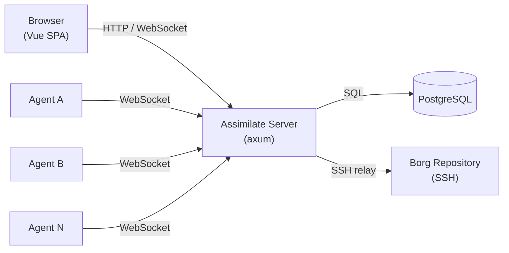
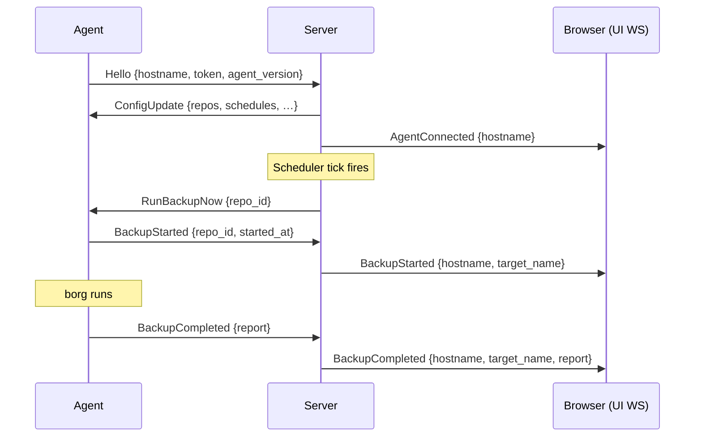
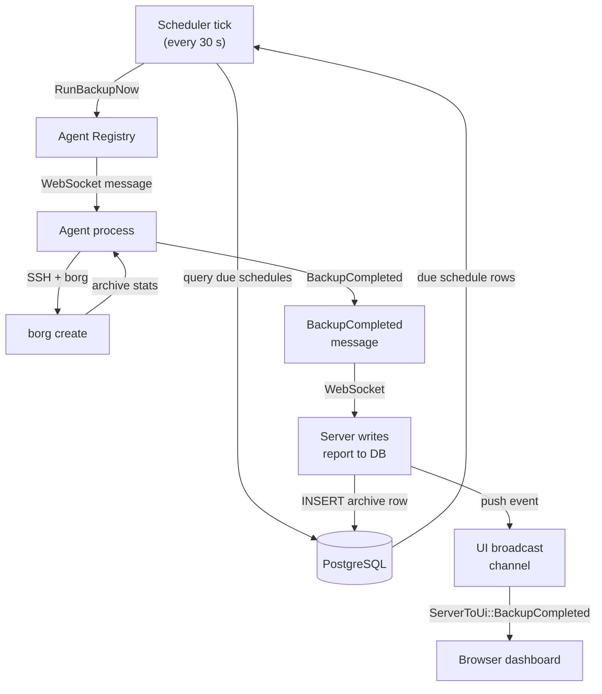

<!--
SPDX-License-Identifier: Apache-2.0
SPDX-FileCopyrightText: 2026 Alexander Mohr
-->

# Architecture Overview

This page describes the high-level architecture of Assimilate: how the server, agents, database, and borg repositories fit together, how they communicate, and how data flows through the system.

## System Overview

Assimilate follows a hub-and-spoke model. A single server process acts as the central hub. Any number of agent processes run on backup machines and connect outward to the server over WebSocket. The server stores all state in PostgreSQL and serves the Vue.js dashboard to browsers.

The server never initiates connections to agents — agents always connect outward. This means agents can run behind NAT or firewalls without any inbound port requirements. The server holds SSH keys and relays them to agents on demand so no SSH private keys need to be distributed to backup machines.

## Crate Structure

The project is a Cargo workspace with three crates and a frontend package.

| Crate / Package | Role |
|---|---|
| `crates/server` | Axum HTTP + WebSocket server. Serves the Vue SPA, exposes the REST API, manages the agent registry, runs the scheduler, and relays SSH agent connections. |
| `crates/agent` | Client binary that runs on each backup machine. Connects to the server over WebSocket, receives commands, executes borg, and reports results. |
| `crates/shared` | Domain types, the WebSocket protocol schema (`ServerToAgent`, `AgentToServer`, `ServerToUi`), and AES-256-GCM crypto utilities. Both server and agent depend on this crate. |
| `frontend/` | Vue.js 3 + Vite SPA (TypeScript). Communicates with the server via REST and a WebSocket for live updates. |

### Server internals

The server is structured around several subsystems:

- **REST API** (`api/`) — handlers for clients, repos, schedules, archives, stats, auth, tokens, RBAC, tunnels, and system settings.
- **WebSocket handlers** (`ws/`) — agent connection handler, UI broadcast channel, SSH relay endpoint.
- **Scheduler** — a background task that ticks every 30 seconds, queries due schedules from the database, and dispatches `RunBackupNow`, `RunCheckNow`, or `RunVerifyNow` messages to connected agents. A separate hourly task prunes old backup-run history (runs without an archive) and system events according to the configured retention policy. Reports that represent an actual archive are exempt, so imported archives with old timestamps are never aged out.
- **Agent registry** — an in-memory map of connected agents keyed by hostname, used to route messages from the scheduler and API to the correct WebSocket connection.
- **Tunnel manager** — manages persistent SSH reverse tunnels for agents that cannot reach the server directly.

## Communication Model

Three distinct communication channels are used:

| Channel | Parties | Purpose |
|---|---|---|
| REST API (`/api/…`) | Browser ↔ Server | CRUD operations, stats, auth |
| Agent WebSocket (`/ws/agent`) | Agent ↔ Server | Command dispatch and result reporting |
| UI WebSocket (`/ws/ui`) | Browser ↔ Server | Real-time push events (backup started/completed, agent connected/disconnected) |
| SSH relay WebSocket (`/ws/ssh-agent/:hostname/:token`) | Agent ↔ Server | SSH agent protocol forwarding |

### Agent handshake and backup sequence

After the `Hello` message is validated against the database, the server sends a `ConfigUpdate` containing the agent's full configuration. From that point on the agent is registered and the scheduler can dispatch work to it. All backup results are forwarded to connected browser sessions in real time via the UI WebSocket.

## Data Flow

The following diagram traces the full lifecycle of a scheduled backup from trigger to dashboard.

If the target agent is not connected when the scheduler fires, the trigger is skipped and the schedule's `next_run` is still advanced so the next window is not missed.

## Security Model Overview

Assimilate uses multiple layers of authentication and encryption. See [Security](security.md) for full details.

| Mechanism | Purpose |
|---|---|
| Session cookies | Browser authentication via login form |
| API tokens | Programmatic access to the REST API |
| Agent tokens | Cryptographically random 32-byte tokens that identify each agent on the WebSocket connection |
| AES-256-GCM passphrase encryption | Borg repository passphrases are encrypted at rest in the database using a key derived from `ASSIMILATE_SECRET_KEY` |
| Brute-force protection | Failed login attempts are tracked in `login_attempts`; accounts are locked after repeated failures |
| RBAC | Role-based access control with groups, roles, and per-repo permissions |

Agent tokens are validated on every WebSocket `Hello` message. Passphrases are decrypted in memory only when needed and are never logged or transmitted in plaintext.

For configuration details see [Configuration](configuration.md).

## Database Schema Overview

The PostgreSQL schema contains the following key tables. Relationships are described in plain terms; see the SQL migrations for full column definitions.

| Table | Description |
|---|---|
| `users` | Admin and operator accounts with hashed passwords and roles |
| `login_attempts` | Tracks failed logins per username for brute-force protection |
| `clients` | Registered agent machines (hostname, token hash, status) |
| `repos` | Borg repository definitions (SSH host/user/path, encrypted passphrase) |
| `schedules` | Cron-based backup, check, and verify schedules linked to a repo and client |
| `archives` | Individual borg archive records created after each successful backup |
| `tokens` | API tokens for programmatic access |
| `system_events` | Audit log of significant server-side events |

**Key relationships:**

- Each `client` can have many `repos`; each `repo` belongs to one `client`.
- Each `repo` can have many `schedules` (one per schedule type: backup, check, verify).
- Each successful backup creates one `archive` row linked to its `repo`.
- `system_events` are pruned automatically according to the configured retention policy.
