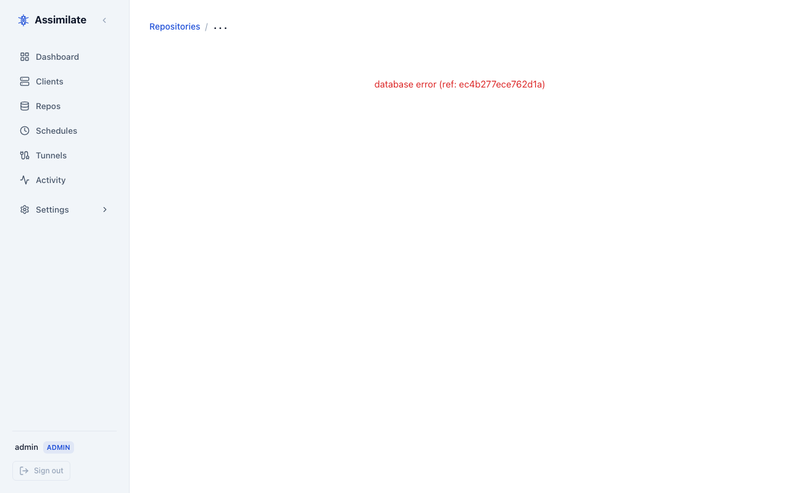

# Archive Browsing & Extraction

Archives are point-in-time snapshots created by each backup run. Assimilate lets you browse, inspect, and extract files from any archive directly in the web UI.

## Viewing Archives

Navigate to **Repos** in the sidebar, select a repository, then open the **Archives** tab. The list shows every archive stored in that repository, ordered by creation time (newest first).

The table supports **sorting** (click any column header) and **inline filtering** (type in the filter row below headers to narrow results).

Each row displays:

| Column | Description |
|--------|-------------|
| Name | Archive name (timestamp-based, see [Archive Naming](#archive-naming)) |
| Date | When the backup started |
| Host | Agent machine that created the archive |
| Size | Original (uncompressed) size of the archive |

Click an archive row to open its detail view.



## Archive Details

The detail view shows statistics reported by `borg info`:

| Stat | Description |
|------|-------------|
| Original size | Total uncompressed size of all backed-up files |
| Compressed size | Size after compression |
| Deduplicated size | Actual new data written to the repository (after deduplication across all archives) |
| File count | Number of files included |
| Duration | Elapsed time from start to end |
| Start / End | Timestamps for the backup window |

The deduplicated size is typically much smaller than the original size because borg shares identical chunks across archives. This is the number that matters for storage capacity planning.

## Browsing Archive Contents

From the archive list, click an archive to open the file tree browser in the right panel.


The browser starts at the repository root (`/`). Each entry shows:

- **Type** — file (`-`) or directory (`d`)
- **Path** — full path within the archive
- **Size** — file size in bytes
- **Modified** — last-modified timestamp
- **Mode** — Unix permission bits (e.g. `rwxr-xr-x`)

Click a directory to navigate into it. Use the breadcrumb path at the top to jump back up the tree. The browser loads up to 100 entries per directory by default; very large directories may be truncated.

## Extracting Files

To download a file from an archive:

1. Browse to the file in the archive contents view.
2. Click the **Download** icon next to the file.
3. The server streams the file directly from borg and your browser saves it with the original filename.

The download uses the correct `Content-Type` for common file types (text, images, JSON, etc.) and falls back to `application/octet-stream` for unknown extensions.

!!! warning "Large file extractions"
    Extraction streams data live from the borg repository over SSH. Downloading very large files (multi-GB) will hold an SSH connection open for the duration of the transfer. The server enforces a 5-minute timeout — extractions that exceed this limit are cancelled. For large restores, consider running `borg extract` directly on the agent machine or repository host.

Only users with the **extract** permission on the repository can download files. Users with view-only access can browse archive contents but cannot download.

## Archive Naming

Borg names archives using a timestamp prefix by default. Assimilate passes the archive name to borg at backup time using the format:

```text
{hostname}-{schedule_type}-{YYYY-MM-DDTHH:MM:SS}
```

For example: `webserver-backup-2024-03-15T02:00:01`

The hostname comes from the agent machine. The schedule type is `backup`, `check`, or `verify`. You cannot rename archives after they are created — borg does not support in-place rename.

To use a custom prefix, configure the archive prefix in the repository's schedule settings. See [Scheduling](scheduling.md) for details.

## File Search

Assimilate can search for files by name within a single archive or across all archives in a repository.

### Search Within an Archive

From the archive detail view, click **Search** and enter a file name or glob pattern (e.g. `*.log`, `config.yaml`). The results list matching paths with their size and modification time.

### Cross-Archive Search

From the repository's **Archives** tab, click **Search All Archives**. Enter a file name or glob pattern. The results show every archive that contains a matching path, allowing you to locate which backup snapshot holds a particular file version.

!!! tip
    Cross-archive search scans the index for each archive and may take a few seconds on repositories with many archives. The search is read-only and does not extract file data.

## Archive Diff

Compare two archives to see what changed between backup runs.

1. On the repository's **Archives** tab, select two archives using the checkboxes.
2. Click **Diff**.
3. The diff view lists every path that was added, removed, or modified between the two archives.

Each row in the diff shows:

| Column | Description |
|--------|-------------|
| **Status** | `added`, `removed`, or `modified` |
| **Path** | Full path within the archive |
| **Old size** | File size in the older archive (blank for added files) |
| **New size** | File size in the newer archive (blank for removed files) |

!!! note
    The diff compares path-level metadata. It does not show line-level content differences for text files.

## Exporting as tar.lz4

To download an entire archive or a subtree as a compressed tar archive:

1. Open the archive detail view.
2. Click **Export**.
3. Optionally specify a sub-path to export only part of the archive tree.
4. Click **Download tar.lz4**. The server pipes `borg export-tar` output through lz4 compression and streams it to your browser.

!!! warning "Large exports"
    Exporting a full archive streams all data live from the borg repository. Exports of large archives (multi-GB) may take several minutes. The server enforces a 10-minute streaming timeout. For very large restores, run `borg export-tar` directly on the agent machine.

The exported file is named `<archive-name>.tar.lz4`. You can decompress it with:

```bash
lz4 -d <archive-name>.tar.lz4 | tar -x
```

## Archive Tags

Tags are short labels you can attach to archives to mark significant snapshots (e.g. `pre-upgrade`, `weekly-baseline`, `release-1.2`).

### Adding Tags

From the archive detail view, click **Edit Tags** and enter one or more comma-separated tags. Tags are stored as archive metadata and persist across retention-policy runs — tagged archives are never pruned automatically.

!!! warning
    Pinned archives consume repository space indefinitely. Remove tags from archives you no longer need to retain.

### Filtering by Tag

On the repository's **Archives** tab, use the **Tag** filter dropdown to show only archives with a specific tag. This is useful for locating baseline snapshots among a long list of daily archives.

### Removing Tags

Open the archive detail view, click **Edit Tags**, remove the desired tag, and save. Once all tags are removed the archive is subject to normal retention-policy pruning on the next backup run.

## Pruning Archives

Old archives are removed automatically after each successful backup run according to the retention policy configured on the schedule. The policy controls how many daily, weekly, monthly, and yearly archives to keep.

Retention settings are per-schedule. See [Scheduling](scheduling.md) for how to configure `keep_daily`, `keep_weekly`, `keep_monthly`, and `keep_yearly`.

Manual pruning through the UI is not available. To prune outside of the normal schedule, run `borg prune` directly on the repository host or trigger a backup run (which includes pruning) from the [Repositories](repositories.md) page.

## Archive Integrity

Borg uses content-addressed, deduplicated chunk storage. Every chunk is identified by a cryptographic hash (BLAKE2b or SHA-256 depending on the encryption mode). This means:

- **Deduplication is automatic** — identical data across archives is stored once.
- **Corruption is detectable** — borg verifies chunk hashes on read. A corrupted chunk causes an error rather than silently returning bad data.

To actively verify repository integrity, run a **Check** schedule (see [Scheduling](scheduling.md)). A check reads all chunks and verifies their hashes without extracting files.

If the repository is corrupted beyond what borg can repair, the affected archives may become unreadable. Assimilate surfaces borg error output in the backup report. For recovery options, refer to the [BorgBackup documentation](https://borgbackup.readthedocs.io/en/stable/usage/check.html).

<!--
SPDX-License-Identifier: Apache-2.0
SPDX-FileCopyrightText: 2026 Alexander Mohr
-->
