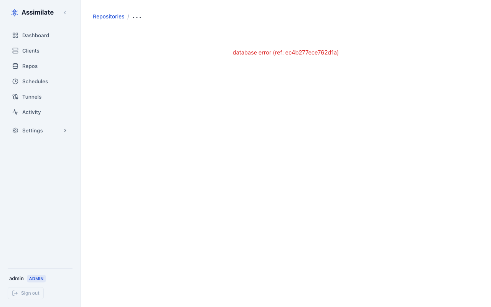
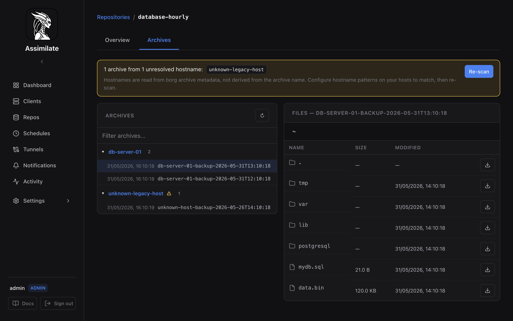

# Archive Browsing & Extraction

Archives are point-in-time snapshots created by each backup run. Assimilate lets you browse, inspect, and extract files from any archive directly in the web UI.

## Viewing Archives

Navigate to **Repos** in the sidebar, select a repository, then open the **Archives** tab. The list shows every archive stored in that repository.

You can also browse archives per schedule: open a schedule's detail view and switch to the **Backups** tab (see [Scheduling](scheduling.md#browsing-archives-from-a-schedule)). This shows only the archives created by that specific schedule, with the same file browser panel for browsing and extraction.

All three places — the repository's **Archives** tab, a schedule's **Backups** tab, and the standalone **Archives** page — use the same archive selector and file browser, so the controls, the row layout and the available actions are identical wherever you reach them from.

Above the list are three controls:

| Control | What it does |
|---------|--------------|
| Search | Narrows the list to archives whose **name or host** contains what you type |
| Sort | Orders by **date**, **original size**, or **deduplicated size**, ascending or descending |
| By host / Flat | Groups the archives under one header per host, or lists them flat |

In **By host** mode each group header carries the hostname, the number of archives it holds and their **total original size**, so a collapsed group still tells you something. Groups start open; on a repository holding archives from more than three hosts they start collapsed instead, and you click a header to expand one.

Each row shows the archive name and its original size on the first line, then the host, the backup's start time and the deduplicated size underneath. A host that borg recorded but no agent claims is marked with an amber stripe — see [Re-scanning Unmatched Archives](repositories.md#re-scanning-unmatched-archives).

Click a row to open the archive in the file browser on the right. Administrators also get a **delete** button on every row; it is always visible, not revealed on hover.



### Viewing a Single Archive

Links that point at one specific archive (for example from a host's backup history) open the **Archives** tab with an `?archive=<name>` query parameter. In this mode the page shows only a **Showing only `<name>`** banner and the file browser for that archive — the archive list, search box, sort selector, and group toggle are hidden, since none of them apply to a single result.

Click **Show all archives** in the banner to clear the filter and return to the full list.

## Archive Details

The detail view shows statistics reported by `borg info`:

| Stat | Description |
|------|-------------|
| Original size | Total uncompressed size of all backed-up files |
| Compressed size | Size after compression |
| Deduplicated size | Actual new data written to the repository (after deduplication across all archives) |
| File count | Number of files included |
| Duration | Elapsed time from start to end |
| Start / End | Timestamps for the backup window |

The deduplicated size is typically much smaller than the original size because borg shares identical chunks across archives. This is the number that matters for storage capacity planning.

## Browsing Archive Contents

Archives can be browsed from three places in the UI, all of them the same component:

**Repositories page:** From the archive list on a repository detail view, click an archive to open the file tree browser in the right panel.

**Schedule detail page (Backups tab):** For backup-type schedules, the **Backups** tab lists every archive produced by the schedule. Select an archive from the left panel to browse its contents in the right panel. This lets you find the most recent backup of a file without leaving the schedule view. Because it is the same selector, a schedule that targets several hosts groups its archives by host here too, and administrators can delete an archive from this tab.

**Archives page:** The standalone **Archives** page adds a repository picker, the restore wizard and the archive diff above the same two panes.



The browser starts at the repository root (`/`). Each entry shows:

- **Type** — file (`-`) or directory (`d`)
- **Path** — full path within the archive
- **Size** — file size in bytes
- **Modified** — last-modified timestamp
- **Mode** — Unix permission bits (e.g. `rwxr-xr-x`)

Click a directory to navigate into it. Use the breadcrumb path at the top to jump back up the tree. The browser loads up to 100 entries per directory by default; very large directories may be truncated.

The browser header names the archive and carries the actions that apply to the whole of it: **Download**, and for administrators **Restore** and **Delete**. Under it, a bar of chips reports the archive's host (a link to that host), its start time and both its original and deduplicated sizes.

Each table row has its own **Download** and, for administrators, **Restore to host** action. Restore writes the selected file or directory back to its original path on the archive's host. The `.` row is the directory you are currently looking at, so downloading or restoring it takes that whole subtree.

New archives from successful backup runs are recorded and indexed in the background immediately after the backup report is saved. Archives discovered later through repository sync are also queued for indexing. Older archives that have not been indexed yet are indexed on first browse.

The index is stored one compressed record per directory rather than one row per file, which is how the browser reads it. This keeps the index small even for repositories with many archives of the same file tree — on a repository whose index had grown to 10 GB, the packed layout is roughly a quarter of the size. Directories with very large numbers of entries are split across several records so that a listing only reads the part it displays.

!!! note "Indexes rebuild after upgrading"
    The content index is derived data, so upgrading to a release that changes its storage layout discards the existing index instead of converting it. Archives are re-indexed automatically the next time they are browsed, or through **Sync now**. Nothing else is lost: archive tags, backup reports, and the archives themselves are unaffected.

## Extracting Files

To download a file from an archive:

1. Browse to the file in the archive contents view.
2. Click the **Download** icon next to the file.
3. The server streams the file directly from borg and your browser saves it with the original filename.

To download the whole archive as `tar.lz4`, click **Download** in the browser header. To restore a file or directory in place, click **Restore to host** on its row; to restore the whole archive, use **Restore** in the header. Both ask for confirmation first.

Administrators can permanently remove an archive from either **Delete** in the browser header or the delete button on its row in the archive list. Both open the same confirmation and delete the borg archive itself, the imported report, and any archive tags.

The `borg delete` runs in the background on the server so the UI is never blocked while it works. The repository detail page shows a **Deleting archive** indicator while the operation is in progress, and the archive disappears from the list once borg finishes. If the deletion fails, the archive remains in the list and a `archive_delete_failed` system event records the reason.

All server-side borg operations for a repository (backup, sync, content indexing, and archive deletion) run **sequentially** through a per-repository queue, so they never contend for the borg repository lock. Deleting several archives at once no longer returns a conflict — each deletion is queued and runs in turn, and the indicator shows how many operations are waiting (for example, *Deleting archive (+3 queued)*). Once the deletion queue drains, the archive list and the repository's total archive count are reconciled from borg (without re-reading file contents), so the count stays accurate.

Deleting an archive only unlinks it from the repository's manifest — the segment data it referenced is not reclaimed until the repository is compacted. Assimilate automatically runs `borg compact` after each successful archive deletion to reclaim that space, shown as a **Compacting repository** indicator. If the compact itself fails, the deletion still stands — the failure is logged as an `archive_compact_failed` system event and the freed space is reclaimed on the next opportunity (for example, a scheduled backup's own compact step).

To pull in new archives and index their contents, use **Sync now** (admin only), which re-reads the repository from borg and indexes any archives that are not already indexed.

!!! warning "Restores overwrite files"
    Restoring writes directly to the original filesystem location on the matched host. Existing files may be overwritten without another prompt from borg.

The download uses the correct `Content-Type` for common file types (text, images, JSON, etc.) and falls back to `application/octet-stream` for unknown extensions.

!!! note "Large file extractions"
    Extraction streams data live from the borg repository over SSH and is not time-limited by the server. Downloading very large files (multi-GB) will hold an SSH connection open for the duration of the transfer. For large restores, consider running `borg extract` directly on the agent machine or repository host.

Only users with the **extract** permission on the repository can download files. Users with view-only access can browse archive contents but cannot download.

## Archive Naming

Borg names archives using a timestamp prefix by default. Assimilate passes the archive name to borg at backup time using the format:

```text
{hostname}-{schedule_type}-{YYYY-MM-DDTHH:MM:SS}
```

For example: `webserver-backup-2024-03-15T02:00:01`

The hostname comes from the agent machine. The schedule type is `backup`, `check`, or `verify`. You cannot rename archives after they are created — borg does not support in-place rename.

To use a custom prefix, configure the archive prefix in the repository's schedule settings. See [Scheduling](scheduling.md) for details.

## File Search

Assimilate can search for files by name within a single archive or across all archives in a repository.

### Search Within an Archive

From the archive detail view, click **Search** and enter a file name or glob pattern (e.g. `*.log`, `config.yaml`). The results list matching paths with their size and modification time.

### Cross-Archive Search

From the repository's **Archives** tab, click **Search All Archives**. Enter a file name or glob pattern. The results show every archive that contains a matching path, allowing you to locate which backup snapshot holds a particular file version.

!!! tip
    Cross-archive search scans the index for each archive and may take a few seconds on repositories with many archives. The search is read-only and does not extract file data.

## Archive Diff

Compare two archives to see what changed between backup runs.

1. On the repository's **Archives** tab, select two archives using the checkboxes.
2. Click **Diff**.
3. The diff view lists every path that was added, removed, or modified between the two archives.

Each row in the diff shows:

| Column | Description |
|--------|-------------|
| **Status** | `added`, `removed`, or `modified` |
| **Path** | Full path within the archive |
| **Old size** | File size in the older archive (blank for added files) |
| **New size** | File size in the newer archive (blank for removed files) |

!!! note
    The diff compares path-level metadata. It does not show line-level content differences for text files.

## Exporting as tar.lz4

To download an entire archive or a subtree as a compressed tar archive:

1. Open the archive detail view.
2. Click **Export**.
3. Optionally specify a sub-path to export only part of the archive tree.
4. Click **Download tar.lz4**. The server pipes `borg export-tar` output through lz4 compression and streams it to your browser.

!!! note "Large exports"
    Exporting a full archive streams all data live from the borg repository and is not time-limited by the server. Exports of large archives (multi-GB) may take several minutes. For very large restores, run `borg export-tar` directly on the agent machine.

The exported file is named `<archive-name>.tar.lz4`. You can decompress it with:

```bash
lz4 -d <archive-name>.tar.lz4 | tar -x
```

## Archive Tags

Tags are short labels you can attach to archives to mark significant snapshots (e.g. `pre-upgrade`, `weekly-baseline`, `release-1.2`).

### Adding Tags

From the archive detail view, click **Edit Tags** and enter one or more comma-separated tags. Tags are stored as archive metadata and persist across retention-policy runs — tagged archives are never pruned automatically.

!!! warning
    Pinned archives consume repository space indefinitely. Remove tags from archives you no longer need to retain.

### Filtering by Tag

On the repository's **Archives** tab, use the **Tag** filter dropdown to show only archives with a specific tag. This is useful for locating baseline snapshots among a long list of daily archives.

### Removing Tags

Open the archive detail view, click **Edit Tags**, remove the desired tag, and save. Once all tags are removed the archive is subject to normal retention-policy pruning on the next backup run.

## Pruning Archives

Old archives are removed automatically after each successful backup run according to the retention policy configured on the schedule. The policy controls how many daily, weekly, monthly, and yearly archives to keep.

Retention settings are per-schedule. See [Scheduling](scheduling.md) for how to configure `keep_daily`, `keep_weekly`, `keep_monthly`, and `keep_yearly`.

Manual pruning through the UI is not available. To prune outside of the normal schedule, run `borg prune` directly on the repository host or trigger a backup run (which includes pruning) from the [Repositories](repositories.md) page.

## Archive Integrity

Borg uses content-addressed, deduplicated chunk storage. Every chunk is identified by a cryptographic hash (BLAKE2b or SHA-256 depending on the encryption mode). This means:

- **Deduplication is automatic** — identical data across archives is stored once.
- **Corruption is detectable** — borg verifies chunk hashes on read. A corrupted chunk causes an error rather than silently returning bad data.

To actively verify repository integrity, run a **Check** schedule (see [Scheduling](scheduling.md)). A check reads all chunks and verifies their hashes without extracting files.

If the repository is corrupted beyond what borg can repair, the affected archives may become unreadable. Assimilate surfaces borg error output in the backup report. For recovery options, refer to the [BorgBackup documentation](https://borgbackup.readthedocs.io/en/stable/usage/check.html).

<!--
SPDX-License-Identifier: Apache-2.0
SPDX-FileCopyrightText: 2026 Alexander Mohr
-->
