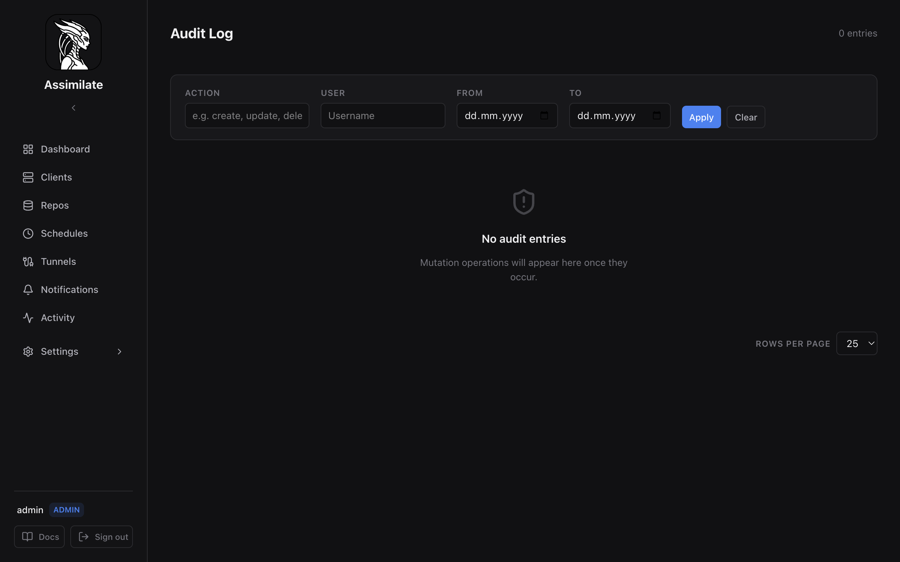

<!--
SPDX-License-Identifier: Apache-2.0
SPDX-FileCopyrightText: 2026 Alexander Mohr
-->

# Audit Log

The audit log records every state-changing action performed through the Assimilate web UI or REST API. Use it to trace who made a change, when, and from which IP address.

## Accessing the Audit Log

Navigate to **Settings → Access Control → Audit Log**. The log is available to users with the **admin** role only.

## Log Entries

Each entry includes:

| Field | Description |
|-------|-------------|
| **Timestamp** | UTC time the action was recorded |
| **User** | Username that performed the action (or `system` for scheduler-triggered actions) |
| **IP Address** | Source IP of the request |
| **Action** | Category of the action (see [Action Categories](#action-categories)) |
| **Resource** | Type and identifier of the affected resource (e.g. `schedule:42`, `host:webserver`) |
| **Detail** | Human-readable summary of what changed |

## Action Categories

| Category | Examples |
|----------|---------|
| `auth` | Login, logout, failed login attempt, password change |
| `user` | User created, role changed, user deleted |
| `host` | Host registered, host deleted, agent token rotated |
| `repository` | Repository created, passphrase changed, repository deleted |
| `schedule` | Schedule created, schedule edited, schedule deleted, manual trigger |
| `archive` | Archive tagged, tag removed, archive deleted |
| `restore` | Agent-side restore triggered, browser download initiated |
| `key` | Key exported, key imported |
| `quota` | Quota configured, quota threshold changed |
| `settings` | System settings changed |

## Filtering

Use the filter bar at the top of the page to narrow results by:

- **Date range** — start and end date/time
- **User** — filter to a specific username
- **Action category** — show only one type of action
- **Resource** — enter a resource type or identifier

Filters are combined with AND logic.

## Retention

Audit log entries are retained for 90 days by default. Configure the retention period in **Settings → Audit Log**. Entries older than the retention period are deleted on a nightly cleanup job.

!!! warning
    Reducing the retention period permanently deletes older entries. This action is irreversible.

## Exporting

Click **Export CSV** to download a filtered view of the audit log as a CSV file. The export respects the currently active filters.

## Related Pages

- [Access Control](access-control.md) — roles and permissions
- [Security](security.md) — authentication and session management
- [Profile & Preferences](profile.md) — per-user session and token management
