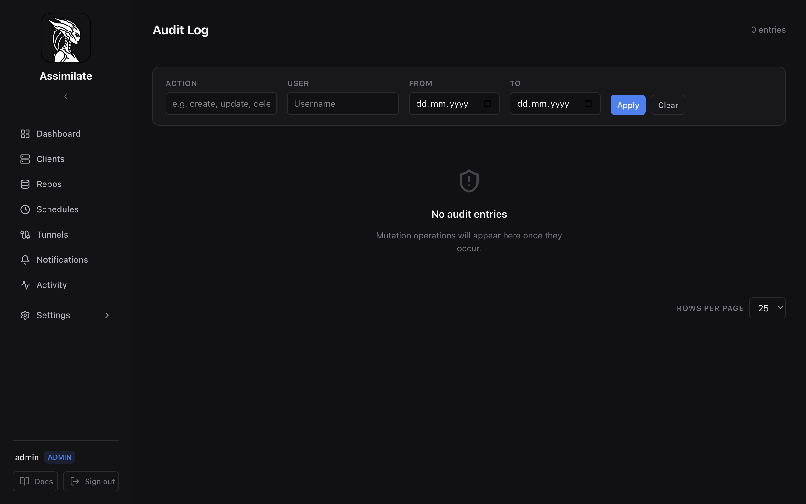

<!--
SPDX-License-Identifier: Apache-2.0
SPDX-FileCopyrightText: 2026 Alexander Mohr
-->

# Audit Log

The audit log records every state-changing action performed through the Assimilate web UI or REST API. Use it to trace who made a change, when, and from which IP address.

## Accessing the Audit Log

Navigate to **Settings → Access Control → Audit Log**. The log is available to users with the **admin** role only.

## Log Entries

Each entry includes:

| Field | Description |
|-------|-------------|
| **Timestamp** | UTC time the action was recorded |
| **User** | Username that performed the action (or `system` for scheduler-triggered actions) |
| **IP Address** | Source IP of the request |
| **Action** | What was done (see [Recorded Actions](#recorded-actions)) |
| **Resource** | Type and identifier of the affected resource (e.g. `archive:3`, `repo:7`) |
| **Details** | The action's own details, when it records any; expand a row to see them |

## Recorded Actions

Each action records a fixed set of details:

| Action | Details |
|--------|---------|
| `delete_archive` | `archive`: the deleted archive |
| `download_files` | `archive` and the downloaded `paths` inside it |
| `restore_files` | `archive`, the restored `paths`, the `target_path` on the agent and its `hostname` |
| `key_export` | none |
| `key_import` | none |
| `key_change_passphrase` | none |
| `migrate_encryption` | the encryption mode it had (`from`), the one it has now (`to`), and where the original repository was preserved (`migrated_path`) |

## Filtering

Use the filter bar at the top of the page to narrow results by:

- **Date range** — start and end date/time
- **User** — filter to a specific username
- **Action** — show only one action, e.g. `delete_archive`
- **Resource** — enter a resource type or identifier

Filters are combined with AND logic.

## Retention

Audit log entries are retained for 90 days by default. Configure the retention period in **Settings → Audit Log**. Entries older than the retention period are deleted on a nightly cleanup job.

!!! warning
    Reducing the retention period permanently deletes older entries. This action is irreversible.

## Exporting

Click **Export CSV** to download a filtered view of the audit log as a CSV file. The export respects the currently active filters.

## Related Pages

- [Access Control](access-control.md) — roles and permissions
- [Security](security.md) — authentication and session management
- [Profile & Preferences](profile.md) — per-user session and token management
