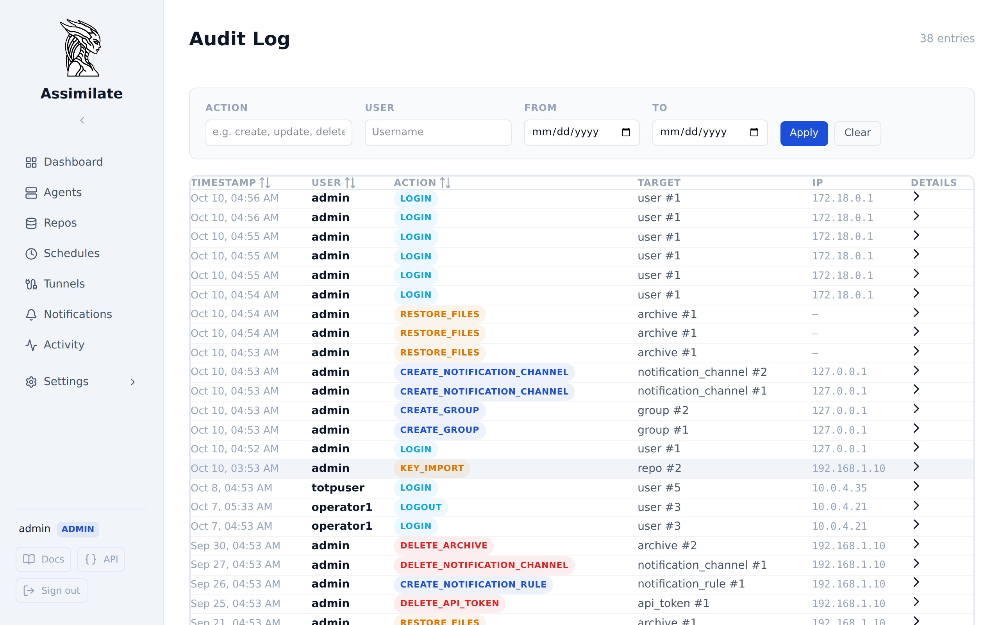

<!--
SPDX-License-Identifier: Apache-2.0
SPDX-FileCopyrightText: 2026 Alexander Mohr
-->

# Audit Log

The audit log records every state-changing action performed through the Assimilate web UI or REST API. Use it to trace who made a change, when, and from which IP address.

## Accessing the Audit Log

Navigate to **Settings → Access Control → Audit Log**. The log is available to users with the **admin** role only.

## Log Entries

Each entry includes:

| Field | Description |
|-------|-------------|
| **Timestamp** | UTC time the action was recorded |
| **User** | Username that performed the action (or `system` for scheduler-triggered actions) |
| **IP Address** | Source IP of the request |
| **Action** | What was done (see [Recorded Actions](#recorded-actions)) |
| **Resource** | Type and identifier of the affected resource (e.g. `archive:3`, `repo:7`) |
| **Details** | The action's own details, when it records any; expand a row to see them |

## Recorded Actions

Each action records a fixed set of details. Sign-ins and the user, role, permission, token and notification changes below also record the IP address the request came from.

### Archives and repository keys

| Action | Details |
|--------|---------|
| `delete_archive` | `archive`: the deleted archive |
| `download_files` | `archive` and the downloaded `paths` inside it |
| `restore_files` | `archive`, the restored `paths`, the `target_path` on the agent and its `hostname` |
| `key_export` | none |
| `key_import` | none |
| `key_change_passphrase` | none |
| `set_repo_passphrase` | none |
| `migrate_encryption` | the encryption mode it had (`from`), the one it has now (`to`), and where the original repository was preserved (`migrated_path`) |

### Sign-ins

| Action | Resource | Details |
|--------|----------|---------|
| `login` | `user` | `method`: how the user proved who they are, `password`, `totp` or `recovery_code` |
| `logout` | `user` | none |

A login is recorded only once it completes, so an account with two-factor authentication gets one `login` entry after the TOTP or recovery code step, not one for the password. Failed logins are not audit entries; they count toward the login rate limit and account lockout instead.

### Users, roles and permissions

| Action | Resource | Details |
|--------|----------|---------|
| `create_user` | `user` | `username` |
| `delete_user` | `user` | `username` |
| `reset_password` | `user` | the `username` whose password an admin set |
| `set_user_roles` | `user` | `username`, and the role names it held `before` and holds `after` |
| `create_group` | `group` | `name` |
| `update_group` | `group` | its `name` now and its `previous_name` |
| `delete_group` | `group` | `name` |
| `set_group_members` | `group` | the `group` name, and the usernames of its members `before` and `after` |
| `create_role` | `role` | `name` and the `permissions` it grants |
| `update_role` | `role` | its `name` now, its `previous_name`, and the permissions it granted `before` and grants `after` |
| `delete_role` | `role` | `name` |
| `set_repo_permission` | `repo` | the `username`, and what they held on the repository `before` and hold `after` (`view`, `backup`, `modify_schedules`, `extract`, `delete`) |

### Tokens

| Action | Resource | Details |
|--------|----------|---------|
| `create_api_token` | `api_token` | the token's `name` |
| `delete_api_token` | `api_token` | the token's `name` and its `owner` |
| `regenerate_agent_token` | `agent` | the agent's `hostname` and `domain` |

### Notifications

| Action | Resource | Details |
|--------|----------|---------|
| `create_notification_channel` | `notification_channel` | `name` and `channel_type` |
| `update_notification_channel` | `notification_channel` | its `name` now and its `channel_type` |
| `delete_notification_channel` | `notification_channel` | `name` and `channel_type` |
| `create_notification_rule` | `notification_rule` | the `channel_id`, the `event_type` routed, and the `repo_id` or `agent_id` it is limited to |
| `delete_notification_rule` | `notification_rule` | the same fields as `create_notification_rule` |
| `set_vapid_keys` | none | none |

!!! note
    No entry ever records a secret: not a password, an API or agent token, a VAPID key, or a notification channel's configuration, which can hold a webhook header or an SMTP password. An entry records that the change happened, who made it and what it applied to.

## Filtering

Use the filter bar at the top of the page to narrow results by:

- **Date range** — start and end date/time
- **User** — filter to a specific username
- **Action** — show only one action, e.g. `delete_archive`
- **Resource** — enter a resource type or identifier

Filters are combined with AND logic.

## Retention

Audit log entries are retained for 90 days by default. Configure the retention period in **Settings → Audit Log**. Entries older than the retention period are deleted on a nightly cleanup job.

!!! warning
    Reducing the retention period permanently deletes older entries. This action is irreversible.

## Exporting

Click **Export CSV** to download a filtered view of the audit log as a CSV file. The export respects the currently active filters.

## Related Pages

- [Access Control](access-control.md) — roles and permissions
- [Security](security.md) — authentication and session management
- [Profile & Preferences](profile.md) — per-user session and token management
