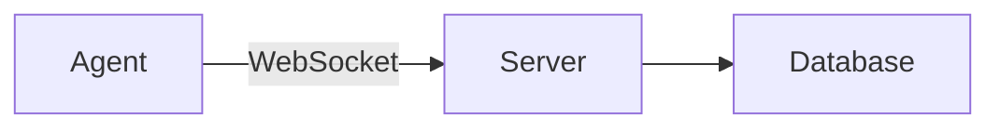

# Documentation Style Guide

This guide defines the writing conventions for all Assimilate documentation. Follow it when adding or editing any page under `docs/`.

---

## Audience

Readers are infrastructure administrators comfortable with Linux, Docker, and SSH. Basic familiarity with [BorgBackup](https://borgbackup.readthedocs.io/) is assumed.

Do not re-explain borg concepts. Link to the [BorgBackup documentation](https://borgbackup.readthedocs.io/) instead.

---

## Voice and Tone

- **Technical and direct.** No filler phrases ("simply", "just", "easy", "straightforward").
- **Imperative mood.** Start instructions with a verb: "Run...", "Configure...", "Add...", "Set...".
- **Present tense only.** Document what the system does now. Never use "will" or "planned".
- **One idea per sentence.** Keep paragraphs short — three to five sentences maximum.

---

## Page Structure

Every page must follow this order:

1. **H1 title** — matches the nav entry in `mkdocs.yml`.
2. **Intro paragraph** — one paragraph: what this feature does and when to use it.
3. **Prerequisites** (if applicable) — link to what must be set up first.
4. **Main content** — numbered steps for procedures, H2 sections for reference material.
5. **Configuration reference table** — if the page covers configurable options.
6. **Related pages** — at least one link to a related page.

---

## Code Blocks

Always specify the language fence:

- ` ```bash ` — shell commands
- ` ```yaml ` — YAML configuration
- ` ```rust ` — Rust source
- ` ```typescript ` — TypeScript source
- ` ```toml ` — TOML configuration
- ` ```ini ` — INI / systemd unit files

Include expected output after commands where it helps the reader verify success.

Use `<placeholder>` notation for values the reader must supply:

```bash
BORG_AGENT_TOKEN=<token> cargo run -p agent
```

---

## Configuration Tables

Use this column order and format for all configuration reference tables:

| Variable | Default | Required | Description |
|----------|---------|----------|-------------|
| `DATABASE_URL` | — | Yes | PostgreSQL connection string |
| `ASSIMILATE_BIND_ADDR` | `0.0.0.0:8080` | No | Address and port the server listens on |

- Use `—` (em dash) when there is no default.
- Mark required fields as **Yes**; optional fields as **No**.
- Wrap variable names in backticks.

---

## Admonitions

Use MkDocs Material admonitions for callouts. Pick the type that matches the content:

```markdown
!!! warning "Security"
    Changing this value after initial setup makes existing encrypted data unrecoverable.
```

```markdown
!!! tip
    Use `borg serve --append-only` to prevent agents from deleting archives.
```

```markdown
!!! note
    The agent reconnects automatically if the WebSocket connection drops.
```

```markdown
!!! example
    See the [Quick Start](../getting-started/quick-start.md) for a complete working setup.
```

| Type | Use for |
|------|---------|
| `warning` | Security-sensitive items, data loss risks, irreversible actions |
| `tip` | Optional enhancements, performance improvements |
| `note` | Clarifications, edge cases, non-obvious behaviour |
| `example` | Complete working examples, links to example pages |

---

## Cross-linking

- Use relative markdown links: `[text](../page.md)` or `[text](../section/page.md)`.
- Never use absolute URLs for internal doc pages.
- Every page must link to at least one related page.

---

## Screenshots

Reference screenshots with descriptive alt text:

```markdown

```

- Alt text must describe what is shown, not just name the feature.
- Screenshots are generated by Playwright — do not create them manually.
- Use a placeholder comment when the screenshot does not exist yet:

```markdown
<!-- screenshot: agents-status -->
```

---

## Mermaid Diagrams

Use fenced code blocks with the `mermaid` language tag:

````markdown

````

- Use `flowchart LR` for architecture and data flow diagrams.
- Use `sequenceDiagram` for protocol and request/response flows.
- Keep diagrams under 20 nodes.
- Follow every diagram with a plain-text description of what it shows.

---

## Example Page

The following is a minimal example demonstrating all patterns in use. Use it as a template when creating new pages.

---

### Example: Configuring Backup Schedules

Backup schedules define when the agent runs `borg create` on a host. Configure a schedule per host in the UI or via the API.

**Prerequisites:** The host must be registered and its agent must be connected. See [Getting Started](../getting-started.md).

**Steps:**

1. Open the **Agents** page and select a host.
2. Click **Edit Schedule**.
3. Set the cron expression:

    ```bash
    # Run at 02:00 every day
    0 2 * * *
    ```

4. Click **Save**. The agent picks up the new schedule on its next heartbeat.

!!! warning "Overlapping schedules"
    If a backup is already running when the next schedule fires, the new run is skipped. Increase the interval or reduce backup size to avoid this.

**Configuration reference:**

| Field | Default | Required | Description |
|-------|---------|----------|-------------|
| `cron` | — | Yes | Cron expression for the backup schedule |
| `timezone` | `UTC` | No | Timezone for cron evaluation |

**Related pages:** [Scheduling](../scheduling.md) · [Security](../security.md)

<!--
SPDX-License-Identifier: Apache-2.0
SPDX-FileCopyrightText: 2026 Alexander Mohr
-->
