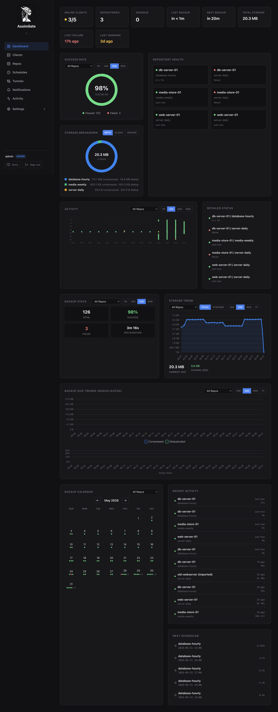

# Dashboard

The Dashboard is an operational summary of current backup risk, fleet protection, upcoming work, and repository capacity. It intentionally does not repeat every schedule-target assignment; use the Schedules and Activity pages for target-level history.

## Summary

The top row uses explicit entity counts:

| Counter | Definition |
|---------|------------|
| **Protected Hosts** | Eligible visible hosts with at least one enabled backup assignment and at least one successful run for an enabled assignment. |
| **Needs Attention** | Current actionable findings after target-level symptom deduplication. |
| **Running Operations** | Persisted backup operations that are currently running. |
| **Storage** | Current deduplicated size summed once per enabled repository from authoritative Borg repository statistics. |

Eligible hosts are registered clients that are not hidden and are not imported placeholder clients. Hidden and imported clients do not affect the coverage denominator.

## Needs Attention

Needs Attention contains only actionable findings. Critical findings appear before warnings. For one schedule target, overlapping failed, warning, overdue, never-succeeded, and offline-due-soon symptoms collapse to the highest-priority finding.

Findings include the affected host, schedule, or repository, the reason, an age or deadline when available, and a direct link to the relevant detail or activity record. Current finding types cover:

- Latest failed or warning backup for an enabled schedule target.
- Overdue enabled schedule targets based on the schedule cron expression and a 30-minute grace window.
- Enabled targets that have run but have never succeeded.
- Offline hosts with an enabled schedule due within two hours.
- Eligible hosts with no enabled backup assignment.
- Enabled repositories with no enabled backup schedule.
- Repository quota warning and critical states.
- Repository import failures with reliable persisted error state.

An empty list displays **No active problems**.

## Protection Coverage

Protection Coverage compares protected hosts with all eligible visible hosts. It separately reports hosts with no enabled assignment, enabled schedule targets that have never succeeded, and hosts whose assignments are all disabled.

Select the coverage score or any reported condition to open the Clients page with the corresponding coverage filter applied.

Disabled schedules do not protect a host. An imported placeholder or intentionally hidden host is excluded rather than silently reducing fleet coverage.

## Upcoming Work

Upcoming Work combines persisted running backups with the next enabled schedule runs. Upcoming entries are grouped once per schedule and show the number of assigned targets and how many of those agents are currently offline.

Select an entry to open its activity record or schedule configuration.

## Repository Capacity

Repository Capacity shows one row per enabled repository with current deduplicated size and configured quota utilization. Quota state is displayed as unconfigured, healthy, warning, or critical.

The current repository schema does not provide enough authoritative historical samples for defensible growth and exhaustion estimates. The dashboard therefore displays **Insufficient history** instead of extrapolating from incomplete data.

## Other Visualizations

Success rate, storage breakdown, activity timeline, backup statistics, storage trends, backup size trends, calendar, recent activity, and next scheduled visualizations remain available below the operational sections. These support historical analysis without replacing the Schedules, Hosts, Repositories, or Activity pages.

## Real-Time Updates

The dashboard refreshes when a backup starts or completes, an agent connects or disconnects, or the WebSocket reconnects.

## Related Pages

- [Activity Log](activity.md) for complete backup history and server logs.
- [Scheduling & Retention](scheduling.md) for schedule-target configuration.
- [Host & Agent Management](hosts.md) for registered host details.
- [Repository Management](repositories.md) for repository and quota configuration.

<!--
SPDX-License-Identifier: Apache-2.0
SPDX-FileCopyrightText: 2026 Alexander Mohr
-->
