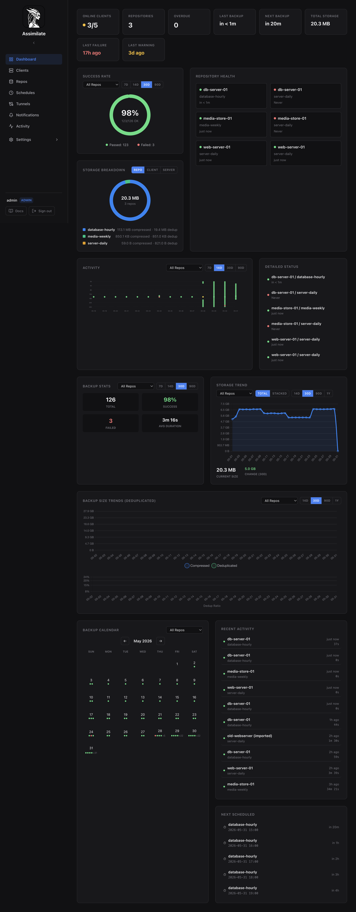
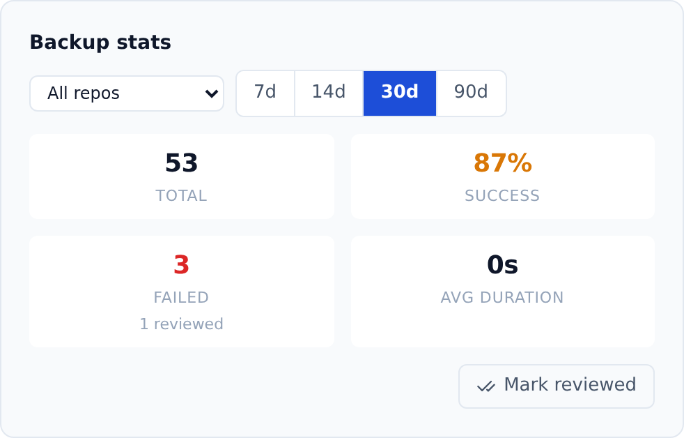

# Dashboard

The Dashboard is an operational summary of current backup risk, fleet protection, upcoming work, and repository capacity. It intentionally does not repeat every schedule-target assignment; use the Schedules and Activity pages for target-level history.

## Layout

Below the counter tiles, Backup Stats and Protection Coverage sit side by side. The panels under them are arranged in two columns: Needs Attention, Backup Calendar, and Repository Capacity on the left; Upcoming Work and Recent Activity on the right. Each column is an independent stack, so a hidden or short panel is followed by the next panel in its column rather than leaving a gap beside a taller neighbour.

The Backup Calendar needs the full width of a half-page column to render a seven-day month grid, so below 1024px the two columns fold into a single full-width column.

## Summary

The top row uses explicit entity counts:

| Counter                | Definition                                                                                                                     |
| ---------------------- | ------------------------------------------------------------------------------------------------------------------------------ |
| **Protected Agents**   | Eligible visible agents with at least one enabled backup assignment and at least one successful run for an enabled assignment. |
| **Needs Attention**    | Current actionable findings after target-level symptom deduplication.                                                          |
| **Running Operations** | Persisted backup operations that are currently running.                                                                        |
| **Storage**            | Current deduplicated size summed once per enabled repository from authoritative Borg repository statistics.                    |

Eligible agents are registered agents that are not hidden and are not imported placeholder agents. Hidden and imported agents do not affect the coverage denominator.

## Backups In Progress

While at least one backup is running, a **Backups In Progress** panel appears above Needs Attention, styled like the other dashboard cards. Each row shows the schedule name, links to the source agent and target repository, and how long the backup has been running. Once enough historical runs exist for that schedule and repository, the row also shows an estimated time remaining, based on the average duration of the last five successful or warned runs.

As archive progress streams in, each row also shows the files and data processed so far, plus the file currently being backed up. The current-file path is clamped to two lines and ellipsized if it still doesn't fit, so one deeply nested path can't stretch the panel.

## Backup Stats

Backup Stats summarises the runs in one window — 7, 14, 30, or 90 days — for every repository or for one picked from the selector beside the range buttons. It reports four numbers: **Total** runs, the **Success** rate, the number of **Failed** runs, and the average duration. Selecting Total, Success, or Failed opens the Activity Log filtered to the same range and outcome.

**Failed** counts only the failures nobody has reviewed yet — failed runs specifically, matching the Activity Log filter the tile links to; a run that merely warned is not counted here. Acknowledging a run — from the [Activity Log](activity.md#acknowledging-a-warning-or-failure), or in bulk from here — takes it out of that count; when the window holds runs that have been reviewed, the tile says how many under the number. Total, Success, and the average duration are history rather than a to-do list, so they keep counting every run either way.

### Resetting the failed count

When anything in view is still awaiting review, a **Mark reviewed** button appears under the tiles. It acknowledges the failed *and* warned runs in the repository and range currently selected, which drops the Failed tile to zero and clears the same warnings from the Activity Log's own outstanding list.

The dialog states how many runs that is — counted on the server over the same repository and window, not from the rows on screen, so the number is what the reset will actually clear. Nothing is deleted: the runs stay in the Activity Log, where the **Acknowledged** filter finds them again and **Unacknowledge** puts any one of them back.

Two limits keep the button from reaching past what it says:

- It only ever touches runs in the selected repository and range. Widen the range to 90 days to clear more; narrow it to 7 days to clear only the recent ones.
- It reaches exactly as far as acknowledging each run by hand would — backup runs in repositories you may modify schedules for, and no further. Because it is scoped to a window of backup runs, it leaves system events alone; those are cleared from the Activity Log's own **Acknowledge all**. If nothing is left for you to acknowledge in view, the button does not appear.

## Needs Attention

Needs Attention contains only actionable findings. Critical findings appear before warnings. For one schedule target, overlapping failed, warning, overdue, never-succeeded, and offline-due-soon symptoms collapse to the highest-priority finding.

Findings include the affected agent, schedule, or repository, the reason, an age or deadline when available, and a direct link to the relevant detail or activity record. Current finding types cover:

- Latest failed or warning backup for an enabled schedule target.
- Overdue enabled schedule targets based on the schedule cron expression and a 30-minute grace window.
- Enabled targets that have run but have never succeeded.
- Offline agents with an enabled schedule due within two hours.
- Eligible agents with no enabled backup assignment.
- Enabled repositories with no enabled backup schedule.
- Repository quota warning and critical states.
- Repository import failures with reliable persisted error state.

A finding reason that comes from an agent or a repository import (Borg output can run to kilobytes of stderr) is normalized to a single line and capped at 200 characters, with an ellipsis marking the cut. Each row additionally clamps the reason to two lines, so one verbose failure cannot stretch the panel. Hovering the reason shows it in full, and the finding's link opens the activity record that carries the untruncated message.

Acknowledging a warning or failed run in the [Activity Log](activity.md#acknowledging-a-warning-or-failure) removes its finding here, dropping the finding count. Because the overdue and never-succeeded states of that same target are consequences of the run just reviewed, they are muted too — but only until the run that should have followed the reviewed one comes and goes. If a fresh report arrives, it replaces the acknowledged one and the findings follow it; if nothing arrives, the target is overdue on a new cycle and reappears here. Reviewing a run settles what was known when it finished, so a host that goes silent afterwards cannot quietly stay off this panel. Findings that do not come from the reviewed run — an offline agent with a backup due soon, a quota state, an unassigned agent — are unaffected. The **Last failure** and **Last warning** tiles follow the same rule and fall back to the most recent run still awaiting review.

When no findings exist, the Needs Attention panel is hidden entirely and the panels below it move up to take its place.

## Protection Coverage

Protection Coverage compares protected agents with all eligible visible agents. It separately reports agents with no enabled assignment, enabled schedule targets that have never succeeded, and agents whose assignments are all disabled.

Select the coverage score or any reported condition to open the Agents page with the corresponding coverage filter applied.

Disabled schedules do not protect an agent. An imported placeholder or intentionally hidden agent is excluded rather than silently reducing fleet coverage.

## Upcoming Work

Upcoming Work combines persisted running backups with the next enabled schedule runs. Upcoming entries are grouped once per schedule and show the number of assigned targets and how many of those are currently offline.

Select an entry to open its activity record or schedule configuration.

## Repository Capacity

Repository Capacity shows one row per enabled repository with current deduplicated size and configured quota utilization. Quota state is displayed as unconfigured, healthy, warning, or critical.

The current repository schema does not provide enough authoritative historical samples for defensible growth and exhaustion estimates. The dashboard therefore displays **Insufficient history** instead of extrapolating from incomplete data.

## Other Visualizations

Success rate, storage breakdown, activity timeline, storage trends, and backup size trends remain available below the operational sections. The Backup Calendar and Recent Activity sit alongside them in the two-column block described under Layout. These support historical analysis without replacing the Schedules, Agents, Repositories, or Activity pages.

## Real-Time Updates

The dashboard refreshes when a backup starts or completes, an agent connects or disconnects, or the WebSocket reconnects.

## Related Pages

- [Activity Log](activity.md) for complete backup history and server logs.
- [Scheduling & Retention](scheduling.md) for schedule-target configuration.
- [Agent Management](agents.md) for registered agent details.
- [Repository Management](repositories.md) for repository and quota configuration.

<!--
SPDX-License-Identifier: Apache-2.0
SPDX-FileCopyrightText: 2026 Alexander Mohr
-->
