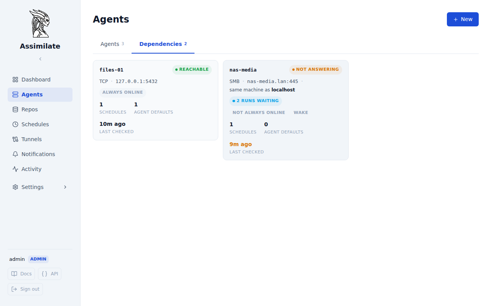
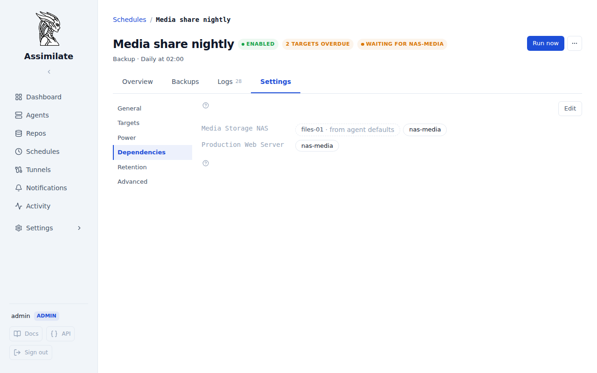

<!--
SPDX-License-Identifier: Apache-2.0
SPDX-FileCopyrightText: 2026 Alexander Mohr
-->

# Dependency Hosts

A dependency host is a machine a backup needs besides its agent and its repository: the SMB or NFS server whose share a pre-backup command mounts, for example. Assimilate checks that it answers on a TCP port before the backup starts, can wake it with Wake-on-LAN, and — when it is marked as not always online — skips the run and catches it up once the machine answers, instead of letting the pre-backup command fail.



## Prerequisites

- A [schedule](scheduling.md) or an [agent's backup defaults](agents.md#settings) with a pre-backup command that needs the machine, for example one that mounts a share.
- Admin access to add, change or remove a dependency. Anyone signed in can see them, since a schedule's own settings name them.

## How a Run Uses a Dependency

A scheduled backup works through these steps for each target agent:

1. Wake the agent and repository hosts, as described in [Power Management](power-management.md).
2. Check every dependency the target needs, in name order. A dependency that does not answer is woken if it is set up for that, and given its wait time to come up.
3. Run the pre-backup commands, then `borg create`, prune, and the post-backup commands.

A dependency that still does not answer after step 2 decides the target's run. Nothing is sent to the agent, so its pre-backup commands never try to mount a share that is not there:

| Dependency | Run is reported as | Report | Notification | Afterwards |
|------------|--------------------|--------|--------------|------------|
| **Not always online** | Skipped | A **skipped** report with the reason | **Backup skipped (dependency offline)** | Caught up once the dependency answers |
| Always online (the default) | Failed | A **failed** report with the reason | **Backup failed** | Nothing to catch up |

Either way the miss counts once toward the schedule's [missed backup threshold](scheduling.md#missed-backup-threshold), the same as an agent that was not there. Re-checks while a run waits never count.

A check or verify schedule never checks dependencies: it reads the repository, not the source.

!!! note "An open port is not a mounted share"
    The check connects to one TCP port from the Assimilate server. An answer means the machine is up, not that the share is exported or that the agent can reach it. Keep the mount point check in the pre-backup command, so a share that fails to mount still fails the backup instead of backing up an empty directory:

    ```bash
    mount /mnt/media && mountpoint -q /mnt/media
    ```

## Adding a Dependency

1. Open **Agents** and select the **Dependencies** tab.
2. Select **New**.
3. Enter a **Name** and the **Address** — a hostname or IP address, as the Assimilate server reaches it.
4. Pick the **Check**: **SMB** (port 445), **NFS** (port 2049), **SSH** (port 22), or **Other port**.
5. If the machine is also a [repository host](repository-hosts.md), pick it under **Same machine as**. The dependency then shares that host's wake settings.
6. Select **Test connection** to check the address now, then **Create dependency**.

Wake-on-LAN and **Host is not always online** are set on the dependency's **Power** section once it exists.

## Requiring a Dependency

A dependency is required per schedule and per agent, because each agent mounts its own shares:

- **On a schedule**: open the schedule, then **Settings → Dependencies**. Select **Edit** and tick what each target agent needs.
- **On an agent**: open the agent, then **Settings → Backup defaults**, and edit **Required dependencies**. Every schedule on that agent needs them, in addition to what the schedule sets itself. Use this when the agent's own default pre-backup commands mount the share.

A dependency an agent's defaults require is shown on the schedule as **from agent defaults** and cannot be removed there.



## The Dependency Page

Open a dependency from its card. The page has four sections:

| Section | Content |
|---------|---------|
| **Connection** | Name, address, the port that is checked, and a description |
| **Power** | How it is woken, and [when the host is offline](#when-the-host-is-offline) |
| **Used by** | Every schedule and agent that needs it, and where the need comes from |
| **Danger zone** | **Remove**. Schedules and agent defaults stop needing it, and runs waiting on it stop waiting |

**Test connection** in the page header checks the dependency now without waking it or starting anything.

### Power

A dependency is woken one of two ways:

| Power settings | Effect |
|----------------|--------|
| **Same as repository host** | The repository host's Wake-on-LAN switch, MAC address, broadcast address and wait time apply. Change them on that [host's Power section](repository-hosts.md#power) |
| **Own wake settings** | **Wake host before backup**, **MAC address**, **Broadcast address** and **Wait for host** set on the dependency itself |

A schedule's own [wake override](power-management.md#per-schedule-overrides) applies to its dependencies the same way it applies to its agents and repository hosts.

Assimilate never shuts a dependency down. When it is the same machine as a repository host, that host is still shut down after a backup if its own **Shut down host after backup** setting says so — but only once no run that needs the dependency is still going.

### When the Host Is Offline

| Setting | Default | Effect |
|---------|---------|--------|
| **Host is not always online** | Off | Off: a run that cannot reach the dependency fails. On: it is skipped and caught up once the dependency answers |
| **Re-check every** | 15 minutes | How often a dependency that runs are waiting on is asked whether it is back |
| **Stop waiting after** | Never | How long a skipped run waits before it is abandoned and reported as **Backup catch-up abandoned** |

The section lists every run waiting on the dependency. **Check now** asks it immediately and catches up every waiting run if it answers.

## Catch-Up Runs

A skipped target is caught up once its dependency answers, following the same rules as [catch-up runs for hosts](scheduling.md#catch-up-runs):

- However many occurrences a dependency misses, at most one catch-up run follows.
- A catch-up is dropped when the schedule's next run is closer than its **Catch-up cutoff**: that run does the same work.
- **Stop waiting after** is measured from the occurrence that was skipped. A catch-up that finds the dependency away again goes back to waiting without moving that window.
- Any backup of the schedule that reaches the agent — the next scheduled run, or a **Run now** — ends the wait.

A **Run now** checks dependencies but never wakes them. If one does not answer, the run fails at once with the reason, and nothing is caught up.

## Run Timeline

The run's **Power management** timeline shows each dependency step under a **Dependency** heading: the check that found no answer, the Wake-on-LAN packet, the dependency answering, or **did not answer** when it never came up.

## API Endpoints

| Method | Path | Description |
|--------|------|-------------|
| `GET` / `POST` | `/api/dependency-hosts` | List dependency hosts, or create one |
| `POST` | `/api/dependency-hosts/test` | Check an address and port before saving them |
| `GET` / `PUT` / `DELETE` | `/api/dependency-hosts/{dependency_host_id}` | Get, change or remove one |
| `PUT` | `/api/dependency-hosts/{dependency_host_id}/power` | Set how it is woken |
| `GET` / `PUT` | `/api/dependency-hosts/{dependency_host_id}/availability` | Get or set whether it is not always online, and list the runs waiting on it |
| `POST` | `/api/dependency-hosts/{dependency_host_id}/availability/check` | Ask it whether it is back now |
| `POST` | `/api/dependency-hosts/{dependency_host_id}/test` | Check it now, without waking it |
| `GET` | `/api/dependency-hosts/{dependency_host_id}/usage` | List the schedules and agents that need it |
| `GET` / `PUT` | `/api/schedules/{id}/dependencies` | Get or set what each target agent of a schedule needs |
| `GET` / `PUT` | `/api/agents/{hostname}/dependencies` | Get or set what an agent's backup defaults require |

## Related Pages

- [Power Management](power-management.md)
- [Repository Hosts](repository-hosts.md)
- [Scheduling & Retention](scheduling.md#hosts-that-are-not-always-online)
- [Notifications](notifications.md)
