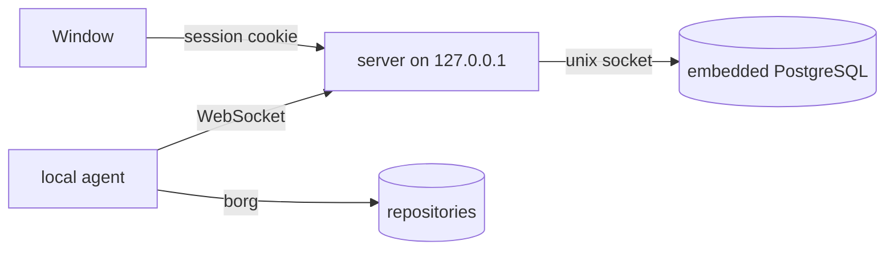

<!--
SPDX-License-Identifier: Apache-2.0
SPDX-FileCopyrightText: 2026 Alexander Mohr
-->

# Desktop App

The desktop app runs Assimilate for a single computer: it starts the server, a local agent and its own PostgreSQL database in the background and shows the web UI in a native window, signed in automatically. Use it to back up one machine to local or remote borg repositories without running a server.

## How it works



On start the app:

1. Reads its secrets from the OS keychain, generating them on first run.
2. Starts its PostgreSQL cluster. The cluster listens on a unix socket in the app's data folder only, never on TCP.
3. Starts the server on a free port on `127.0.0.1`, with `ASSIMILATE_DEPLOYMENT_MODE=desktop`.
4. Signs in as the built-in `admin` user. On first run it replaces the default `admin` password with a generated one.
5. Registers the local agent, issues it a fresh token and starts it.
6. Opens the web UI in the window, already signed in.

Authentication stays on: the app signs in for you instead of switching it off, so other programs on the computer can't use the server without a session.

Closing the window keeps backups running in the background. Open the window again or quit the app from its tray icon. Quitting stops the agent, the server and the database, in that order.

## What desktop mode hides

A single computer has one user and one agent, so the window leaves out the pages that manage several: Users, Groups, Roles and SSH Tunnels. See `ASSIMILATE_DEPLOYMENT_MODE` in [Configuration](configuration.md).

## Data and secrets

| Platform | Data folder |
|----------|-------------|
| macOS | `~/Library/Application Support/assimilate` |
| Linux | `$XDG_DATA_HOME/assimilate`, or `~/.local/share/assimilate` |

The data folder holds the database, the server's SSH keys and the logs (`logs/server.log`, `logs/agent.log`).

The app keeps three secrets in the OS keychain (Keychain Services on macOS, the Secret Service on Linux), under the service name `assimilate-desktop`:

| Account | Holds |
|---------|-------|
| `server-secret-key` | `ASSIMILATE_SECRET_KEY`, which encrypts the stored repository passphrases |
| `admin-password` | The password of the built-in `admin` user |
| `postgres-password` | The embedded database's superuser password |

!!! warning "Keep your repository passphrases"
    Repository passphrases in the app's database are encrypted with `server-secret-key`. If that keychain entry is lost, the app can't decrypt them. Keep each repository's passphrase or key export somewhere outside the app.

## Running from source

The app lives in `desktop/`, its own Cargo workspace. On Linux, install Tauri's build dependencies first:

```bash
sudo apt-get install libwebkit2gtk-4.1-dev libxdo-dev libssl-dev libayatana-appindicator3-dev librsvg2-dev
```

Build the server, the agent and the web UI, then run the app with the environment variables below pointing at them and at a PostgreSQL installation:

```bash
cargo build -p server -p agent
(cd frontend && npm ci && npm run build)
ASSIMILATE_DESKTOP_SERVER_BIN=$PWD/target/debug/server \
ASSIMILATE_DESKTOP_AGENT_BIN=$PWD/target/debug/agent \
ASSIMILATE_DESKTOP_STATIC_DIR=$PWD/frontend/dist \
ASSIMILATE_DESKTOP_POSTGRES_DIR=<postgres-install-dir> \
ASSIMILATE_DESKTOP_DATA_DIR=/tmp/assimilate-desktop \
ASSIMILATE_DESKTOP_EPHEMERAL_SECRETS=1 \
cargo run --manifest-path desktop/Cargo.toml
```

`<postgres-install-dir>` is the directory that contains PostgreSQL's `bin/initdb`, for example `/usr/lib/postgresql/16` on Debian and Ubuntu.

| Variable | Default | Required | Description |
|----------|---------|----------|-------------|
| `ASSIMILATE_DESKTOP_DATA_DIR` | Platform data folder | No | Put all app data under this directory instead. |
| `ASSIMILATE_DESKTOP_SERVER_BIN` | `server` next to the app | No | The server binary. |
| `ASSIMILATE_DESKTOP_AGENT_BIN` | `agent` next to the app | No | The agent binary. |
| `ASSIMILATE_DESKTOP_POSTGRES_DIR` | `postgres` in the app's resources | No | The PostgreSQL installation (contains `bin/initdb`). |
| `ASSIMILATE_DESKTOP_STATIC_DIR` | `web` in the app's resources | No | The built web UI. |
| `ASSIMILATE_DESKTOP_DOCS_DIR` | `docs` in the app's resources, if present | No | The built documentation site. |
| `ASSIMILATE_DESKTOP_BORG_BIN` | `borg/borg` in the app's resources, if present, else `borg` on `PATH` | No | The borg binary for the server and the agent. |
| `ASSIMILATE_DESKTOP_EPHEMERAL_SECRETS` | — | No | Debug builds only. Keep secrets in memory instead of the OS keychain. Data encrypted in such a run can't be read by the next one. |

If the app can't start, the window shows the error and where the logs are.

## Related pages

- [Architecture](architecture.md)
- [Security](security.md)
- [Configuration](configuration.md)
