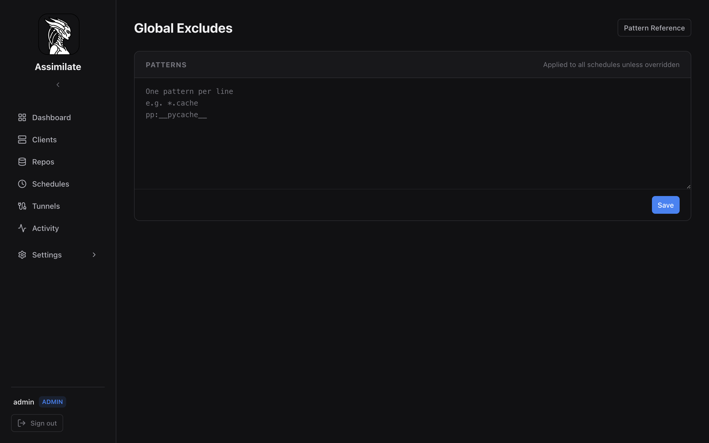

# Global Excludes

Global exclude patterns define paths and files that are excluded from all backup schedules by default. Manage them from the **Excludes** page under **Settings** in the sidebar.



## How Global Excludes Work

When a backup runs, the agent passes exclude patterns to `borg create --exclude`. Global excludes apply to every schedule on every host unless a schedule explicitly opts out by enabling **Ignore global excludes** in its configuration.

This means you can define patterns once (e.g., cache directories, temporary files, build artifacts) and have them apply fleet-wide without duplicating them on every schedule.

## Managing Patterns

The Excludes page presents a plain-text editor — one pattern per line. Add, remove, or reorder patterns, then click **Save**.

Patterns are evaluated in order. Borg checks each file path against the pattern list and skips the first match.

## Pattern Syntax

Assimilate passes patterns directly to borg. The following prefixes control matching behaviour:

### Shell Patterns (default)

Patterns without a prefix use shell-style globbing:

| Pattern | Effect |
|---------|--------|
| `*.cache` | Any file ending in `.cache` |
| `home/*/Downloads` | `Downloads` directory in any home dir |
| `*.{jpg,png}` | Multiple extensions |

### Path Prefix (`pp:`)

Matches any path component by name:

| Pattern | Effect |
|---------|--------|
| `pp:__pycache__` | Any directory named `__pycache__` at any depth |
| `pp:/proc` | Exact path prefix `/proc` |

### Regex (`re:`)

Full regular expression matching against the entire path:

| Pattern | Effect |
|---------|--------|
| `re:\.git/objects/` | Git object directories anywhere |
| `re:/tmp/[^/]+\.sock$` | Socket files in `/tmp` |

### Fnmatch (`fm:`)

Case-sensitive fnmatch pattern:

| Pattern | Effect |
|---------|--------|
| `fm:*.log` | Any file ending in `.log` |

For the full pattern syntax reference, see the [BorgBackup documentation](https://borgbackup.readthedocs.io/en/stable/usage/help.html#borg-patterns).

## Per-Schedule Override

Individual schedules can override global excludes in two ways:

1. **Add schedule-specific patterns** — these are merged with global excludes.
2. **Ignore global excludes** — check this option in the schedule configuration to use only the schedule's own patterns.

See [Scheduling](scheduling.md) for per-schedule exclude configuration.

## Recommended Patterns

A reasonable starting set for Linux systems:

```text
pp:__pycache__
pp:.cache
pp:node_modules
pp:.tmp
re:\.git/objects/
*.pyc
*.swp
*~
/dev
/proc
/sys
/run
/tmp
```

Adjust based on the workloads running on your backup machines. Avoid overly broad patterns that might exclude important data.

## API Endpoints

Global excludes are stored as a single newline-separated block of patterns and edited as a whole, not as individually addressable records.

| Method | Path | Description |
|--------|------|-------------|
| `GET` | `/api/excludes` | Get the global exclude patterns as raw text |
| `PUT` | `/api/excludes` | Replace the global exclude patterns from raw text |

See the full [API Reference](api-reference.md) for request/response schemas.

<!--
SPDX-License-Identifier: Apache-2.0
SPDX-FileCopyrightText: 2026 Alexander Mohr
-->
