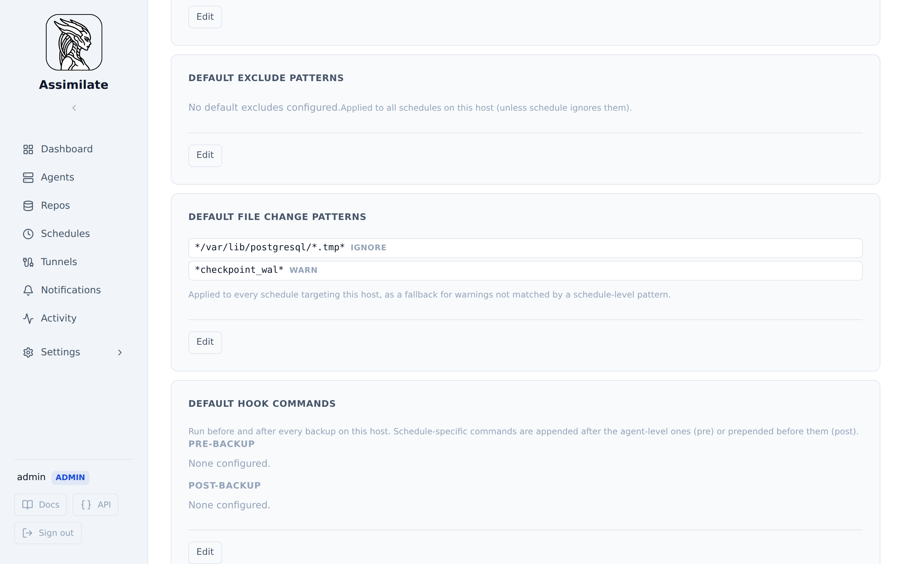

<!--
SPDX-License-Identifier: Apache-2.0
SPDX-FileCopyrightText: 2026 Alexander Mohr
-->

# File Change Patterns

File change patterns let you control how warnings about files that change during a backup are handled. By default, any file that is modified while being backed up generates a warning. You can configure specific path patterns to:

- **ignore** — suppress the warning entirely
- **warn** — keep the warning (default)
- **fatal** — fail the backup

## Configuration

File change patterns can be configured at three levels:

- **Schedule level** — applies to every agent targeted by the schedule.
- **Per-agent override within a schedule** — overrides the schedule-level patterns for specific hosts, when a schedule targets multiple agents.
- **Agent default** — configured once on the host itself and applied as a fallback to _every_ schedule that targets it, so you don't have to repeat the same patterns on every schedule.

### Schedule-level patterns

Navigate to **Schedules** → select a schedule → **File Change Patterns** section.

Each line contains an optional action keyword followed by a glob pattern. Patterns are matched against the full warning message text (see [Pattern Syntax](#pattern-syntax) below), so they typically need a leading or trailing `*`:

```text
*/tmp/logs* ignore
*/etc/config* fatal
*/var/www/cache* warn
```

If no action is specified, `warn` is assumed:

```text
*/tmp/logs*          ← equivalent to `*/tmp/logs* warn`
```

### Per-agent override within a schedule

When a schedule targets multiple agents, you can toggle **Configure per agent** and provide different patterns for each host. A host with an empty override falls back to the schedule-level patterns above.

### Agent default patterns

Navigate to **Agents** → select a host → **Default File Change Patterns** section. Patterns are entered the same way as at the schedule level (glob plus optional action). These patterns apply to every schedule that targets the host, so they're useful for host-specific noise (e.g. a database's WAL files) that would otherwise need to be repeated on every schedule backing up that host.



### Precedence

For a given agent and schedule, patterns are checked in this order, and the **first match wins**:

1. The per-agent override for that schedule, if one is configured; otherwise the schedule-level patterns.
2. The agent's default patterns, checked only for warnings the previous step didn't match.

This means schedule-specific configuration always takes priority over a host's defaults, while the host's defaults still catch anything the schedule doesn't explicitly handle.

## Action Reference

| Action   | Behavior                                                              |
| -------- | --------------------------------------------------------------------- |
| `ignore` | The warning is silently discarded; the backup continues with no alert |
| `warn`   | The warning is preserved in the report (default; backward compatible) |
| `fatal`  | The backup is stopped and reported as failed with an error message    |

## Pattern Syntax

> **Not the same glob dialect as Exclude Patterns.** The exclude patterns configured elsewhere on the agent page are passed straight through to borg, where a single `*` matches across `/`. File change patterns are matched by Assimilate itself using a stricter, git-style glob where `*` does **not** cross `/`. A pattern that works as an exclude pattern will often need `**` here to have the same reach — see below.

- `*` matches any number of characters **within a single path component** — it does not match `/`, so it won't reach into subdirectories.
- `**` matches any number of characters **including `/`** — use it to cover every file anywhere under a directory, no matter how deeply nested.
- `?` matches any single character.

The pattern is matched against the full warning message text, not just the file path — a bare path like `/etc/config` will only match if the _entire_ message is exactly `/etc/config`, which is never the case. Use `*` to match the surrounding message text. For example, a warning message like `/var/log/nginx/access.log: file changed while we backed it up` can be matched with a pattern like `*access.log: file changed while we backed it up` or the simpler `*access.log*`.

Directories with deeply nested, frequently-changing files (e.g. a database's write-ahead log) need a trailing `**`, not a single `*`:

```text
/data/influxdb/wal/*   ← only matches files directly in wal/, NOT nested ones like wal/<shard>/<segment>.wal
/data/influxdb/wal/**  ← matches every file under wal/, at any depth
```

## Backward Compatibility

Existing schedules without file change patterns continue to work as before — all file changes produce warnings. The feature is entirely opt-in.
