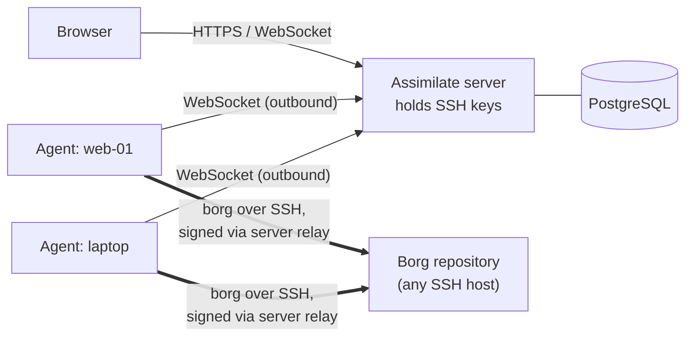

---
hide:
  - navigation
  - toc
---

# Assimilate

<div class="hero" markdown>

<p class="hero-tagline">Self-hosted BorgBackup for every machine you run. One dashboard, one scheduler, and SSH keys that stay on the server.</p>

Assimilate orchestrates [BorgBackup](https://borgbackup.readthedocs.io) across many hosts. A small Rust agent runs on each machine and dials out to the server. The server schedules backups, checks and prunes, indexes every archive, and lends its SSH key to agents for the duration of a job.

[Get started](getting-started.md){ .md-button .md-button--primary }
[Compare](comparison.md){ .md-button }
[GitHub](https://github.com/alexmohr/assimilate){ .md-button }

</div>

{ .hero-shot }

!!! warning "Alpha software"
    Assimilate is under heavy development. Expect breaking changes and data-format migrations between releases. Keep an independent copy of anything you cannot afford to lose. See [How It's Built](how-its-built.md) for how changes are tested.

## Why Assimilate

<div class="grid" markdown>

<div class="card" markdown>

:material-key-chain-variant:{ .lg .middle } **Keys stay on the server**

---

The server holds the SSH private key and relays the ssh-agent protocol to each backup. Backup machines sign through the relay instead of storing a repository key.

[:octicons-arrow-right-24: SSH agent forwarding](ssh-agent-forwarding.md)

</div>

<div class="card" markdown>

:material-lan-connect:{ .lg .middle } **No inbound ports on clients**

---

Agents connect outward over WebSocket, so machines behind NAT or a firewall work without port forwarding. A reverse SSH tunnel covers hosts that cannot reach the server.

[:octicons-arrow-right-24: Architecture](architecture.md)

</div>

<div class="card" markdown>

:material-calendar-sync:{ .lg .middle } **Schedules that fit real fleets**

---

One schedule backs up many hosts to several repositories, each marked required or best effort. Missed runs catch up when a laptop comes back online.

[:octicons-arrow-right-24: Scheduling & retention](scheduling.md)

</div>

<div class="card" markdown>

:material-file-search:{ .lg .middle } **Find any file, in any archive**

---

Every archive is indexed. Browse, search across archives, diff two archives, download as a stream, or restore straight to the host.

[:octicons-arrow-right-24: Archive browsing](archives.md)

</div>

</div>

## Built for

<div class="grid" markdown>

<div class="card" markdown>

:material-home-automation:{ .lg .middle } **Homelabs**

---

- Wake the NAS with Wake-on-LAN, back up, shut it down again
- Incremental libvirt VM snapshots with restore and rebuild
- Quotas that warn, block backups, or pause a schedule

[:octicons-arrow-right-24: Power management](power-management.md) ·
[:octicons-arrow-right-24: VM snapshots](vm-snapshots.md)

</div>

<div class="card" markdown>

:material-laptop:{ .lg .middle } **Laptops and desktops**

---

- Catch-up runs for hosts that are not always online
- Browser push, email, and webhook notifications
- A missed-backup threshold that flags and disables a failing schedule

[:octicons-arrow-right-24: Notifications](notifications.md)

</div>

<div class="card" markdown>

:material-account-group:{ .lg .middle } **Teams**

---

- Roles, groups, and per-repository permissions
- Searchable, exportable audit log
- REST API with an OpenAPI specification and API tokens

[:octicons-arrow-right-24: Access control](access-control.md) ·
[:octicons-arrow-right-24: API reference](api-reference.md)

</div>

</div>

## How it works



Backup data flows directly from each agent to the repository host. Only ssh-agent signing requests pass through the server.

## Quick start

```yaml
# docker-compose.yml
services:
  db:
    image: postgres:16
    environment:
      POSTGRES_DB: borg
      POSTGRES_USER: borg
      POSTGRES_PASSWORD: ${POSTGRES_PASSWORD:-borg_secret}
    volumes:
      - pgdata:/var/lib/postgresql/data
    healthcheck:
      test: ["CMD-SHELL", "pg_isready -U borg -d borg"]
      interval: 5s
      timeout: 3s
      retries: 5

  server:
    image: ghcr.io/alexmohr/assimilate:latest
    ports:
      - "8080:8080"
    environment:
      DATABASE_URL: postgres://borg:${POSTGRES_PASSWORD:-borg_secret}@db:5432/borg
      ASSIMILATE_SECRET_KEY: ${ASSIMILATE_SECRET_KEY:?must be set}
    volumes:
      - ssh_keys:/app/ssh
    depends_on:
      db:
        condition: service_healthy

volumes:
  pgdata:
  ssh_keys:
```

```bash
export ASSIMILATE_SECRET_KEY=$(openssl rand -hex 32) && docker compose up -d
```

Open [http://localhost:8080](http://localhost:8080) and log in with `admin` / `admin`. The first login requires a password change.

## Everything else

<div class="grid" markdown>

<div class="card" markdown>

### Backups

- Cron schedules with presets, retention, compact, and integrity checks
- Pre- and post-backup hook commands with captured output
- Global excludes and bandwidth limits
- Import existing borg repositories

</div>

<div class="card" markdown>

### Security

- Repository passphrases encrypted at rest (AES-256-GCM)
- TOTP two-factor authentication with recovery codes
- Brute-force lockout, idle timeout, session management
- Per-agent tokens, pinned SSH host keys

</div>

<div class="card" markdown>

### Operations

- Real-time dashboard with "needs attention" findings
- Live backup logs and per-run event timeline
- Activity log and server log viewer
- Docker images for amd64 and arm64

</div>

</div>

## Next steps

- [Getting Started](getting-started.md): full setup walkthrough
- [Comparison](comparison.md): how Assimilate relates to other borg tools
- [Architecture](architecture.md): how the components fit together
- [Security & Authentication](security.md): auth model, encryption, RBAC
- [Agent Management](agents.md): add machines and deploy agents
- [API Reference](api-reference.md): REST API documentation

<!--
SPDX-License-Identifier: Apache-2.0
SPDX-FileCopyrightText: 2026 Alexander Mohr
-->
