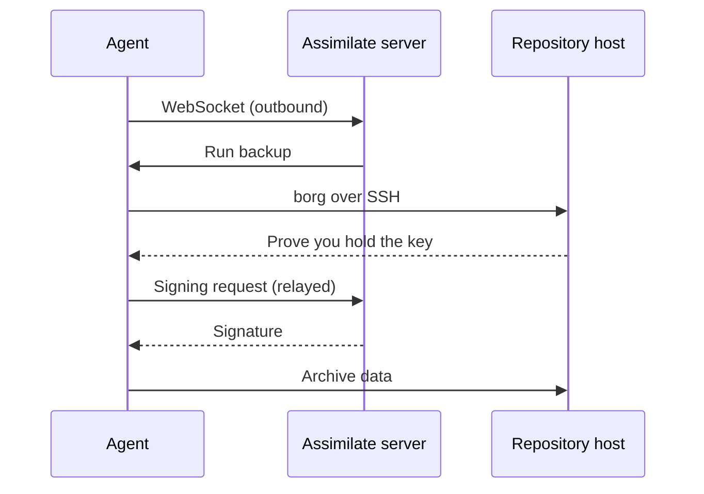
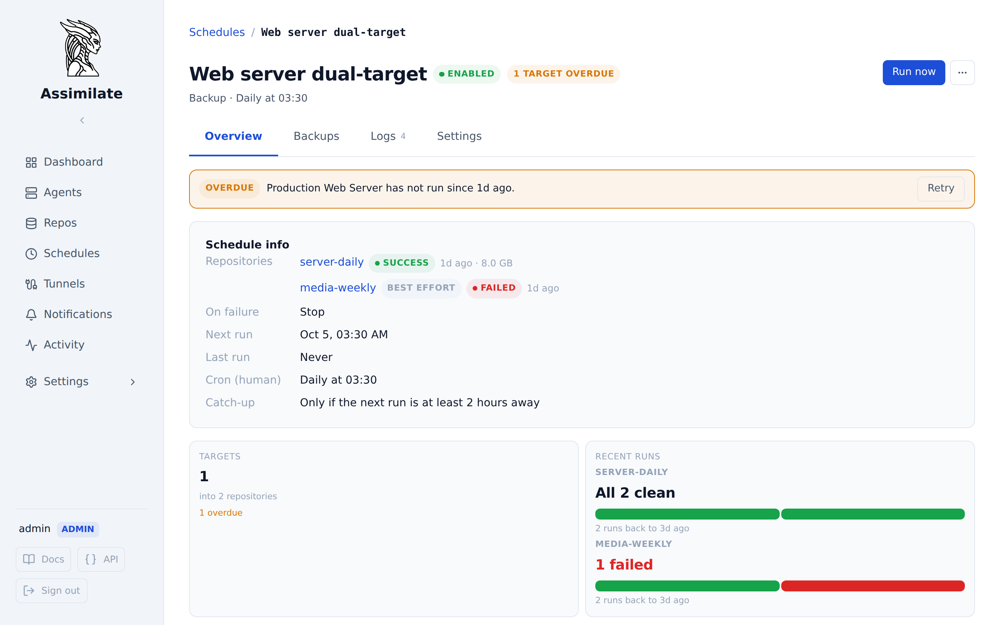
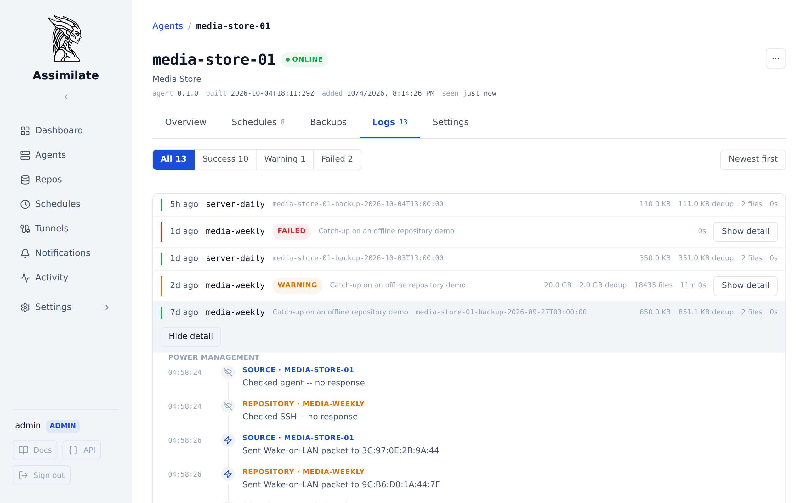
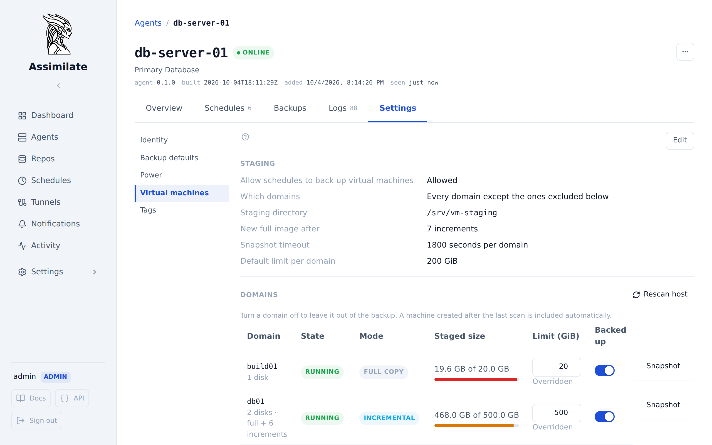
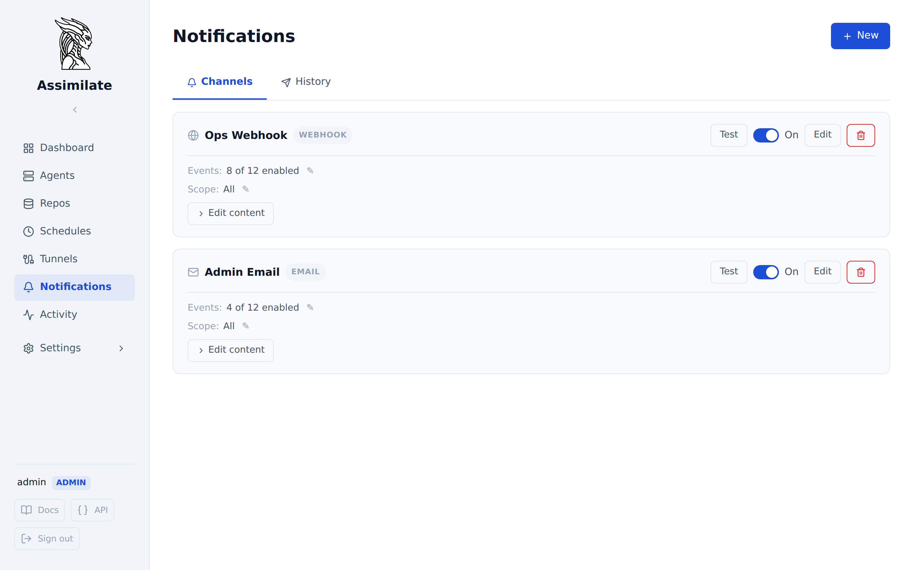

---
hide:
  - navigation
  - toc
---

# Assimilate

<div class="hero" markdown>

<p class="hero-title">Borg backups for the whole fleet, without handing out keys.</p>

<p class="hero-tagline">Assimilate is a self-hosted control plane for <a href="https://borgbackup.readthedocs.io">BorgBackup</a>. A small agent on each Linux machine connects out to the server; the server plans the work, lends its SSH key only while a job runs, and indexes every archive so restores start with a search.</p>

[Deploy with Docker](#get-started){ .md-button .md-button--primary }
[Documentation](getting-started.md){ .md-button }
[Source on GitHub](https://github.com/alexmohr/assimilate){ .md-button }

</div>

{ .hero-shot }

<div class="pill-row" markdown>

<span>:material-language-rust: Rust server and agent</span>
<span>:material-database: PostgreSQL</span>
<span>:material-docker: amd64 and arm64 images</span>
<span>:material-api: OpenAPI-described REST API</span>
<span>:material-scale-balance: Apache-2.0</span>

</div>

## Agents call home. Keys never leave. { #architecture }

<div class="feature" markdown>

<div class="feature-text" markdown>

<p class="eyebrow">Architecture</p>

Each agent keeps a single outbound WebSocket open to the server. Nothing listens on the backup machine, so hosts behind NAT or a strict firewall need no port forwarding; a reverse SSH tunnel handles the odd host that cannot reach the server at all.

When borg authenticates to a repository, the agent forwards the ssh-agent request to the server, which signs it and sends the signature back. The private key stays on the server. Backup data takes the direct path from agent to repository host.

- **Nothing to expose on clients:** no inbound ports, no SSH access needed.
- **One key to rotate,** in one place, instead of one per machine.
- **Pinned host keys** for every repository host.
- **Repository hosts as objects:** address, host key, wake-up and availability are set once and shared by every repository on that machine.

[:octicons-arrow-right-24: SSH agent forwarding](ssh-agent-forwarding.md) ·
[:octicons-arrow-right-24: Architecture](architecture.md) ·
[:octicons-arrow-right-24: Reverse tunnels](ssh-tunnels.md)

</div>

<div class="feature-media" markdown>



</div>

</div>

## One schedule, every host, every copy { #scheduling }

<div class="feature feature--flip" markdown>

<div class="feature-text" markdown>

<p class="eyebrow">Scheduling</p>

A schedule names the hosts, the sources, the repositories, and the timing. Add a second repository as **best effort** and an unreachable offsite copy becomes a warning instead of a failed run.

- **Several hosts and repositories** in one schedule, with sources and excludes per host.
- **Cron builder with presets,** retention per schedule, compact after prune, and separate integrity-check schedules.
- **Catch-up runs** for machines that are offline at the scheduled time.
- **Hooks before and after** each backup, with timeouts and captured output.
- **Global excludes,** file-change patterns, bandwidth caps, and dry runs.
- **Auto-disable** after a configurable number of missed backups, so a broken job surfaces instead of failing quietly.

[:octicons-arrow-right-24: Scheduling & retention](scheduling.md)

</div>

<div class="feature-media" markdown>



</div>

</div>

## Back up machines that sleep most of the day { #power }

<div class="feature" markdown>

<div class="feature-text" markdown>

<p class="eyebrow">Power management</p>

A NAS or workstation does not have to stay on to stay protected. Before a run, Assimilate wakes the source and the repository host, waits until both respond, runs the backup, and powers them down again.

- **Wake-on-LAN** for both agent hosts and repository hosts.
- **Start the agent over SSH** when the machine is up but the service is not.
- **Shut down, or just stop the agent,** once the backup is done.
- **Overrides per schedule** for the job that needs to behave differently.
- **A timeline per run** listing every wake, check, and shutdown step.

[:octicons-arrow-right-24: Power management](power-management.md)

</div>

<div class="feature-media" markdown>



</div>

</div>

## Whole virtual machines, incrementally { #vms }

<div class="feature feature--flip" markdown>

<div class="feature-text" markdown>

<p class="eyebrow">Virtual machines</p>

The agent finds the libvirt domains on its host and backs each one up as an incremental snapshot chain. Restoring writes the disks back and defines the domain again.

- **Automatic discovery** of the domains on each host.
- **Incremental chains** with a staging limit per domain.
- **Restore and rebuild** a domain from any archive.

[:octicons-arrow-right-24: VM snapshots](vm-snapshots.md)

</div>

<div class="feature-media" markdown>



</div>

</div>

## Search first, restore second { #restore }

<div class="feature" markdown>

<div class="feature-text" markdown>

<p class="eyebrow">Restore</p>

Archive contents are indexed on the server, so browsing and searching never take a lock on the repository. Look across every archive for the file you lost, compare two points in time, then download it or write it back to the host.

- **Browse any archive** in any repository.
- **Search across archives** and **diff** any two of them.
- **Stream a download** of files or whole directories as tar.lz4.
- **Restore to the host,** queued until its agent reconnects.
- **Tag archives** such as `pre-upgrade` so the important ones are easy to find.

[:octicons-arrow-right-24: Archive browsing](archives.md) ·
[:octicons-arrow-right-24: Restoring files](restore.md)

</div>

<div class="feature-media" markdown>


</div>

</div>

## Roles that match how your team works { #access }

<div class="feature feature--flip" markdown>

<div class="feature-text" markdown>

<p class="eyebrow">Access and security</p>

Start with the built-in admin, operator, and viewer roles, then add custom roles and groups as the team grows. Permissions are granted per repository, and every change is recorded.

- **Per-repository permissions:** view, back up, edit schedules, extract, delete.
- **TOTP two-factor login** with single-use recovery codes.
- **Lockout on repeated failures,** per address and per account, with growing lockout periods.
- **Idle timeout** and a list of active sessions.
- **Audit log** of every change, with filters and export.
- **Encrypted at rest with AES-256-GCM:** repository passphrases, TOTP secrets, SMTP passwords, webhook headers.

[:octicons-arrow-right-24: Security](security.md) ·
[:octicons-arrow-right-24: Access control](access-control.md) ·
[:octicons-arrow-right-24: Audit log](audit-log.md)

</div>

<div class="feature-media" markdown>


</div>

</div>

## Problems first, details on demand { #monitoring }

<div class="feature" markdown>

<div class="feature-text" markdown>

<p class="eyebrow">Monitoring</p>

The dashboard opens on what needs fixing: overdue schedules, failing targets, unprotected hosts, and repositories close to their quota. The rest is a click away, and all of it updates live.

- **Needs-attention findings,** protection coverage, upcoming work, and capacity.
- **Live logs** while a backup runs, and an event timeline afterwards.
- **Alerts** by email, webhook (Slack, Discord, ntfy, Gotify), or browser push.
- **Quotas** for repositories and repository hosts that warn, block new backups, or disable a schedule.
- **Activity log** that merges runs, system events, and the server log.

[:octicons-arrow-right-24: Dashboard](dashboard.md) ·
[:octicons-arrow-right-24: Notifications](notifications.md) ·
[:octicons-arrow-right-24: Quotas](quotas.md)

</div>

<div class="feature-media" markdown>



</div>

</div>

## Also included { #also }

<div class="grid" markdown>

<div class="card" markdown>

### :material-database-import: Bring existing repositories

Register a repository that already holds archives. Archives are assigned to hosts by the hostname borg recorded, with glob aliases for renamed machines.

[:octicons-arrow-right-24: Repositories](repositories.md)

</div>

<div class="card" markdown>

### :material-key-variant: Keys and encryption

Export and import repository keys, change passphrases, or move a repository to another encryption mode.

[:octicons-arrow-right-24: Encryption migration](repositories.md#encryption-migration)

</div>

<div class="card" markdown>

### :material-rocket-launch: Agent rollout from the browser

Install or upgrade the agent and its systemd unit over SSH. Your own unit settings survive upgrades.

[:octicons-arrow-right-24: Agent management](agents.md#ssh-deploy-from-dashboard)

</div>

<div class="card" markdown>

### :material-harddisk: Storage pools per host

Set a pool size for each repository host and see how its repositories divide it before the disk runs out.

[:octicons-arrow-right-24: Server quotas](server-quotas.md)

</div>

<div class="card" markdown>

### :material-api: Automate everything

Anything the UI does is available through the REST API, described by an OpenAPI specification and authorised with API tokens.

[:octicons-arrow-right-24: API reference](api-reference.md)

</div>

<div class="card" markdown>

### :material-file-export: Portable configuration

Export the server configuration and load it into a new instance.

[:octicons-arrow-right-24: Configuration](configuration.md)

</div>

</div>

## Where Assimilate fits { #fit }

Assimilate overlaps most with Borg Backup Server and complements borgmatic and Vorta. The short version:

| | Assimilate | Borg Backup Server | borgmatic | Vorta |
|---|---|---|---|---|
| Manage many hosts from one UI | Yes | Yes | No | No |
| Repository keys kept off clients | Yes | Only for repositories on its own server | No | No |
| One schedule across many hosts and repositories | Yes | No | No | No |
| Wake-on-LAN and shutdown after backup | Yes | Wake-on-LAN only | No | No |
| Windows and macOS clients | No | Yes | macOS | macOS |

[:octicons-arrow-right-24: Detailed comparison](comparison.md), including what Assimilate does not do yet.

## Open source, no tiers { #license }

<div class="grid" markdown>

<div class="card" markdown>

### Free to run, free to change

Apache-2.0 licensed. No paid edition, no license keys, no limits on hosts or storage. The server, agent, web UI, and API are all in the repository.

[Source on GitHub](https://github.com/alexmohr/assimilate){ .md-button .md-button--primary }

</div>

<div class="card" markdown>

### Developed in the open

Coding agents write most of the code under human direction. Formatting, linting, unit, integration, and end-to-end tests, dependency audits, and coverage checks gate every merge.

[How It's Built](how-its-built.md){ .md-button }

</div>

</div>

## Get started

Run the server and its database with Docker Compose:

```yaml
# docker-compose.yml
services:
  db:
    image: postgres:16
    environment:
      POSTGRES_DB: borg
      POSTGRES_USER: borg
      POSTGRES_PASSWORD: ${POSTGRES_PASSWORD:-borg_secret}
    volumes:
      - pgdata:/var/lib/postgresql/data
    healthcheck:
      test: ["CMD-SHELL", "pg_isready -U borg -d borg"]
      interval: 5s
      timeout: 3s
      retries: 5

  server:
    image: ghcr.io/alexmohr/assimilate:latest
    ports:
      - "8080:8080"
    environment:
      DATABASE_URL: postgres://borg:${POSTGRES_PASSWORD:-borg_secret}@db:5432/borg
      ASSIMILATE_SECRET_KEY: ${ASSIMILATE_SECRET_KEY:?must be set}
    volumes:
      - ssh_keys:/app/ssh
    depends_on:
      db:
        condition: service_healthy

volumes:
  pgdata:
  ssh_keys:
```

```bash
export ASSIMILATE_SECRET_KEY=$(openssl rand -hex 32) && docker compose up -d
```

Open [http://localhost:8080](http://localhost:8080) and log in with `admin` / `admin`; the first login asks for a new password. Then:

1. [Add a repository](repositories.md) on any SSH host that runs `borg serve`.
2. [Add an agent](agents.md) and deploy it from the UI, or run the `ghcr.io/alexmohr/assimilate-agent` image.
3. [Create a schedule](scheduling.md) and follow the first run on the dashboard.

[Full setup guide](getting-started.md){ .md-button .md-button--primary }
[Configuration reference](configuration.md){ .md-button }

<!--
SPDX-License-Identifier: Apache-2.0
SPDX-FileCopyrightText: 2026 Alexander Mohr
-->
