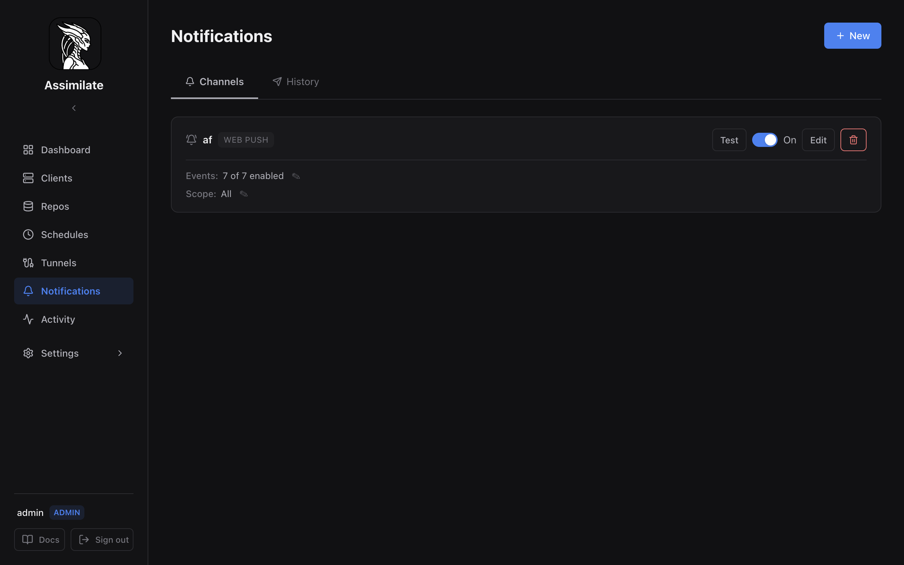

<!--
SPDX-License-Identifier: Apache-2.0
SPDX-FileCopyrightText: 2026 Alexander Mohr
-->

# Notifications

Assimilate can notify you when backups succeed, fail, or produce warnings. Three delivery channels are supported — all self-hosted, no third-party services required:

| Channel | Use case |
|---------|----------|
| **Email** | SMTP delivery to one or more addresses (STARTTLS, SSL/TLS, or plain) |
| **Webhook** | HTTP POST to any URL — Slack, Discord, ntfy, Gotify, or your own endpoint |
| **Web Push** | Browser push notifications via the Web Push protocol (VAPID) |



## Supported Events

| Event | Triggered when |
|-------|----------------|
| Backup Success | A backup completes without errors or warnings |
| Backup Warning | A backup completes but borg reported warnings |
| Backup Failed | A backup fails |
| Check Success | A repository consistency check passes |
| Check Failed | A repository consistency check fails |
| Agent Connected | An agent establishes a WebSocket connection |
| Agent Disconnected | An agent drops its WebSocket connection |

## Channels

Navigate to **Notifications** in the sidebar to manage channels. Click the **New** button to add a channel.

### Email (SMTP)

Configure your SMTP server details:

- **SMTP Host** — e.g. `smtp.gmail.com`, `mail.example.com`
- **SMTP Port** — 587 (STARTTLS), 465 (SSL/TLS), or 25 (plain)
- **Security** — STARTTLS (recommended), SSL/TLS, or None
- **SMTP User / Password** — credentials for authentication
- **From Address** — the sender address
- **To Addresses** — comma-separated list of recipients

### Webhook

Send a JSON POST request to any URL when events fire:

- **URL** — the endpoint to POST to (e.g. `https://hooks.slack.com/services/...`)
- **Headers** — optional key-value pairs (e.g. `Authorization: Bearer ...`)

The payload is a JSON object:

```json
{
  "event_type": "backup_failed",
  "hostname": "web-server-01",
  "repo_name": "daily-backup",
  "status": "failed",
  "error_message": "Repository lock could not be acquired",
  "timestamp": "2026-01-15T03:00:12Z"
}
```

### Web Push (Browser Notifications)

Browser push notifications appear even when the Assimilate tab is closed. They use the [Web Push protocol](https://www.rfc-editor.org/rfc/rfc8030) with VAPID authentication — no Firebase or external push services needed.

When you create your first Web Push channel, the browser will prompt you to allow notifications. No separate subscription step is required.

## Channel Scope

By default, a channel fires for **all** events system-wide. You can restrict a channel to specific repositories, hosts, or schedules using the **Scope** section on each channel card.

- Click the **Scope** toggle on a channel card to expand scope options.
- Select one or more **Repositories**, **Hosts**, or **Schedules** to narrow the channel's scope.
- Only events matching the selected scope will be delivered through that channel.
- Leaving a scope category empty means "all" — no filtering for that dimension.

!!! tip
    Scope is set per channel, not per rule. If you need different scoping for different event types, create separate channels.

### Example

A webhook channel scoped to the repository **server-backup** and the host **web-01** will only fire when backup events occur for that specific host/repository combination. Agent connect/disconnect events will still fire if the agent matches the host scope.

## Rules

Each channel can have multiple **rules** that determine which events trigger it. When adding rules, you can select multiple event types at once.

Rules can optionally be scoped to:

- A specific **repository** — only events from that repo trigger the rule
- A specific **client** — only events from that host trigger the rule
- A specific **schedule** — only events from that schedule trigger the rule

If no scope is set on a rule, the rule matches all events (subject to channel-level scope).

## VAPID Keys (Web Push)

Web Push requires a VAPID key pair for authenticating push messages. Assimilate **auto-generates** a VAPID key pair on first startup and stores it in the database — no manual configuration is required.

### Viewing the VAPID Public Key

The VAPID public key is available at:

```http
GET /api/notifications/push/vapid-key
```

This returns `{ "key": "<base64url>", "configured": true }`.

### Custom VAPID Keys

If you need to use your own VAPID keys (e.g. migrating from another server), you can set them via the API:

```http
PUT /api/notifications/push/vapid-key
Content-Type: application/json

{
  "public_key": "<base64url-encoded public key>",
  "private_key": "<base64url-encoded private key>"
}
```

You can generate a key pair with:

```bash
npx web-push generate-vapid-keys
```

!!! warning
    Changing VAPID keys invalidates all existing browser push subscriptions. Users will need to re-create their Web Push channels to re-subscribe.

### Docker

No special volume mounts or environment variables are needed. VAPID keys are stored in the database and persist across container restarts automatically.

## Testing

Each channel has a **Test** button that sends a sample notification to verify your configuration is correct. Check the **History** tab to see delivery status and error messages for recent notifications.

## Delivery History

The **History** tab shows the last 50 notification deliveries with:

- Channel name and event type
- Delivery status (sent / failed)
- Error message (if failed)
- Timestamp

Failed deliveries are logged but not retried automatically. Fix the channel configuration and use the Test button to verify.
