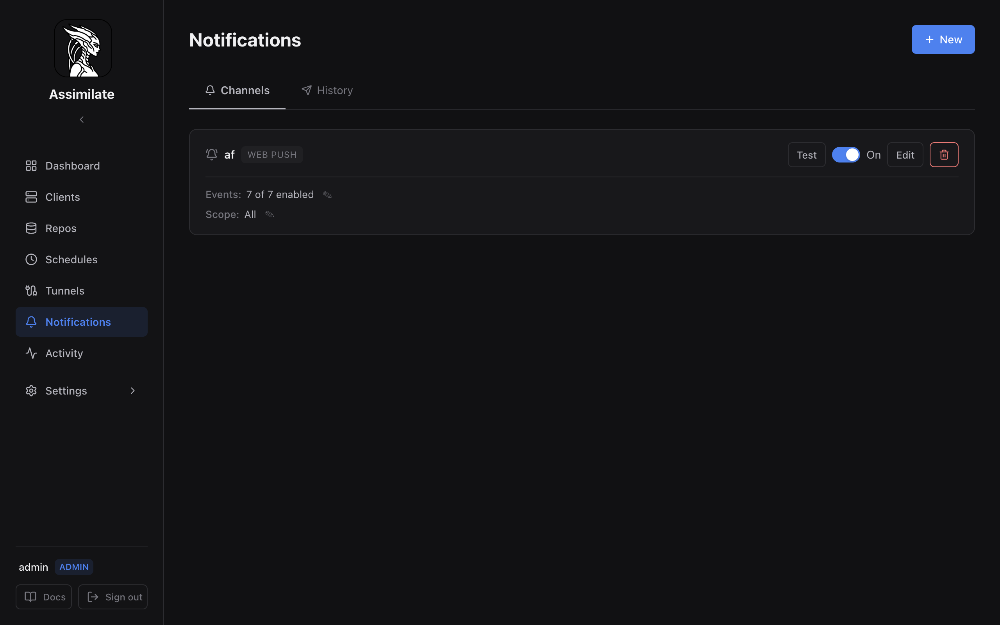
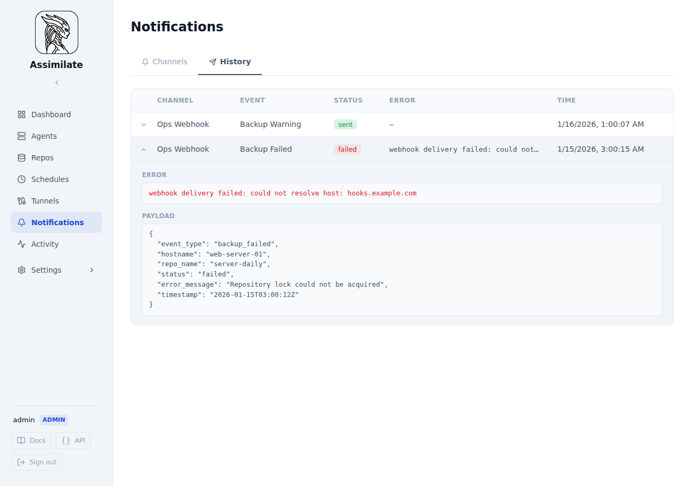

<!--
SPDX-License-Identifier: Apache-2.0
SPDX-FileCopyrightText: 2026 Alexander Mohr
-->

# Notifications

Assimilate can notify you when backups succeed, fail, or produce warnings. Three delivery channels are supported — all self-hosted, no third-party services required:

| Channel | Use case |
|---------|----------|
| **Email** | SMTP delivery to one or more addresses (STARTTLS, SSL/TLS, or plain) |
| **Webhook** | HTTP POST to any URL — Slack, Discord, ntfy, Gotify, or your own endpoint |
| **Web Push** | Browser push notifications via the Web Push protocol (VAPID) |



## Supported Events

| Event | Triggered when |
|-------|----------------|
| Backup Success | A backup completes without errors or warnings |
| Backup Warning | A backup completes but borg reported warnings |
| Backup Failed | A backup fails |
| Check Success | A repository consistency check passes |
| Check Failed | A repository consistency check fails |
| Agent Connected | An agent establishes a WebSocket connection |
| Agent Disconnected | An agent drops its WebSocket connection |
| Schedule Auto Disabled | The scheduler disables a schedule after it reaches its [missed backup threshold](scheduling.md#missed-backup-threshold) |
| Backup Skipped (Agent Offline) | A scheduled backup could not be started because its target agent was offline |
| Backup Skipped (Repository Offline) | A scheduled backup could not be started because the host holding its target repository did not answer SSH |

## Channels

Navigate to **Notifications** in the sidebar to manage channels. Click the **New** button to add a channel.

### Email (SMTP)

Configure your SMTP server details:

- **SMTP Host** — e.g. `smtp.gmail.com`, `mail.example.com`
- **SMTP Port** — 587 (STARTTLS), 465 (SSL/TLS), or 25 (plain)
- **Security** — STARTTLS (recommended), SSL/TLS, or None
- **SMTP User / Password** — credentials for authentication
- **From Address** — the sender address
- **To Addresses** — comma-separated list of recipients

The subject identifies the event, host, and repository (e.g. `Backup failed: web-server-01
/ daily-backup`); the body is a plain-text summary with the schedule (and its next
scheduled run), archive, duration, size, files processed, any warnings, the error message
on a failure, and -- when [`public_url`](#activity-log-deep-links) is configured -- a link
to the exact run in the Activity Log.

### Webhook

Send a JSON POST request to any URL when events fire:

- **URL** — the endpoint to POST to (e.g. `https://hooks.slack.com/services/...`)
- **Headers** — optional key-value pairs (e.g. `Authorization: Bearer ...`)

The payload is a JSON object. Fields that don't apply to a given event (for example
`duration_secs` on an `agent_connected` event) are `null`:

```json
{
  "event_type": "backup_failed",
  "hostname": "web-server-01",
  "repo_name": "daily-backup",
  "status": "failed",
  "error_message": "Repository lock could not be acquired",
  "timestamp": "2026-01-15T03:00:12Z",
  "schedule_id": 4,
  "schedule_name": "Nightly Server Backup",
  "archive_name": null,
  "run_id": "8f2e1a3c-6b7a-4e9a-9c2b-8f6a2e0b1c9d",
  "duration_secs": 10,
  "original_size": null,
  "compressed_size": null,
  "deduplicated_size": null,
  "files_processed": null,
  "warnings": [],
  "next_run_at": "2026-01-16T03:00:00Z",
  "activity_url": "https://backups.example.com/activity?category=backup&run_id=8f2e1a3c-6b7a-4e9a-9c2b-8f6a2e0b1c9d"
}
```

`activity_url` is only present when the [`public_url` system setting](configuration.md#system-settings)
is configured -- see [Activity Log Deep Links](#activity-log-deep-links) below.

### Web Push (Browser Notifications)

Browser push notifications appear even when the Assimilate tab is closed. They use the [Web Push protocol](https://www.rfc-editor.org/rfc/rfc8030) with VAPID authentication — no Firebase or external push services needed.

When you create your first Web Push channel, the browser will prompt you to allow notifications. No separate subscription step is required.

Tapping a push notification opens the app to the most relevant page: a backup
failure/warning opens the [Activity Log](#activity-log-deep-links) filtered to that run (or
the host, if the exact run isn't known), a schedule auto-disabled or backup-skipped event
opens that schedule, a repository check failure opens the affected host's overview (checks
aren't recorded in the Activity Log, so there's no run detail to link to), and everything
else opens the affected host or repository.

## Activity Log Deep Links

A backup **failure or warning** notification links to the [Activity Log](activity.md) so you
can go straight from the alert to the full run detail (duration, size, warnings, and the
exact error). Web Push notifications build this link automatically -- as precisely as
`run_id` allows, or by host otherwise -- since the browser resolves it against its own
origin. Repository check failures don't get this link: a check run isn't persisted anywhere
the Activity Log reads from, so those notifications link to the host overview instead.

Email and webhook notifications are delivered outside the browser, so they need to know the
server's externally-reachable address to build a clickable link. Set it once via the
`public_url` [system setting](configuration.md#system-settings):

```bash
curl -s -X PUT http://localhost:8080/api/system/settings \
  -H "cookie: session=<admin-session>" \
  -H "content-type: application/json" \
  -d '{"retention_days": 7, "public_url": "https://backups.example.com"}'
```

Until `public_url` is configured, email and webhook notifications omit the link (everything
else in this page still applies) -- Web Push is unaffected either way.

## Channel Scope

By default, a channel fires for **all** events system-wide. You can restrict a channel to specific repositories, hosts, or schedules using the **Scope** section on each channel card.

- Click the **Scope** toggle on a channel card to expand scope options.
- Select one or more **Repositories**, **Agents**, or **Schedules** to narrow the channel's scope.
- Only events matching the selected scope will be delivered through that channel.
- Leaving a scope category empty means "all" — no filtering for that dimension.

!!! tip
    Scope is set per channel, not per rule. If you need different scoping for different event types, create separate channels.

### Example

A webhook channel scoped to the repository **server-backup** and the agent **web-01** will only fire when backup events occur for that specific agent/repository combination. Agent connect/disconnect events will still fire if the agent matches the agent scope.

## Rules

Each channel can have multiple **rules** that determine which events trigger it. When adding rules, you can select multiple event types at once.

Rules can optionally be scoped to:

- A specific **repository** — only events from that repo trigger the rule
- A specific **agent** — only events from that agent trigger the rule
- A specific **schedule** — only events from that schedule trigger the rule

If no scope is set on a rule, the rule matches all events (subject to channel-level scope).

## VAPID Keys (Web Push)

Web Push requires a VAPID key pair for authenticating push messages. Assimilate **auto-generates** a VAPID key pair on first startup and stores it in the database — no manual configuration is required.

### Viewing the VAPID Public Key

The VAPID public key is available at:

```http
GET /api/notifications/push/vapid-key
```

This returns `{ "key": "<base64url>", "configured": true }`.

### Custom VAPID Keys

If you need to use your own VAPID keys (e.g. migrating from another server), you can set them via the API:

```http
PUT /api/notifications/push/vapid-key
Content-Type: application/json

{
  "public_key": "<base64url-encoded public key>",
  "private_key": "<base64url-encoded private key>"
}
```

You can generate a key pair with:

```bash
npx web-push generate-vapid-keys
```

!!! warning
    Changing VAPID keys invalidates all existing browser push subscriptions. Users will need to re-create their Web Push channels to re-subscribe.

### Docker

No special volume mounts or environment variables are needed. VAPID keys are stored in the database and persist across container restarts automatically.

## Testing

Each channel has a **Test** button that sends a sample notification to verify your configuration is correct. Check the **History** tab to see delivery status and error messages for recent notifications.

## Delivery History

The **History** tab shows the last 50 notification deliveries with:

- Channel name and event type
- Delivery status (sent / failed)
- Error message (if failed)
- Timestamp

Click a row to expand it and see the full error message and the raw event payload that was sent to the channel — useful when an error message is too long to read in the table, or when you need to see exactly which fields (hostname, repo, archive name, etc.) were included in the notification. On narrow screens the table switches to a stacked card layout instead of scrolling horizontally, so long error messages and payloads wrap in place.



Failed deliveries are logged but not retried automatically. Fix the channel configuration and use the Test button to verify.
