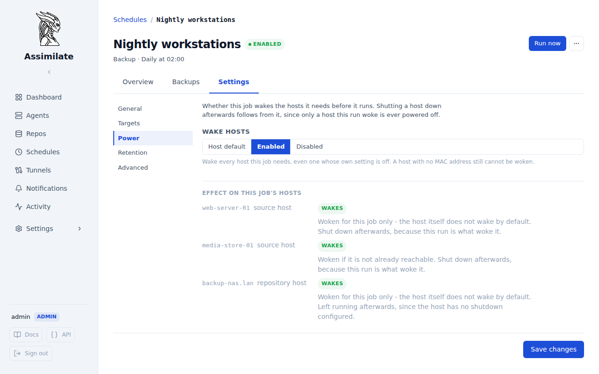

# Power Management

Assimilate can wake a powered-down host before a backup needs it, and power it back down once the backup is done — for both the source host (an agent's machine) and the repository host (the SSH destination borg writes to). Reachability is always checked first: a host that already responds is never disturbed, and only what a given run itself turned on is ever turned back off.

Each host carries the details a wake needs — MAC address, broadcast address, timeout, SSH destination — and its own **Wake host before backup** setting is the *default* answer for every schedule that touches it. A single schedule can override that answer in either direction; see [Per-Schedule Overrides](#per-schedule-overrides) below.

## How It Works

Before a scheduled backup runs, the server checks each of the two hosts it needs independently and concurrently — one being slow to wake never holds up the other:

1. **Source host** (the agent): if the agent is already connected over its WebSocket, nothing happens. Otherwise, if waking is enabled, the server sends a Wake-on-LAN packet and waits for the agent to reconnect. If the agent still isn't connected once the host is up (or waking is disabled) and starting the agent process over SSH is enabled, the server starts it and waits again.
2. **Repository host**: if it already answers SSH, nothing happens. Otherwise, if waking is enabled, the server sends a Wake-on-LAN packet and waits for SSH to become reachable.

After the backup finishes — whether it succeeded or failed — the server undoes only what *this run itself* turned on:

- A host is shut down only if this run woke it. A host that was already on when the backup started is left running.
- The agent process is stopped only if this run started it.

If two schedules concurrently rely on the same host, it stays up until every one of them has finished with it — a host woken for one schedule is never shut down out from under another that is still using it.

Every step is recorded to the run's timeline, visible in the backup's detail view (see [Run Timeline](#run-timeline) below), and pushed live if the view is open while it happens.

## Prerequisites

- **Wake-on-LAN**: the host's network interface must have WOL enabled in firmware/BIOS and in the OS, and the network between the Assimilate server and the host must allow broadcast UDP traffic on port 9. Wake-on-LAN packets do not cross routed network boundaries unless the router is configured to forward them.
- **Starting the agent process over SSH**: the server's SSH key must already be authorized on the host — deploy it once from the agent's header (**Deploy SSH key**, or as part of **Deploy agent**; see [Agent Deployment](agents.md#agent-deployment)). Starting the process requires the deploying user to have permission to manage systemd units (directly, or via passwordless `sudo`).
- **Shutting a host down**: uses the same SSH connection and permission requirements as starting the agent — the connecting user needs permission to run `shutdown` (directly or via passwordless `sudo`).

## Configuring an Agent's Host

From the agent's detail page, **Settings → Power** (admins only):

| Field | Description |
|-------|--------------|
| **Wake host before backup** | Send a Wake-on-LAN packet if the agent doesn't already respond. The default for this host's jobs — a schedule can override it either way |
| **MAC address** | Required when wake is enabled, and required for any schedule that overrides this host to be able to wake it |
| **Broadcast address** | Optional — defaults to the global broadcast address (`255.255.255.255`) when unset |
| **Wait for host** | How long to wait for the agent to reconnect before the backup is marked failed |
| **Shut down host after backup** | Only takes effect if this run woke the host. Configurable whenever a MAC address is set, including with wake off — a host woken only by a single job still needs to power down |
| **Start agent before backup** | Start the agent's systemd unit over SSH if it still isn't connected once the host is up. Requires the SSH key to have been deployed to the host at least once already |
| **SSH host / port** | Where to reach the host for starting the agent process and for shutting it down |
| **Service name** | Name of the systemd unit managing the agent process (defaults to `assimilate-agent`) |
| **Stop agent after backup** | Only takes effect if this run started the agent process |

## Per-Schedule Overrides

A host's **Wake host before backup** setting decides what happens for every schedule that uses it. Where one job needs to differ, set it on that job instead: from the schedule's detail page, **Settings → Power**.

| Setting | What the job does |
|---------|-------------------|
| **Host default** | Leaves it to each host's own setting. This is what every schedule does unless told otherwise. |
| **Enabled** | Wakes every host this job needs, including one whose own setting is off — as long as that host has a MAC address on file. |
| **Disabled** | Never wakes anything for this job, whatever its hosts are set to. A host that is not already up fails the run. |

The setting applies to both of the job's hosts at once — its agents and its repository — and it is available on backup, check and verify schedules alike. Under the control, the pane resolves the choice against the hosts this job actually uses, so what tonight's run will do is on screen rather than reconstructed from each host's own page.

Only *waking* is overridden. Two things follow the host's own settings in every case:

- **Starting the agent process over SSH** keeps following the agent's **Start agent before backup** setting. A machine that is already powered on needs no wake for its agent to be started.
- **Shutting a host down** still only happens where this run is what woke it, so **Disabled** removes the shutdown by removing the wake rather than suppressing it separately.

Because a schedule can now wake a host whose own setting is off, two things changed on the host panes:

- The wake details stay on screen when **Wake host before backup** is off, and **Shut down host after backup** stays configurable, as long as a MAC address is set. A host woken only by one job still has to be able to power off afterwards.
- The pane names the schedules that override it, so switching a host's own setting off does not quietly leave it being woken anyway. It lists the schedules *you* can see: a private schedule belonging to someone else is left out, the same way it is everywhere else in the UI, so treat the list as complete only if you are an admin. What a run actually does is never affected by who is looking.

!!! warning
    A job set to **Enabled** cannot wake a host that has no MAC address on file. The schedule's Power pane says so per host before you save, and a run that hits it records a **Cannot wake** step on the run timeline rather than failing silently.

## Configuring a Repository's Host

From the repository's detail page, **Settings → Power** (admins only). The same wake/shutdown fields as above apply, minus anything agent-process related — a repository host isn't running Assimilate, it's just an SSH destination borg writes to, so there is nothing to start or stop beyond the machine itself. Reachability reuses the same SSH connection check as the **Test Connection** button on the repository's own settings.

## Run Timeline

A backup run's detail view shows every power-management step recorded around it, in order — both the source and repository host's events interleaved by time, since they run independently. A run whose hosts were already reachable records nothing here beyond what the backup itself reports; most runs never touch this at all.

A **Cannot wake** step means a schedule asked to wake a host that has no MAC address on file. The run continues — the host simply is not woken, and the backup fails naturally if it never comes up.

!!! note
    A manually triggered ("Run Now") run never wakes a host itself, so it rarely records more than a teardown step — typically nothing at all unless it happens to be the last participant releasing a host a concurrent scheduled run woke.

## Limitations

Which hosts are currently owed a shutdown (or an agent stop) is tracked only in the server's memory, not persisted to the database. If the server restarts or crashes after a run has woken a host but before that run's teardown step runs, the server has no record on startup that the host is still powered on and pending shutdown — it stays on indefinitely, with no error and nothing in the run timeline to explain why. This is rare in practice (the window is the gap between a wake completing and its backup finishing), but worth knowing if a host you expected to power off is still running after an unplanned server restart: check it manually.

<!--
SPDX-License-Identifier: Apache-2.0
SPDX-FileCopyrightText: 2026 Alexander Mohr
-->
