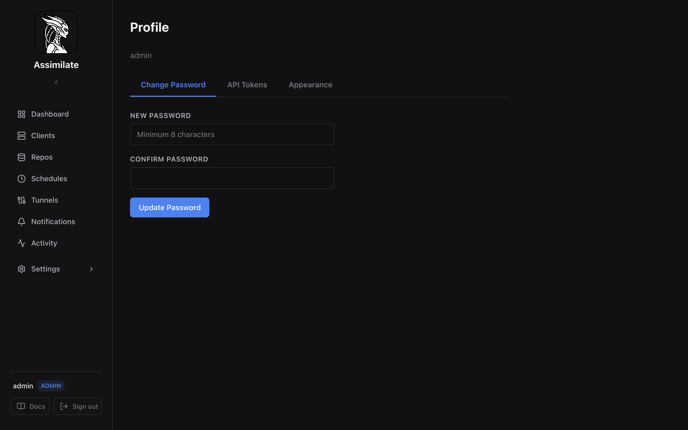

# Profile & Preferences

The Profile page lets you manage your account settings, API tokens, and UI preferences. Access it from **Settings → Profile** in the sidebar.



## Change Password

The **Change Password** tab lets you update your login password.

1. Enter your new password (minimum 8 characters).
2. Confirm the password.
3. Click **Update Password**.

Passwords are hashed with bcrypt before storage. The server enforces a minimum length of 8 characters.

!!! note
    Admins can also reset other users' passwords from **Settings → Access Control → Users**. See [Access Control](access-control.md) for details.

## API Tokens

The **API Tokens** tab lets you create and manage personal API tokens for programmatic access to the REST API.

### Creating a Token

1. Click **Create Token**.
2. Enter a descriptive name (e.g., "CI pipeline", "monitoring script").
3. Click **Create**.
4. **Copy the token immediately** — it is shown only once and cannot be retrieved later.

### Using a Token

Include the token in the `Authorization` header of API requests:

```http
Authorization: Bearer <token>
```

Tokens authenticate with the same permissions as your user account.

### Managing Tokens

The token list shows:

| Column | Description |
|--------|-------------|
| Name | The label you assigned at creation |
| Created | When the token was created |
| Last Used | When the token was last used to authenticate a request (or "Never") |

Click the delete icon to revoke a token. Any integrations using that token will immediately stop working.

!!! warning
    Deleted tokens cannot be recovered. Create a new token if you need to replace a revoked one.

### Admin Token Management

Admins can view and delete all users' tokens from **Settings → Access Control → Users**. Regular users can only manage their own tokens. See [Security](security.md) for more details.

## Appearance

The **Appearance** tab lets you switch between light and dark mode. Your preference is saved server-side and persists across browsers and sessions.

| Theme | Description |
|-------|-------------|
| Light | Light background, dark text |
| Dark | Dark background, light text |

The theme applies immediately without a page reload.

## Related Pages

- [Security & Authentication](security.md) — authentication mechanisms and token security
- [API Reference](api-reference.md) — using tokens with the REST API
- [Access Control](access-control.md) — roles, groups, and permissions

<!--
SPDX-License-Identifier: Apache-2.0
SPDX-FileCopyrightText: 2026 Alexander Mohr
-->
