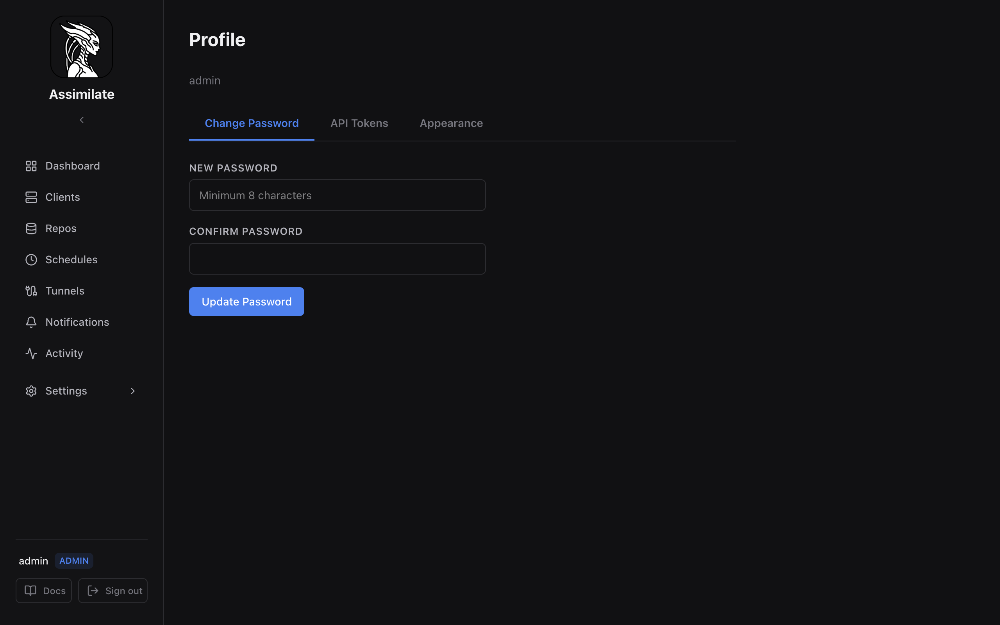

# Profile & Preferences

The Profile page lets you manage your account settings, API tokens, and UI preferences. Access it from **Settings → Profile** in the sidebar.



## Change Password

The **Change Password** tab lets you update your login password.

1. Enter your new password (minimum 8 characters).
2. Confirm the password.
3. Click **Update Password**.

Passwords are hashed with bcrypt before storage. The server enforces a minimum length of 8 characters.

!!! note
    Admins can also reset other users' passwords from **Settings → Access Control → Users**. See [Access Control](access-control.md) for details.

## API Tokens

The **API Tokens** tab lets you create and manage personal API tokens for programmatic access to the REST API.

### Creating a Token

1. Click **New token**.
2. Enter a descriptive name (e.g., "CI pipeline", "monitoring script").
3. Click **Create**.
4. **Copy the token immediately** — it is shown only once and cannot be retrieved later.

### Using a Token

Include the token in the `Authorization` header of API requests:

```http
Authorization: Bearer <token>
```

Tokens authenticate with the same permissions as your user account.

### Managing Tokens

The token list shows:

| Column | Description |
|--------|-------------|
| Name | The label you assigned at creation |
| Created | When the token was created |
| Last Used | When the token was last used to authenticate a request (or "Never") |

Click the delete icon to revoke a token. Any integrations using that token will immediately stop working.

!!! warning
    Deleted tokens cannot be recovered. Create a new token if you need to replace a revoked one.

### Admin Token Management

Admins can view and delete all users' tokens from **Settings → Access Control → Users**. Regular users can only manage their own tokens. See [Security](security.md) for more details.

## Appearance

The **Appearance** tab lets you switch between light and dark mode. Your preference is saved server-side and persists across browsers and sessions.

| Theme | Description |
|-------|-------------|
| Light | Light background, dark text |
| Dark | Dark background, light text |

The theme applies immediately without a page reload.

## Two-Factor Authentication (TOTP)

The **Two-Factor Auth** tab enrolls and manages TOTP-based two-factor authentication for your account. Once enabled, every login requires a one-time code from an authenticator app (e.g. Google Authenticator, Authy) in addition to your password.

### Enabling 2FA

1. Click **Set Up Two-Factor Auth**. The server generates a new TOTP secret and a set of recovery codes.
2. Scan the displayed QR code with your authenticator app, or enter the manual key.
3. Enter the current 6-digit code from your authenticator app and click **Verify & Enable**.
4. **Save the recovery codes** shown on completion in a secure place. Each code can be used once to regain access if you lose your authenticator device.

TOTP is only activated after the verification code confirms you can generate valid codes, so a mistyped secret never locks you out.

### Logging in without your authenticator device

If you lose access to your authenticator app, click **Use a recovery code instead** on the two-factor step of the login page and enter one of the recovery codes you saved during enrollment in place of the 6-digit code. Each recovery code works once; to get a fresh full set, disable and re-enable 2FA (this generates 10 new codes and invalidates any unused old ones).

### Disabling 2FA

To turn 2FA off, enter your current account password on the **Two-Factor Auth** tab and click **Disable Two-Factor Auth**. Disabling removes the stored secret and any remaining recovery codes.

!!! warning
    Disabling 2FA reduces account security. Prefer rotating your authenticator device over disabling 2FA whenever possible.

See [Security & Authentication](security.md) for the security properties of TOTP (replay protection, recovery-code hashing, and secret encryption).

## Sessions

The **Sessions** tab lists every active session for your account. Use it to review where your account is signed in and to sign out other devices.

| Column | Description |
|--------|-------------|
| Created | When the session was established |
| Last Active | The most recent time the session made an API request |
| Expires | When the session expires (remember-me sessions last 7 days) |
| Type | `Remember Me` (7-day) or `Session` (24-hour) |
| Status | `Current` for the session used by this browser, otherwise `Active` |

Click the trash icon next to any non-current session to revoke it immediately. Your current session cannot be revoked from here — sign out normally instead.

Sessions that are inactive longer than the configured **Session Idle Timeout** (see [Configuration](configuration.md)) are revoked automatically on the next request.

## Related Pages

- [Security & Authentication](security.md) — authentication mechanisms and token security
- [API Reference](api-reference.md) — using tokens with the REST API
- [Access Control](access-control.md) — roles, groups, and permissions

<!--
SPDX-License-Identifier: Apache-2.0
SPDX-FileCopyrightText: 2026 Alexander Mohr
-->
