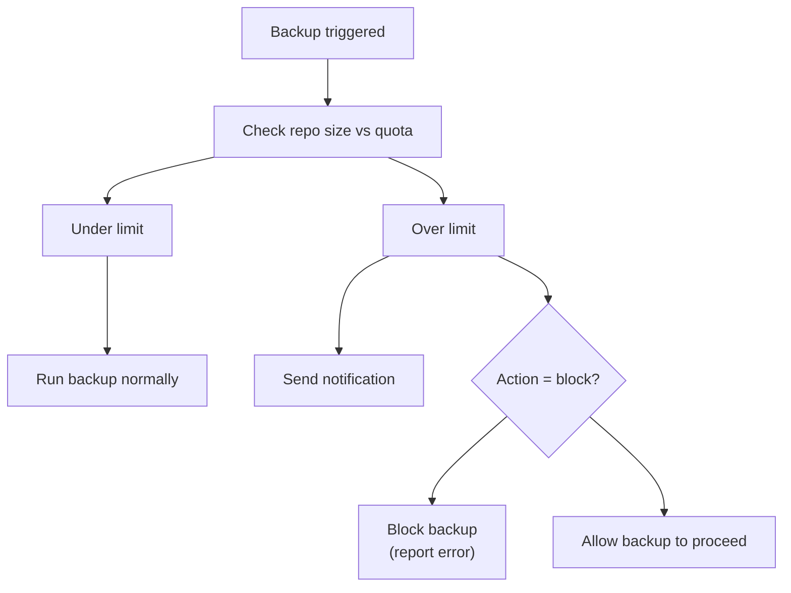

<!--
SPDX-License-Identifier: Apache-2.0
SPDX-FileCopyrightText: 2026 Alexander Mohr
-->

# Storage Quotas

Storage quotas let you set a maximum deduplicated storage limit per repository. When a repository exceeds its quota, Assimilate can block new backups, send a notification, or both.

<!-- screenshot: quotas -->

## Configuring a Quota

1. Navigate to **Repos** and select the repository.
2. Open the **Settings** tab.
3. Enable **Storage Quota** and enter the limit in GiB.
4. Set the **Action** to take when the limit is reached.
5. Click **Save**.

## Quota Options

| Field | Default | Description |
|-------|---------|-------------|
| **Enabled** | `false` | Toggle quota enforcement on or off |
| **Limit** | — | Maximum deduplicated storage in GiB |
| **Action** | `notify` | What to do when the limit is exceeded (see [Actions](#actions)) |
| **Warning threshold** | `90` | Percentage of the limit at which a warning notification is sent |

## Actions

| Action | Behaviour |
|--------|-----------|
| `notify` | Send a notification when the limit is exceeded; backup proceeds normally |
| `block` | Refuse to start new backups while the repository is over quota |
| `notify_and_block` | Send a notification and block new backups |

!!! tip
    Set the warning threshold to 80–90% to give yourself time to prune archives or increase the quota before backups are blocked.

## Quota Enforcement Flow

The quota check runs before `borg create` is invoked. If the action is `block` or `notify_and_block` and the repository is over quota, the backup is recorded as failed with the reason `quota_exceeded`.

## Viewing Current Usage

The repository detail page shows current deduplicated size alongside the configured quota limit and a progress bar indicating percentage used.

The [Dashboard](dashboard.md) **Storage Breakdown** chart also reflects per-repository size, making it easy to identify repositories approaching their quota.

## Removing a Quota

Set **Enabled** to off and click **Save**. No quota limit is applied to future backups.

## Related Pages

- [Repository Management](repositories.md) — configure repositories
- [Dashboard](dashboard.md) — storage overview across all repositories
- [Notifications](notifications.md) — configure quota alert notifications
