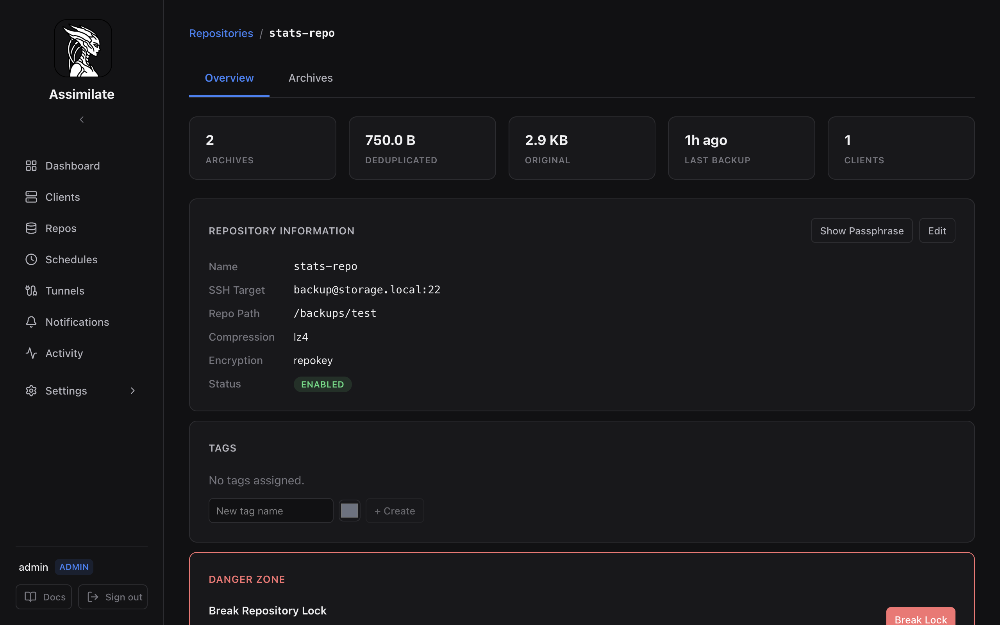
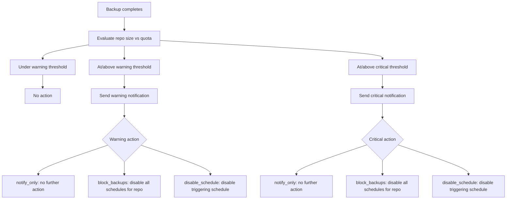

<!--
SPDX-License-Identifier: Apache-2.0
SPDX-FileCopyrightText: 2026 Alexander Mohr
-->

# Storage Quotas

Storage quotas let you set warning and critical deduplicated storage thresholds per repository. Each threshold has its own configurable **action**: send a notification only, block all backups for the repository, or disable just the schedule that pushed the repository over the limit.

Storage quota configuration is available on the repository detail page under the **Storage Quota** section.

## Configuring a Quota

1. Navigate to **Repos** and select the repository.
2. In the **Storage Quota** panel, click **Configure Quota** (or **Edit** if one already exists).
3. Enter the **Warning** and **Critical** thresholds in GB.
4. Choose the **action** for each threshold (see [Actions](#actions)).
5. Toggle **Enabled** and click **Save**.

## Quota Options

| Field | Default | Description |
|-------|---------|-------------|
| **Enabled** | `true` | Toggle quota enforcement on or off |
| **Warning threshold** | — | Deduplicated size at which the warning action fires |
| **Warning action** | `notify_only` | Action taken when the warning threshold is reached |
| **Critical threshold** | — | Deduplicated size at which the critical action fires |
| **Critical action** | `notify_only` | Action taken when the critical threshold is reached |

## Actions

| Action | Behaviour |
|--------|-----------|
| `notify_only` | Send a notification; all schedules keep running normally |
| `block_backups` | Disable every schedule for this repository, in addition to notifying |
| `disable_schedule` | Disable only the schedule whose backup triggered the breach, in addition to notifying |

Disabling a schedule pushes an updated configuration to every agent assigned to it, so the agent stops running that schedule immediately rather than waiting for its next check-in. A disabled schedule can be re-enabled at any time from the [Scheduling](scheduling.md) page.

!!! tip
    Use `disable_schedule` for a targeted response when several schedules feed the same repository, and reserve `block_backups` for repositories where any further growth is unacceptable.

## Quota Enforcement Flow

Quota status is evaluated after each backup completes, using the repository's current deduplicated size:

Because enforcement runs after the triggering backup has already completed, the backup that crosses the threshold is never itself blocked — only *subsequent* runs of the affected schedule(s) are stopped.

## Server Quotas

When several repositories share the same SSH host — for example, multiple repos backed by one disk on the same storage server — a per-repository quota can't see the combined usage. [Server Quotas](server-quotas.md) solve this by applying a single warning/critical threshold (with the same three actions) across every repository on a shared host.

## Viewing Current Usage

The repository detail page shows current deduplicated size alongside the configured quota thresholds and a progress bar indicating percentage used.

The [Dashboard](dashboard.md) **Storage Breakdown** chart also reflects per-repository size, making it easy to identify repositories approaching their quota.

## Removing a Quota

Set **Enabled** to off and click **Save** to stop enforcement while keeping the configured thresholds.

## Related Pages

- [Repository Management](repositories.md) — configure repositories
- [Server Quotas](server-quotas.md) — shared storage limits across repositories on the same host
- [Scheduling & Retention](scheduling.md) — re-enable a schedule disabled by a quota action
- [Dashboard](dashboard.md) — storage overview across all repositories
- [Notifications](notifications.md) — configure quota alert notifications
