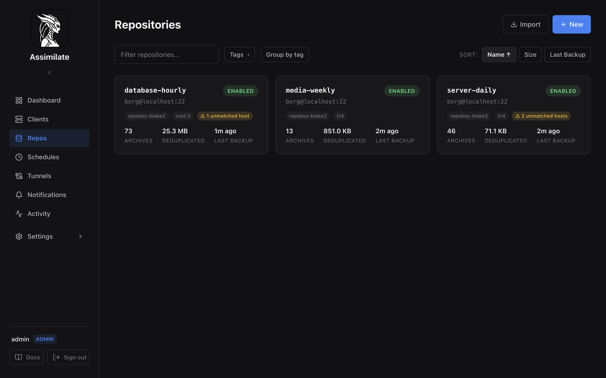

# Repository Management

A repository is a borg backup destination — an SSH-accessible path where archives are stored. Each repository has its own encryption passphrase, compression settings, and access controls.

## SSH Setup Prerequisites

Assimilate connects to borg repositories over SSH using the server's Ed25519 key pair. Before creating a repository, the server's public key must be authorized on the repository host.

**View the server's public key** under **System** in the admin UI, or retrieve it via:

```bash
ssh-add -L
```

Add the key to `~/.ssh/authorized_keys` on the borg repository host:

```bash
echo "<server-public-key>" >> ~/.ssh/authorized_keys
```

For append-only access, use a `command=` restriction in `authorized_keys`:

```text
command="borg serve --append-only --restrict-to-path /backup/repos",restrict ssh-ed25519 AAAA...
```

Once the key is in place, use the **Test Connection** button in the repository form to verify SSH connectivity and confirm that `borg` is installed on the remote host.

On the first successful borg connection, SSH may add the repository host key to the running user's default `known_hosts` file. A one-time "Permanently added ..." warning from OpenSSH is expected then; subsequent borg commands reuse the stored key and should not repeat it.

For the full SSH agent forwarding setup — including Docker and systemd configurations — see [SSH Agent Forwarding](ssh-agent-forwarding.md).

## Creating a Repository

There are two paths for adding a repository:

| Path | When to use |
|------|-------------|
| **Init new** | The remote path does not yet exist — Assimilate runs `borg init` |
| **Import existing** | A borg repository already exists at the path — register it without reinitializing |

Both paths are available from **Repositories → New Repository** in the UI.



The Repositories list page shows all registered repositories with:

- **Text filter** — search by repository name
- **Tag filter** — filter by one or more tags
- **Group by tag** — organize repositories into tag groups
- **Sort buttons** — sort by Name, Size, or Last Backup

Each repository card shows the name, SSH target, enabled state, encryption type, compression algorithm, unmatched host warnings, archive count, deduplicated size, and last backup time.


The repository detail page shows full connection information, storage statistics (original, compressed, deduplicated sizes), storage quota status with a progress bar, tags, and danger zone actions (Refresh SSH Key, Break Lock, Remove Repository, Delete Repository).

## Init New Repository

Use this path when the remote directory is empty or does not exist yet.

1. Enter the SSH connection details: host, user, port (default 22), and repository path.
2. Use the **Browse** button to navigate the remote filesystem and select a path (see [Folder Browser](#folder-browser)).
3. Select an encryption type (see [Encryption Types](#encryption-types)).
4. Enter a passphrase. Choose a strong, unique passphrase — it cannot be recovered if lost.
5. Optionally select a compression algorithm (see [Compression](#compression)).
6. Click **Initialize**. The server runs `borg init` on the remote host and registers the repository.

The borg output is shown after initialization. If the remote path already contains a borg repository, the server returns a conflict error — use **Import Existing** instead.

## Import Existing Repository

Use this path when a borg repository already exists at the remote path and you want to register it in Assimilate without reinitializing.

1. Enter the SSH connection details and the exact path to the existing repository.
2. Enter the passphrase that was used when the repository was originally initialized.
3. Click **Save**. The repository is registered and will appear in the repository list.

No `borg init` is run. The passphrase is stored encrypted at rest and used for all future backup and archive operations.

### Import Progress

After saving, the server runs `borg info` and `borg list` in the background to sync existing archives. While this is in progress:

- The repository card shows an **Importing** spinner badge.
- The repository detail page shows an importing indicator.
- If the import fails (e.g. SSH timeout, wrong passphrase), the error is displayed on the repository card and detail page.

During a full repository sync, Assimilate also prunes archives that no longer exist in borg from the database. The scheduled disk sync uses the same full reimport path, so it refreshes the complete archive list instead of only adding new entries.

### Full resync and content indexing

The **Full Resync** action on the repository detail page re-reads every archive from borg and then builds the browsable **content index** (the file tree used for archive browsing, search, diff, and restore). Because borg archives are immutable:

- Archives whose content index is already complete are **skipped** — a resync never re-scans an archive it has already indexed.
- Stats are only re-fetched for archives that don't have them yet.

Indexing runs in the background and the repository badge shows live progress: the **bar advances as each archive finishes** (so it never sits at 100% while work remains), and the status line shows the archive currently being scanned together with a running file count and the file being processed, e.g. *Indexing 'host-2026-06-10T02:00:00' (3/84) — 12,345 files · home/user/project/main.rs*. You can navigate away — indexing continues and the UI updates automatically via WebSocket.

For large repositories with many archives, the initial import and first full index may take several minutes.

### Archive-to-Host Matching

During import, each archive's hostname is resolved to a registered agent:

1. **Exact match** — the archive hostname matches an agent's hostname directly.
2. **Pattern match** — the hostname matches a glob pattern configured on an agent (see [Agent Management — Hostname Aliases](agents.md#hostname-aliases-glob-patterns)).
3. **Unmatched** — a placeholder agent is created with an "(imported)" badge.

Unmatched archives can be resolved later by adding hostname patterns and running a re-scan.

## Re-scanning Unmatched Archives

After adding hostname aliases to agents, you can re-scan a repository to match previously unmatched archives against the updated patterns.

1. Open the repository detail page.
2. Click **Re-scan Archives** (admin only).
3. The server evaluates all unmatched archives against current hostname patterns.
4. A toast shows how many archives were matched and how many remain unmatched.
5. Placeholder agents with no remaining archives are automatically cleaned up.

## Encryption Migration

Admins can migrate a repository to a different encryption mode (e.g. from `repokey` to `repokey-blake2`).

1. Open the repository detail page.
2. Click **Migrate Encryption** and select the target encryption mode.
3. Click **Confirm**.

The server:

1. Renames the existing repository to `<path>.migrated-<date>` on the remote host.
2. Runs `borg init` at the original path with the new encryption mode.
3. Updates the database record.

The old repository is preserved at the `.migrated-*` path and can be removed manually once you've confirmed the migration is successful. This operation is audit-logged.

!!! warning
    Migration creates a new empty repository. Existing archives remain in the old (renamed) repository. You will need to run new backups to populate the migrated repository.

## Folder Browser

The built-in folder browser lets you navigate the remote filesystem over SFTP to select a repository path without typing it manually.

Click the **Browse** button next to the repository path field. The browser connects to the SSH host using the server's key and lists directories. Navigate to the desired parent directory and either select an existing directory or type a new subdirectory name.

The selected path is written back into the repository path field.

The folder browser requires the SSH host and user fields to be filled in first.

## Encryption Types

Assimilate supports all borg encryption modes. The encryption type is set at `borg init` time and cannot be changed afterwards.

| Mode | Description |
|------|-------------|
| `repokey` | Passphrase-protected key stored in the repository |
| `repokey-blake2` | Same as `repokey` with BLAKE2b MAC — **recommended** |
| `keyfile` | Passphrase-protected key stored on the agent machine |
| `keyfile-blake2` | Same as `keyfile` with BLAKE2b MAC |
| `authenticated` | No encryption, HMAC authentication only |
| `authenticated-blake2` | No encryption, BLAKE2b authentication only |
| `none` | No encryption, no authentication |

**Recommendation:** Use `repokey-blake2`. It stores the key in the repository (no separate key file to manage), uses the faster and more secure BLAKE2b MAC, and is the most common choice for server-managed backups.

Avoid `none` for any data that should remain confidential. For details on borg encryption internals, see the [BorgBackup documentation](https://borgbackup.readthedocs.io/en/stable/usage/init.html).

## Compression

Compression is applied per-archive at backup time. It can be changed on an existing repository — the new setting applies to future archives only.

| Algorithm | Trade-off |
|-----------|-----------|
| `lz4` | Very fast, low CPU, moderate ratio — **default, good for most cases** |
| `zstd` (level 1–22) | Balanced speed and ratio; level 3 is a good starting point |
| `zlib` (level 1–9) | Slower than lz4, similar ratio; legacy option |
| `none` | No compression — useful when data is already compressed (e.g., media files) |

For general-purpose backups, `lz4` is the default and works well. Use `zstd,3` when storage space is a priority and CPU overhead is acceptable.

## Repository Tags

Tags are short labels that help organize repositories when managing many agents. A repository can have multiple tags.

Tags are set in the repository edit form and are visible in the repository list. They have no effect on backup behavior — they are purely organizational.

## Passphrase Management

The passphrase is required by borg to encrypt and decrypt archives. Assimilate stores it encrypted at rest using AES-256-GCM, derived from the `ASSIMILATE_SECRET_KEY` environment variable.

**Viewing the passphrase** is restricted to admins. Navigate to the repository detail page and click **Show Passphrase**. The decrypted passphrase is fetched from the server and displayed once.

The passphrase is never logged or transmitted in plaintext. See [Security](security.md) for details on the encryption scheme.

!!! warning "Passphrase is irrecoverable"
    If you lose the passphrase, the repository contents are permanently inaccessible. Assimilate cannot recover it. Store the passphrase in a secure location (e.g., a password manager) independent of Assimilate.
    If `ASSIMILATE_SECRET_KEY` is changed or lost, all stored passphrases become unreadable. Keep this value stable and back it up separately. See [Configuration](configuration.md) for details.

## Editing and Deleting

**Editing** a repository updates the SSH connection details, compression, and enabled state. The passphrase and encryption type cannot be changed after initialization — borg does not support re-encrypting an existing repository.

Changing the SSH host or path does not move or modify the remote repository. It only updates the connection details Assimilate uses to reach it.

### Repository Relocation Safety

When you change a repository's path, SSH host, or SSH port, borg needs to accept that the repository has moved. Assimilate handles this securely:

1. **On edit**: The server marks the repository as "relocation pending."
2. **Next backup**: The agent sets `BORG_RELOCATED_REPO_ACCESS_IS_OK=yes` for that single backup run, allowing borg to accept the new location.
3. **After success**: The relocation flag is cleared automatically. Subsequent backups no longer accept relocations.

This means borg will only accept a repository relocation **once**, immediately after an admin changes the connection details. If an attacker swaps the remote repository at any other time, borg will refuse to operate on it.

!!! note
    No manual action is required. The relocation acceptance is automatic and one-shot. If the first backup after a path change fails for an unrelated reason, the flag remains set until a backup succeeds.

**Deleting** a repository removes it from Assimilate — the database record, stored passphrase, and associated schedules are deleted. The remote borg repository and its archives are **not** deleted. You must remove the remote data manually if desired.

Deletion requires admin privileges.

## Repository Permissions

By default, repository visibility follows the owner model. Admins can grant per-user access to specific repositories using the permissions panel on the repository detail page.

| Permission | Effect |
|------------|--------|
| `can_view` | User can see the repository and its archives |
| `can_backup` | User can trigger manual backups |
| `can_modify_schedules` | User can create, edit, and delete backup schedules for this repository |
| `can_extract` | User can browse and extract files from archives |
| `can_delete` | User can delete archives |

Admins always have full access regardless of per-user permissions. For a broader overview of access control, see [Security](security.md).

<!--
SPDX-License-Identifier: Apache-2.0
SPDX-FileCopyrightText: 2026 Alexander Mohr
-->
