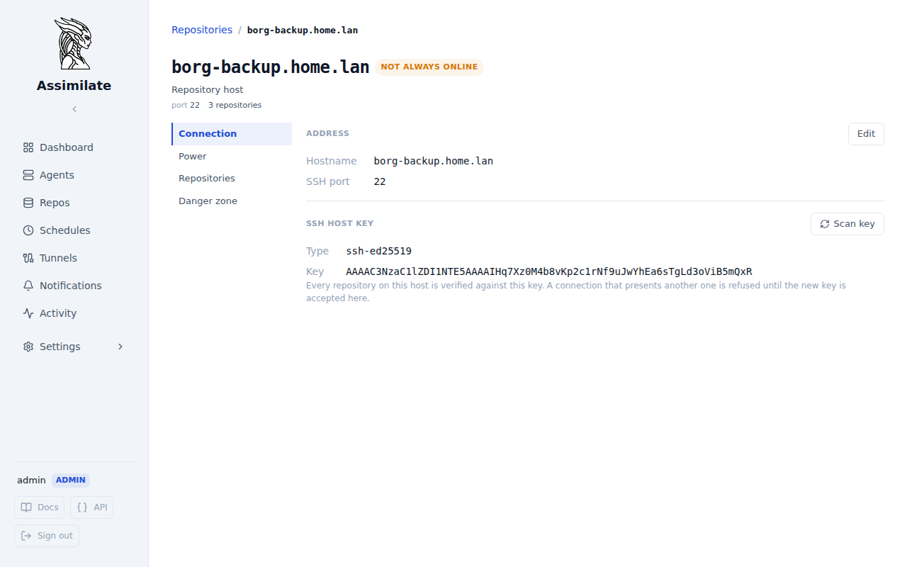

<!--
SPDX-License-Identifier: Apache-2.0
SPDX-FileCopyrightText: 2026 Alexander Mohr
-->

# Repository Hosts

A repository host is the machine borg writes to: one hostname, one SSH port and one pinned SSH host key. Everything that is a fact about that machine rather than about one repository on it is set once, on the host, for every repository it holds: where it is reached, the key it presents, how it is woken and shut down, and whether it is expected to be online. A repository keeps what is really its own: the SSH user it logs in as and its path.

## Prerequisites

- At least one [repository](repositories.md). A host is created the first time a repository names its hostname, and there is no separate step to add one.
- Admin access. The host page, and every endpoint behind it, is admin-only: its repository list names every repository on the machine, whoever may see which.

## Opening a Host

Open a host from either of these:

- The **Host** row of a repository's **Settings → Repository** pane.
- The host header of the grouped [Repositories](repositories.md#quota-by-host) list. A host marked as not always online carries a **Not always online** badge there. With **Group by host** off, each repository card on such a host carries a **host sleeps** pill instead.

The page has four sections:

| Section | Content |
|---------|---------|
| **Connection** | Hostname, SSH port and the pinned SSH host key |
| **Power** | Wake-on-LAN, shutting down after a backup, and [when the host is offline](power-management.md#when-the-host-is-offline) |
| **Repositories** | Every repository on the host, with the user and path each one uses |
| **Danger zone** | **Remove host**, available once no repository uses it |

## Connection

**Hostname** and **SSH port** say where every repository on the host is reached. A host has exactly one port. A repository that names a known hostname with another port is refused, rather than silently pointed at a different SSH daemon.

Changing either value moves every repository on the host at once. Each one is marked for [relocation](repositories.md#repository-relocation-safety), so borg accepts the new location on its next backup, and the host's [server quota](server-quotas.md) follows the new name.

### SSH Host Key

The pinned key is what every repository on the host is verified against. A connection that presents another key is refused until the new key is accepted here.

1. Open the host's **Connection** section. The page scans the key the host presents now. If it differs from the pinned one, a warning with **Review key** appears. A repository's own **Settings → Repository** pane shows the same warning, with a link here.
2. Select **Review key** (or **Scan key** to check on demand) and compare the key with the one the machine reports locally, for example with `ssh-keygen -lf /etc/ssh/ssh_host_ed25519_key.pub`.
3. Select **Accept key**. The key is pinned for every repository on the host, and the agents that write to them receive it with their next config push.

A failed scan is not treated as a changed key: the host may simply be asleep.

Adding a repository on a host that already has a pinned key requires the host to present that same key. A different key is refused rather than pinned over the old one, because that would silently re-trust every other repository on the machine.

## Power

Waking, shutting down and availability are set on the host and apply to every repository on it. See [Power Management](power-management.md#configuring-a-repository-host) for each setting.

A run that writes to several repositories on one host wakes it once, and shuts it down only after the last of those repositories is done.

A repository's own **Settings → Power** pane shows its host's settings read-only, with a link to the host to change them. It also lists the schedules currently waiting on that repository.

## Upgrading from Per-Repository Settings

Before repository hosts existed, every repository carried its own copy of these settings. The schema migration groups existing repositories into hosts once:

1. **Group.** Repositories that pinned the same host key on the same port form one host, whatever hostname each used (`nas`, `nas.lan`, an IP address). A matching key proves it is the same SSH server. Repositories with no pinned key are grouped by hostname alone.
2. **Name.** The host takes the hostname most of its repositories used. A tie goes to the name used by the most recently written repository.
3. **Fold settings.** Each setting takes the value that changes nothing for the worse for any repository on the host:

| Setting | When repositories on one host disagree |
|---------|----------------------------------------|
| SSH port | The port most of the host's repositories use |
| SSH host key | The key most repositories on that port pinned; a tie goes to the newest repository |
| Wake host before backup | On if any repository had it on |
| MAC and broadcast address | From the newest repository that wakes the host |
| Wait for host | The longest timeout |
| Shut down host after backup | Off unless every repository had it on |
| Host is not always online | On if any repository had it on |
| Re-check every | The shortest interval |
| Stop waiting after | The longest window, with "wait indefinitely" winning |
| Server quota | A quota set on a name that lost the vote moves to the host when the host has none; otherwise it is removed |

Everything the migration could not decide without changing where or how a repository connects is written to the [Activity Log](activity.md#system-events) as a **Repo Host Migrated** event, naming the repository: a new hostname, another port, a different pinned key or wake address, or a removed quota.

!!! warning "Check the Activity Log after upgrading"
    Borg connects from the agent, not from the server, so a hostname the migration chose may not resolve from every agent. That repository's next backup fails with a connection error. Edit the host's hostname to one every agent can resolve.

## API Endpoints

| Method | Path | Description |
|--------|------|-------------|
| `GET` | `/api/repo-hosts` | List every repository host with its repositories |
| `GET` | `/api/repo-hosts/{repo_host_id}` | Get one repository host |
| `PUT` | `/api/repo-hosts/{repo_host_id}` | Change the hostname and SSH port |
| `DELETE` | `/api/repo-hosts/{repo_host_id}` | Remove a host no repository uses |
| `PUT` | `/api/repo-hosts/{repo_host_id}/power` | Set the Wake-on-LAN and shutdown settings |
| `GET` / `PUT` | `/api/repo-hosts/{repo_host_id}/availability` | Get or set whether the host is not always online, and list the schedules waiting on it |
| `POST` | `/api/repo-hosts/{repo_host_id}/availability/check` | Ask the host whether it is back now |
| `POST` | `/api/repo-hosts/{repo_host_id}/ssh-host-key/scan` | Scan the key the host presents |
| `POST` | `/api/repo-hosts/{repo_host_id}/ssh-host-key` | Pin a key for every repository on the host |

## Related Pages

- [Repository Management](repositories.md)
- [Power Management](power-management.md)
- [Scheduling & Retention](scheduling.md#hosts-that-are-not-always-online)
- [Server Quotas](server-quotas.md)
