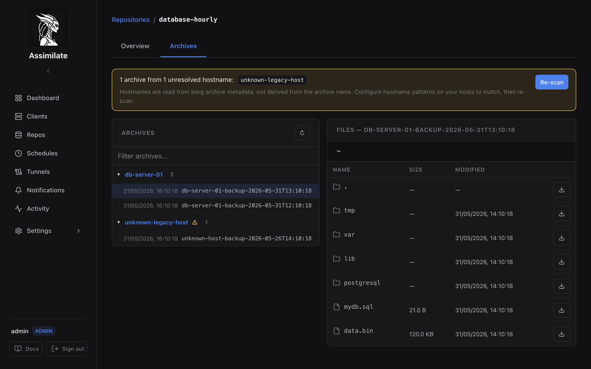
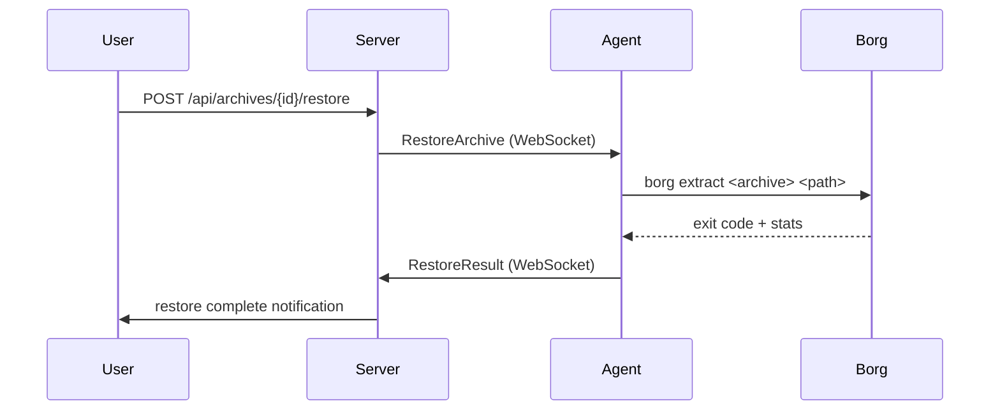

<!--
SPDX-License-Identifier: Apache-2.0
SPDX-FileCopyrightText: 2026 Alexander Mohr
-->

# Restoring Files

Assimilate supports two restore paths: downloading files directly to your browser, or restoring files to the agent machine's filesystem. Choose based on the destination you need.

## Prerequisites

- The target repository must be accessible (agent connected or repository reachable via SSH).
- You need the **extract** permission on the repository.

## Browser Download

Use browser download to retrieve individual files or a directory tree directly to your local machine.

1. Navigate to **Repos**, select a repository, and open the **Archives** tab.
2. Click the archive you want to restore from.
3. Navigate to the file or directory you want.
4. Click **Download** to save it locally, or **Restore to host** to restore it directly to its original location.
5. Use the actions on the root `.` row to download or restore the whole archive.

The server streams data live from the borg repository. For details on the export format, see [Exporting as tar.lz4](archives.md#exporting-as-tarlz4).

!!! warning "Streaming timeout"
    Large downloads stream data live over SSH. The server enforces a 5-minute per-file timeout and a 10-minute archive-export timeout. For multi-GB restores, use agent-side restore instead.

## Agent-Side Restore

Agent-side restore extracts files directly on the agent machine — no data passes through the Assimilate server or your browser. This is the right approach for large restores or when the destination is the agent's own filesystem.

Navigate to the archive browser and click **Restore to host** beside a file or directory. Confirm the operation to extract it to its original location. Use the root `.` row to restore the whole archive.

### Restore Status

While the restore runs, the detail view shows a live progress indicator. On completion the view reports:

- Exit code from `borg extract`
- Number of files extracted
- Any warnings or errors from borg output

!!! note
    The agent must be connected when you trigger a restore. If the agent is offline, the restore request is queued and delivered when the agent reconnects.

### Overwriting Existing Files

By default, `borg extract` overwrites existing files at the target path. Ensure the target path is correct before starting — there is no undo.

!!! warning "Data loss risk"
    Restoring to a non-empty directory will overwrite existing files without prompting. Set the target path to an empty staging directory if you want to inspect files before replacing production data.

## Restore Flow

## Related Pages

- [Archive Browsing & Extraction](archives.md) — browse archive contents and download individual files
- [Scheduling & Retention](scheduling.md) — configure backup schedules and retention policies
- [Host & Agent Management](hosts.md) — manage connected agents
