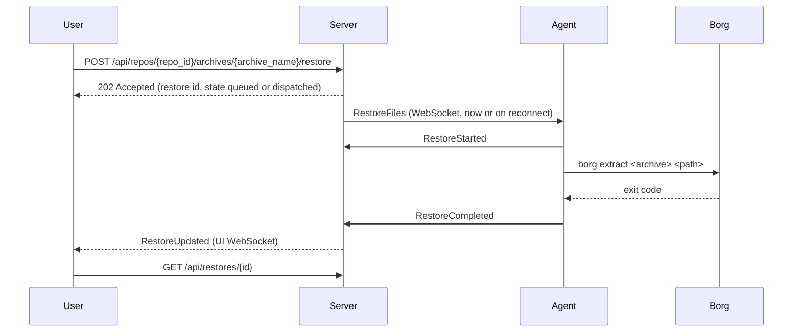

<!--
SPDX-License-Identifier: Apache-2.0
SPDX-FileCopyrightText: 2026 Alexander Mohr
-->

# Restoring Files

Assimilate supports two restore paths: downloading files directly to your browser, or restoring files to the agent machine's filesystem. Choose based on the destination you need.

## Prerequisites

- The target repository must be accessible (agent connected or repository reachable via SSH).
- You need the **extract** permission on the repository.

## Browser Download

Use browser download to retrieve individual files or a directory tree directly to your local machine.

1. Navigate to **Repos**, select a repository, and open the **Archives** tab.
2. Click the archive you want to restore from.
3. Navigate to the file or directory you want.
4. Click **Download** to save it locally, or **Restore to host** to restore it directly to its original location.
5. Use the actions on the root `.` row to download or restore the whole archive.

The server streams data live from the borg repository. For details on the export format, see [Exporting as tar.lz4](archives.md#exporting-as-tarlz4).

!!! note "Large downloads"
    Large downloads stream data live over SSH and are not time-limited by the server. For multi-GB restores, agent-side restore avoids holding a browser connection open for the duration of the transfer. When downloading through the restore wizard's **Download to browser** option, a **Cancel Download** button is shown while the transfer is in progress; cancelling stops the transfer and the underlying `borg` process on the server immediately.

## Virtual Machines

A staged virtual machine is restored in two stages: the file restore below puts its directory back on disk, then the agent merges the increment chain and defines the domain. Both stages are driven from the agent's **Virtual machines** section - see [VM Snapshots](vm-snapshots.md#restore-a-domain).

## Agent-Side Restore

Agent-side restore extracts files directly on the agent machine — no data passes through the Assimilate server or your browser. This is the right approach for large restores or when the destination is the agent's own filesystem.

Navigate to the archive browser and click **Restore to host** beside a file or directory. Confirm the operation to extract it to its original location. Use the root `.` row to restore the whole archive. To restore into another directory, use the restore wizard on the **Archives** page and choose **Restore to agent filesystem**.

### Restore Status

A restore runs in the background. The server records it and answers at once, then the agent runs `borg extract` for as long as it takes. A restore moves through these states:

| State | Meaning |
|-------|---------|
| Queued | The agent is offline. The restore is sent as soon as it reconnects. |
| Dispatched | The agent has the restore and waits for the repository to be free. The agent runs one operation per repository at a time, so a restore can wait behind a running backup. |
| Running | The agent is extracting the files. |
| Succeeded | The agent extracted the files. |
| Failed | The restore could not be carried out. The reason is shown, for example borg's error output. |
| Cancelled | An admin withdrew the restore before the agent received it. |

The restore wizard shows the current state and updates live. You can close it while a restore runs: the restore carries on. The archive browser reports a restore it started with a notification when it is accepted and another when it ends.

Each finished restore is also recorded in the [Activity Log](activity.md#system-events), as a `restore_completed` or `restore_failed` system event that names the archive, the paths, the target directory and the host.

!!! note "Offline agents"
    A restore to an offline agent is queued and sent when the agent reconnects. Until then, **Cancel restore** in the wizard withdraws it. Once the agent has received a restore, it runs to the end.

If the agent connection drops while a restore runs, the restore continues and the agent reports the result after it reconnects. If the agent process itself restarted, the server sends the restore again on reconnect and the agent runs it from the start. The agent ignores a restore it is already working on, so the same files are never extracted twice at once.

### Overwriting Existing Files

By default, `borg extract` overwrites existing files at the target path. Ensure the target path is correct before starting — there is no undo.

!!! warning "Data loss risk"
    Restoring to a non-empty directory will overwrite existing files without prompting. Set the target path to an empty staging directory if you want to inspect files before replacing production data.

## Restore Flow

```mermaid
sequenceDiagram
    participant User
    participant Server
    participant Agent
    participant Borg

    User->>Server: POST /api/repos/{repo_id}/archives/{archive_name}/restore
    Server-->>User: 202 Accepted (restore id, state queued or dispatched)
    Server->>Agent: RestoreFiles (WebSocket, now or on reconnect)
    Agent->>Server: RestoreStarted
    Agent->>Borg: borg extract <archive> <path>
    Borg-->>Agent: exit code
    Agent->>Server: RestoreCompleted
    Server-->>User: RestoreUpdated (UI WebSocket)
    User->>Server: GET /api/restores/{id}
```

The API answers `POST .../restore` with `202 Accepted` and the restore record. Follow it with `GET /api/restores/{id}` until its `status` is `succeeded`, `failed` or `cancelled`. `POST /api/restores/{id}/cancel` withdraws a restore that is still `queued` and answers `409 Conflict` once the agent has it. All three endpoints are admin only.

## Related Pages

- [Archive Browsing & Extraction](archives.md) — browse archive contents and download individual files
- [Scheduling & Retention](scheduling.md) — configure backup schedules and retention policies
- [Agent Management](agents.md) — manage connected agents
- [Activity Log](activity.md) — where finished restores are recorded
