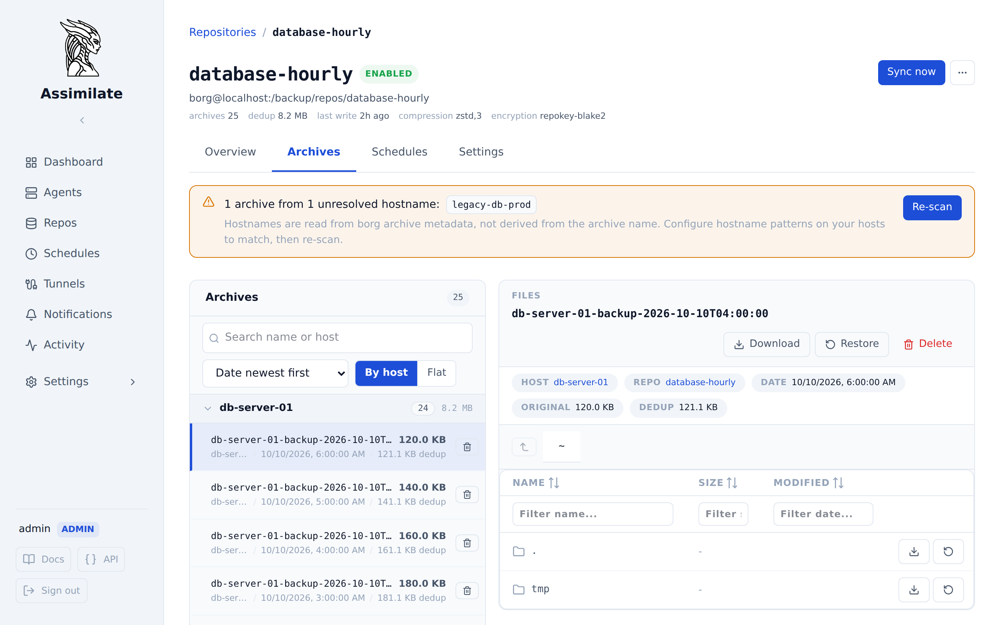
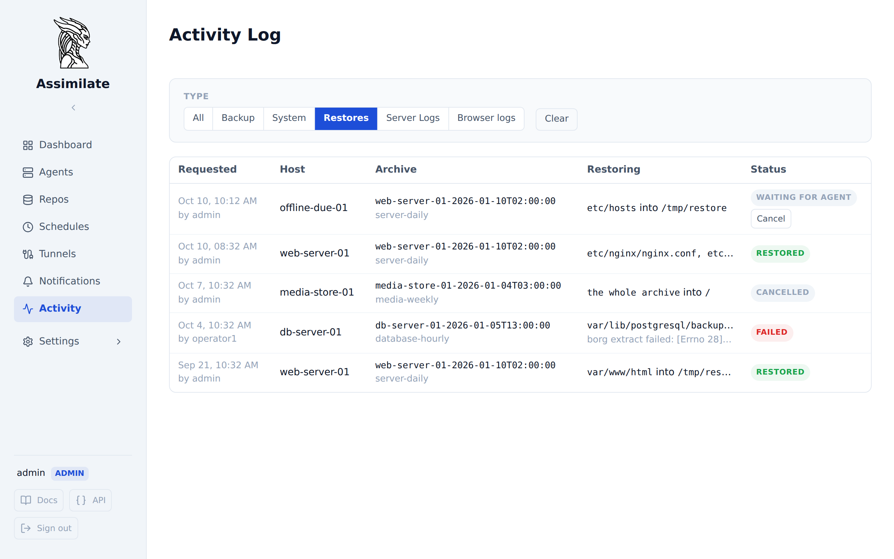
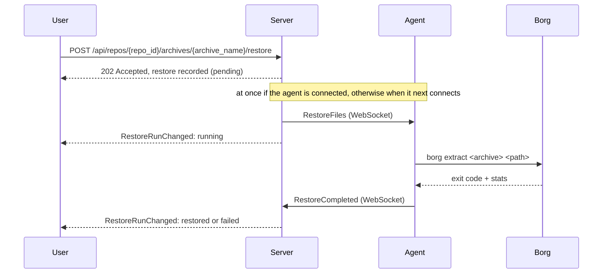

<!--
SPDX-License-Identifier: Apache-2.0
SPDX-FileCopyrightText: 2026 Alexander Mohr
-->

# Restoring Files

Assimilate supports two restore paths: downloading files directly to your browser, or restoring files to the agent machine's filesystem. Choose based on the destination you need.

## Prerequisites

- The target repository must be accessible (agent connected or repository reachable via SSH). An agent-side restore for an offline host waits until its agent connects.
- You need the **extract** permission on the repository to download. Restoring onto a host is limited to administrators.

## Browser Download

Use browser download to retrieve individual files or a directory tree directly to your local machine.

1. Navigate to **Repos**, select a repository, and open the **Archives** tab.
2. Click the archive you want to restore from.
3. Navigate to the file or directory you want.
4. Click **Download** to save it locally, or **Restore to host** to restore it directly to its original location.
5. Use the actions on the root `.` row to download or restore the whole archive.

The server streams data live from the borg repository. For details on the export format, see [Exporting as tar.lz4](archives.md#exporting-as-tarlz4).

!!! note "Large downloads"
    Large downloads stream data live over SSH and are not time-limited by the server. For multi-GB restores, agent-side restore avoids holding a browser connection open for the duration of the transfer. When downloading through the restore wizard's **Download to browser** option, a **Cancel Download** button is shown while the transfer is in progress; cancelling stops the transfer and the underlying `borg` process on the server immediately.

## Virtual Machines

A staged virtual machine is restored in two stages: the file restore below puts its directory back on disk, then the agent merges the increment chain and defines the domain. Both stages are driven from the agent's **Virtual machines** section - see [VM Snapshots](vm-snapshots.md#restore-a-domain).

## Agent-Side Restore

Agent-side restore extracts files directly on the agent machine — no data passes through the Assimilate server or your browser. This is the right approach for large restores or when the destination is the agent's own filesystem.

Navigate to the archive browser and click **Restore to host** beside a file or directory. Confirm the operation to extract it to its original location. Use the root `.` row to restore the whole archive. The restore wizard on the **Archives** page restores selected paths to any target path on any host.

### Restore Status

A restore runs in the background. Starting one records it and returns at once, however long `borg extract` takes, so a large restore never runs into a request timeout. A restore moves through these states:

| Status | Meaning |
|--------|---------|
| **Waiting for agent** | The host is offline. The restore starts as soon as its agent connects again. |
| **Restoring** | The agent is running `borg extract`. |
| **Restored** | `borg extract` finished; the number of files restored is recorded. |
| **Failed** | `borg extract` failed, or the agent restarted while it ran. The reason is recorded. |
| **Cancelled** | It was cancelled while it was still waiting for the agent. |

The archive browser shows a notification when a restore starts and another when it ends. The restore wizard follows the restore it started until it ends; you can close it at any time without stopping the restore.

Every restore is listed on the **Restores** tab of the [Activity Log](activity.md#restores), newest first, with its host, archive, paths, target, status and who requested it. The list updates live.

!!! note "Offline hosts"
    A restore for a host whose agent is offline waits for it. Use **Cancel** on the Restores tab to drop a waiting restore before the agent comes back. A restore the agent is already running cannot be cancelled.

!!! note "Agent restarts"
    If the agent process restarts while a restore is running, the restore it was running is lost with it and is marked failed with `Agent '<host>' restarted while the restore was running`. A brief network drop that leaves the agent process running does not affect it: the agent reports the result once it has reconnected. An agent older than the server cannot tell the server which process it is, so every reconnect of such an agent, a brief network drop included, fails the restore it was running; update the agent to avoid this.

!!! note "Database errors"
    If the server's database rejects the result the agent reports, for example while the database is briefly unreachable, the server keeps the result and tries again, waiting up to a minute between tries, until the database accepts it. The restore stays **Restoring** until then. A result that has not been stored when the server shuts down is lost; the restore then stays **Restoring** until the agent process next restarts.

### Overwriting Existing Files

By default, `borg extract` overwrites existing files at the target path. Ensure the target path is correct before starting — there is no undo.

!!! warning "Data loss risk"
    Restoring to a non-empty directory will overwrite existing files without prompting. Set the target path to an empty staging directory if you want to inspect files before replacing production data.

## Restore Flow

```mermaid
sequenceDiagram
    participant User
    participant Server
    participant Agent
    participant Borg

    User->>Server: POST /api/repos/{repo_id}/archives/{archive_name}/restore
    Server-->>User: 202 Accepted, restore recorded (pending)
    Note over Server,Agent: at once if the agent is connected, otherwise when it next connects
    Server->>Agent: RestoreFiles (WebSocket)
    Server-->>User: RestoreRunChanged: running
    Agent->>Borg: borg extract <archive> <path>
    Borg-->>Agent: exit code + stats
    Agent->>Server: RestoreCompleted (WebSocket)
    Server-->>User: RestoreRunChanged: restored or failed
```

## Related Pages

- [Archive Browsing & Extraction](archives.md) — browse archive contents and download individual files
- [Scheduling & Retention](scheduling.md) — configure backup schedules and retention policies
- [Agent Management](agents.md) — manage connected agents
