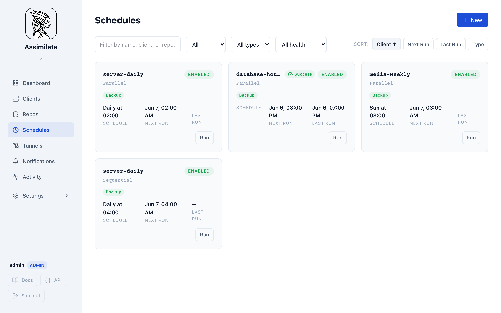
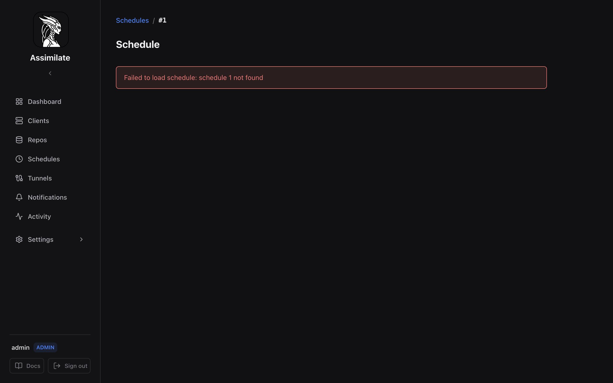
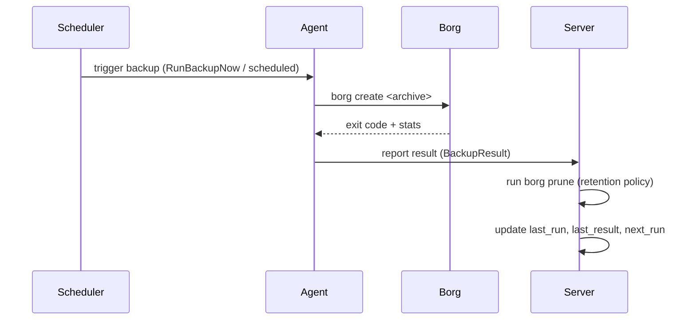

<!--
SPDX-License-Identifier: Apache-2.0
SPDX-FileCopyrightText: 2026 Alexander Mohr
-->

# Scheduling & Retention

Assimilate runs backups on a schedule you define per repository. Each schedule carries its own cron expression, retention policy, exclude patterns, optional pre/post commands, and optional Borg bandwidth cap.

When set, the bandwidth cap is passed to Borg as `--remote-ratelimit` in kB/s.

## Creating a Schedule

1. Navigate to **Clients** and select the host you want to back up.
2. Choose the repository to back up to (see [Repositories](repositories.md)).
3. Click **Add Schedule**.
4. Set the cron expression (see [Cron Expression Builder](#cron-expression-builder)).
5. Configure the retention policy (see [Retention Policy](#retention-policy)).
6. Optionally add exclude patterns, backup sources, pre/post commands, and a remote bandwidth limit.
7. Click **Save**. The server validates the cron expression and, if the schedule is enabled, verifies SSH connectivity to the repository before saving.

## Cron Expression Builder

Schedules use standard five-field cron syntax: `minute hour day-of-month month day-of-week`.

The UI provides a visual builder with common presets:

| Preset | Expression | Description |
|--------|-----------|-------------|
| Hourly | `0 * * * *` | Every hour on the hour |
| Every 6 hours | `0 */6 * * *` | Four times a day |
| Daily | `0 2 * * *` | Every day at 02:00 |
| Weekly | `0 2 * * 0` | Every Sunday at 02:00 |
| Monthly | `0 2 1 * *` | First day of each month at 02:00 |

You can also type a custom expression directly. The builder validates the expression in real time and shows the next five scheduled run times.

For a full reference of cron syntax, see [crontab.guru](https://crontab.guru).

## Retention Policy

After each successful backup, Assimilate runs `borg prune` using the retention settings on the schedule. Archives that fall outside the policy are deleted automatically.

| Field | Default | Description |
|-------|---------|-------------|
| `keep_daily` | 7 | Keep the most recent N daily archives |
| `keep_weekly` | 4 | Keep the most recent N weekly archives |
| `keep_monthly` | 6 | Keep the most recent N monthly archives |
| `keep_yearly` | 0 | Keep the most recent N yearly archives (0 = disabled) |

!!! tip "Sensible defaults"
    The defaults (7 daily, 4 weekly, 6 monthly) give you roughly six months of recovery points without consuming excessive repository space. For critical data, increase `keep_monthly` or enable `keep_yearly`. For high-frequency backups, reduce `keep_daily` to avoid accumulating too many archives.

Pruning runs immediately after the backup completes. Only archives created by this schedule are considered — archives from other schedules or manual runs are not affected.

## Exclude Patterns

Each schedule can carry its own list of exclude patterns. These are passed directly to `borg create --exclude` and follow [borg's pattern syntax](https://borgbackup.readthedocs.io/en/stable/usage/help.html#borg-patterns).

Patterns are configured per schedule in the **Exclude Patterns** field. If **Ignore global excludes** is unchecked, any repository-level exclude patterns (see [Repositories](repositories.md)) are merged with the schedule's own patterns. Check **Ignore global excludes** to use only the schedule's patterns.

## Backup Paths

Backup paths determine which directories borg includes when creating an archive. There are three levels of configuration, resolved in priority order:

| Priority | Source | Description |
|----------|--------|-------------|
| 1 (highest) | Per-host paths | Paths configured for a specific host within this schedule |
| 2 | Schedule-level paths | Paths configured on the schedule (shared across all target hosts) |
| 3 (lowest) | Host default paths | Default backup paths configured on the host itself |

### Schedule-Level Paths

When all hosts in a schedule back up the same directories, enter the paths in the **Backup Paths** textarea. These apply to every target host unless overridden by per-host paths.

### Per-Host Paths

When a schedule targets multiple hosts and each host needs different directories, enable **Configure per host** in the Backup Paths section. This reveals a textarea for each selected host where you can specify host-specific paths.

Per-host paths completely override schedule-level paths for that host. If a host's per-host paths field is left empty, the system falls back to schedule-level paths, then to the host's default paths.

!!! tip
    Use per-host paths when a single schedule targets hosts with different roles (e.g., a web server backing up `/var/www` and a database server backing up `/var/lib/postgresql`). This avoids creating separate schedules for each host while still customizing what gets backed up.

## Schedule Status

Each schedule row in the UI shows:

| Field | Description |
|-------|-------------|
| **Enabled** | Toggle to pause or resume the schedule without deleting it |
| **Next run** | UTC timestamp of the next scheduled execution |
| **Last run** | UTC timestamp of the most recent execution |
| **Last result** | `success`, `warning`, or `error` from the last run |

Disabling a schedule clears the next-run time. Re-enabling it recalculates the next occurrence from the current time.

## Manual Trigger

To run a backup immediately without waiting for the next scheduled time, click **Run now** on the schedule row. The server sends a `RunBackupNow` message to the connected agent. The agent starts the backup immediately and reports the result back to the server.

Manual runs follow the same retention policy and exclude patterns as scheduled runs.

## Backup Notifications

Assimilate sends notifications when backups succeed, fail, or produce warnings. Supported channels include **Email** (SMTP), **Webhooks**, and **Browser Push** (Web Push / VAPID).

Configure channels and rules under **Notifications** in the sidebar. See the [Notifications](notifications.md) page for full setup instructions.

You can also monitor outcomes passively:

- **Dashboard** — the activity feed shows recent backup results across all hosts.
- **Activity log** — per-host and per-repository views list every run with its result, duration, and archive size.
- **Schedule status** — the **Last result** column on the Schedules page turns red on failure.

## Pruning

Pruning is automatic and runs as part of the backup lifecycle:

1. `borg create` runs and creates a new archive.
2. On success, `borg prune` runs with the schedule's retention settings.
3. Pruned archives are removed from the repository.
4. If `compact_enabled` is set (default: true), `borg compact` runs to reclaim freed space.

Pruning only removes archives whose names match the prefix used by this schedule. Archives created outside Assimilate are not touched.

## Timezone Handling

All cron expressions are evaluated in the **server's local timezone**. There is no per-schedule timezone setting. If your server runs in UTC (recommended), `0 2 * * *` fires at 02:00 UTC every day.

To verify the server's timezone, check the system clock or the `TZ` environment variable on the server host.

## Rate Limiting

Each schedule can cap the bandwidth that borg uses when communicating with the repository server. This prevents backups from saturating network links during business hours.

Set the **Remote rate limit** field (in kB/s) when creating or editing a schedule. The value is passed to borg as `--remote-ratelimit`. Set to `0` to disable rate limiting on that schedule.

!!! tip
    For schedules that run during the day, set a low rate limit (e.g. 1000 kB/s) to avoid impacting other traffic. Remove the limit for overnight schedules where full bandwidth is available.

## Cloning a Schedule

To create a new schedule with the same settings as an existing one:

1. Open the schedule detail view.
2. Click **Clone**.
3. Adjust the cron expression, repository, or any other fields as needed.
4. Click **Save**.

The cloned schedule starts disabled. Enable it once you have verified its settings.

!!! note
    Cloning copies all fields including retention policy, exclude patterns, pre/post commands, and the rate limit. The clone is always created in the disabled state regardless of the source schedule's state.

## Dry-Run Preview

Before running a backup for real, you can preview what borg would do without writing any data to the repository.

1. Open the schedule detail view.
2. Click **Dry Run**.
3. The server sends a `DryRunBackup` message to the agent.
4. The agent runs `borg create --dry-run` and reports the result back.

The dry-run result shows:

| Field | Description |
|-------|-------------|
| **Files scanned** | Number of files that would be included |
| **Data volume** | Estimated uncompressed data volume |
| **New data** | Estimated new (non-deduplicated) data that would be written |
| **Output** | Full borg stdout/stderr for inspection |

<!-- screenshot: schedule-dry-run -->

!!! note
    Dry-run uses the same exclude patterns, backup sources, and pre-commands as the real backup. Post-commands are not executed during a dry run. No archive is created and no data is written to the repository.

## Editing and Deleting Schedules

**Editing:** Changes take effect on the next scheduled run. If a backup is already in progress when you save an edit, the running backup completes with the old settings. The updated cron expression and retention policy apply from the next run onward.

**Deleting:** Deleting a schedule removes it from the database and pushes an updated configuration to the agent. Any backup currently in progress is not interrupted — it runs to completion. Archives already created by the deleted schedule remain in the repository and must be pruned manually if desired.

## Backup Flow

