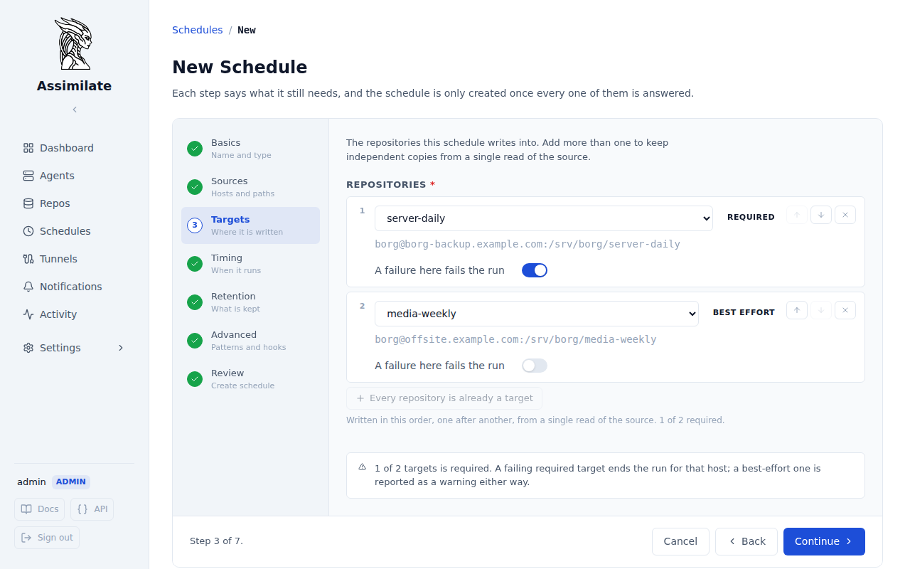
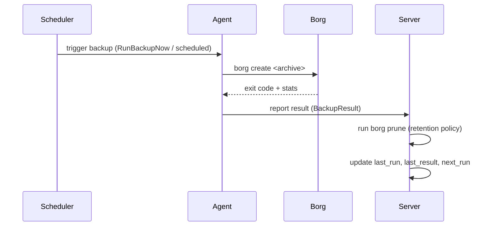

<!--
SPDX-License-Identifier: Apache-2.0
SPDX-FileCopyrightText: 2026 Alexander Mohr
-->

# Scheduling & Retention

Assimilate runs backups on a schedule you define. Each schedule carries its own cron expression, one or more target repositories, retention policy, exclude patterns, optional pre/post commands (each bounded by a configurable timeout), and optional Borg bandwidth cap.

When set, the bandwidth cap is passed to Borg as `--upload-ratelimit` in kB/s.

## Creating a Schedule

**New** on the Schedules page opens a wizard. Each step states what it still needs, the next step unlocks only once that is answered, and **Create schedule** exists on the final Review step alone — so a half-filled form can no longer be submitted.



1. **Basics** — name the schedule and pick its type (Backup, Integrity check, or Verify). The type decides which later steps apply: a check or verify schedule creates no archives, so Retention and Advanced are skipped.
2. **Sources** — the hosts this schedule runs on and the paths to back up. Leave the paths empty to use each agent's own defaults.
3. **Targets** — the repositories it writes into (see [Backup targets](#backup-targets)), and, once there is more than one host or more than one target, what a failure does to the rest of the run.
4. **Timing** — the cron expression (see [Cron Expression Builder](#cron-expression-builder)) and how many missed runs are tolerated before the schedule is marked failed.
5. **Retention** — the retention policy (see [Retention Policy](#retention-policy)).
6. **Advanced** — exclude and include patterns, file change patterns, pre/post commands, bandwidth limit, and the other options most schedules leave alone.
7. **Review** — a summary of everything, with an **Edit** link back to each step. Creating the schedule validates the cron expression and, if the schedule is enabled, verifies SSH connectivity to **every** target repository.

## Backup targets

A schedule writes into one or more repositories. Several targets means several independent copies from one schedule — one cron expression, one retention policy, one set of exclude patterns and hooks — typically a local repository that restores fast and an offsite one that survives losing the building.

Each host runs its targets in the order shown, one after another. Every target is its own borg run over the source, so a second target roughly doubles how long the schedule takes; targets are never written in parallel. Per target you choose how a failure is treated:

- **Required** — a failure on this repository is the schedule's failure. It counts towards the missed-backup threshold that auto-disables the schedule, and with **On failure: stop the run** it ends the whole run there — the targets after it on that host, and any host the run had not reached yet, are skipped until the next scheduled time.
- **Best effort** — a failure is recorded as a warning. It never stops the remaining targets and never counts towards the auto-disable threshold.

At least one target must be required: without one, a run could report success having written nothing.

!!! warning "Two targets on one storage host are one copy"
    The target list flags two repositories that live on the same SSH host. They fail together, so they do not give you the independence multiple targets are for.

Retention, exclude patterns, hooks and the bandwidth cap are schedule-wide: every target keeps the same history.

The repositories a schedule writes into can be changed later under **Settings → Targets** on the schedule's detail page.


The Schedules list page shows all configured backup schedules with:

- **Text filter** — search by schedule name, agent, storage host, or repository name, with an optional field syntax (see [Filter syntax](#filter-syntax))
- **Status filter** — show All, Enabled only, or Disabled only
- **Type filter** — filter by Backup, Check, or Verify
- **Health filter** — filter by Passed only, Failed only, or Overdue only
- **Sort buttons** — sort by Agent, Next run, Last run, or Type
- **Group control** — section the cards by Time, Agent, or Repo

By default schedules are grouped into sections by when they next run — Due now, Next 6 hours, Next 24 hours, This week, Later, Unscheduled, and Paused for disabled schedules — so schedules that need attention soon surface at the top regardless of sort order.

The **Group** control beside the sort buttons switches which question the sections answer:

| Group by | Sections | Use it to see |
|---|---|---|
| Time | Due now, Next 6 hours, Next 24 hours, This week, Later, Unscheduled, Paused | What runs next, and what is paused |
| Agent | One per targeted agent, named "Display name (hostname)" | Everything that backs up a given machine |
| Repo | One per repository the schedules write into | Everything that writes into a given repository |

A schedule that targets several agents appears under each of them, so an agent's section lists everything that backs that machine up. Sorting, filtering and the 24-hour rail are unchanged by the group mode — every section is ordered by the active sort, and only schedules matching the current filters are grouped. Schedules with no agent or no repository assigned collect in a final **No agents** or **No repository** section.

!!! note "Agents that share a hostname"
    A schedule records the *hostname* it targets, and a hostname identifies a machine only together with its [domain](agents.md) — two agents in different domains can report the same one. Grouping by agent therefore puts every schedule naming that hostname in one section, whichever of those agents it actually targets. Such a section is titled with the bare hostname rather than either agent's display name, and carries an **N agents** badge saying how many machines it covers; hover it for the detail. Grouping by agent or repo drops the separate Paused section: a disabled schedule stays with its agent or repository and is identified by its **Disabled** pill instead.

Above the groups, a 24-hour rail plots every enabled schedule due within the next day along a timeline from now. When two or more of those runs land within 30 minutes of each other **on the same repository**, the rail marks them and names the repository and time so you can stagger them before they contend for the same repository lock. Two runs that share a storage host but write to different repositories are not a collision — they don't block each other — and are not flagged.

Click the warning to expand the runs behind it: each cluster lists its runs with the time each is due, and clicking one opens that schedule so you can move it.

!!! note
    The rail only ever plots enabled schedules that match the current filters, so filtering the list also narrows the collision check.

Each schedule card shows the repository or schedule name, agent count, execution mode (Parallel/Sequential), enabled state, schedule type, a run-history strip, cadence, and next run time, plus a **Run** button for manual triggering. The run-history strip draws up to the ten most recent runs as bars — bar height reflects duration for a completed run, and a failed run always draws at full height so it never reads as the least significant bar in the strip. A run cancelled via the **Cancel** button below draws as a muted bar distinct from a failure, and isn't counted in the strip's failed-run tally.

A disabled schedule tints the card and adds a **Disabled** pill; a **Failed**, **Warning**, or **Overdue** chip appears when a target needs attention, and an **N/threshold missed** chip appears once the schedule has missed at least one backup but hasn't yet crossed its [missed backup threshold](#missed-backup-threshold) — click a chip to jump to the filtered activity log (Failed/Warning) or the schedule detail page (Overdue/missed). While a backup for the schedule is currently running, the card also shows a **Running** pill and the **Run** button is replaced with **Cancel**.

Next to the **Run** button, an **Enabled**/**Disabled** switch lets you pause or resume the schedule directly from the list, without opening it. Flipping it saves immediately; enabling a schedule with no repository assigned, or any of whose target repositories can't be reached over SSH, shows an error toast instead.

Overdue is evaluated per host: a schedule can show Overdue even while its own next/last run times look on track, if one of its target hosts hasn't completed a backup within its cron interval plus a 30-minute grace period. Hover the Overdue chip to see which target host(s) are behind and when each last reported a backup; if a host's agent is currently disconnected, the tooltip also notes that ("Agent offline (last seen ...)") so you can tell at a glance whether the host is overdue because it's offline or because something else went wrong.

### Filter syntax

The text filter searches every field at once, so typing `borg-backup` matches a schedule whose name, agent, storage host, or repository contains it. To search one field only, prefix the term with the field name. The help button beside the filter box shows the same reference in the UI.

| Term | Matches |
|---|---|
| `name:nightly` | Schedule name |
| `agent:k3s` | Agent hostname or display name |
| `host:borg-backup` | Storage host the repository lives on |
| `repo:server-daily` | Repository name |

Terms combine:

| Example | Meaning |
|---|---|
| `borg-backup` | Bare text matches any of the fields above |
| `agent:k3s host:borg-backup` | A space means both must match (AND) |
| `agent:k3s \| agent:nas` | A pipe means either may match (OR) |
| `agent:"web server"` | Quote a value that contains spaces |

Matching ignores case and matches on part of a value, so `host:borg` finds `borg-backup.example.com`. `agent` and `host` are deliberately separate: the agent is the machine being backed up, the host is the machine the repository lives on. A prefix that names no field — a schedule called `db:primary`, say — is searched as plain text.

### Schedule Detail Tabs

A saved schedule's detail page opens on **Overview**: an at-a-glance summary (repository, on-failure behavior, next/last run, human-readable cron), the list of target agents with their health, and a preview of recent backups. Settings — name, cron, targets, retention, and (for backup-type schedules) the advanced options below — live under a **Settings** tab with its own sub-navigation, so editing a schedule no longer means scrolling past its status. Editing takes effect on save; nothing here is a live view of a running backup except the progress card described below.


On the Overview tab, a target that's behind shows an **Overdue** badge and a **Retry** button, both in the attention banner at the top and in its row further down. Retry re-runs the backup for just that host, without re-running the other targets in the schedule.

#### Per-repository outcome

A schedule with [several target repositories](#backup-targets) reports each of them separately, because one occurrence leaves one run per repository behind and they can end differently:

- **Repositories** in the summary lists each target with its last outcome, when it last finished, and a **best effort** pill on a target whose failure never stops the run. A target that has never run says so rather than reading as a failure.
- **Recent runs** draws one history strip per repository, so a run of failures on the offsite copy is visible as exactly that, rather than being mixed into one strip with the healthy local copy.
- **Targets** rows carry an **N of M repos failing** badge when some of a host's copies are landing and others are not.
- **Recent backups** rows name the repository each run wrote into. Without it, the two runs a two-target schedule produces for one host in the same minute are indistinguishable.

A schedule with a single repository is unchanged: the repository is the page's context, and naming it on every row would say nothing.

The **Recent backups** preview below them is a way into each run, not just a status line. A run that produced an archive opens it from the host name, selected on this schedule's **Backups** tab. A run that finished with warnings or failed carries **View warnings** / **View error**, which opens that run on the host's own Logs tab with its output expanded — a failed run wrote no archive, so its output is the only thing there is to show for it.

A run against a repository that has since been removed from the schedule keeps its row, named after the repository it was written to, but offers no way in: the Backups tab browses the schedule's *current* targets, so there is nowhere for it to land. The archive itself is still reachable from that repository's own page.

While a backup for the schedule is running, the Overview tab also shows live progress: elapsed time, an estimated time remaining (once enough history exists), files processed, data transferred, the archive name, and the current file being backed up.

### Backups Tab

For backup-type schedules, the schedule detail view includes a **Backups** tab. This tab lists all archives produced by the schedule, derived from successful and warning backup reports. Select an archive in the left panel to browse its file contents, navigate directories via breadcrumbs, and download individual files or directories — all without leaving the schedule view.

A schedule that writes into more than one repository gets a **Repository** selector above the archive list, naming each target and how many of the loaded archives it holds. The tab opens on the schedule's primary target. The selector is a scope, not a filter: browsing, downloading, restoring and deleting all act against the repository it names, and the archive header says which one that is. Opening a run's archive from the Overview tab's **Recent backups** preview scopes the tab to that run's repository, so the jump lands on the copy you clicked.

!!! note "One name, one copy per repository"
    The same archive name exists in every target a schedule writes into — they are copies of the same source. Deleting one removes it from the selected repository only; the other copies stay.

The Backups tab is only visible for backup-type schedules that have been saved (not in create mode).

A failed run usually produced no borg archive, so there is nothing on disk to lose by clearing its history — and the rare failed run that did produce one (e.g. a prune or post-backup hook failing after a successful `borg create`) is left alone rather than deleted. When there are one or more archive-less failed runs, **Clean up failed backups (N)** in the header's overflow menu deletes every such failed report for this schedule after a confirmation dialog. This is a manual, on-demand action for this schedule alone — independent of the [`failed_report_retention_days`](configuration.md#system-settings) setting, which prunes failed reports for *every* schedule automatically by age. It requires the same permission as editing or deleting the schedule itself.

### Logs Tab

Every schedule, of any type, has a **Logs** tab: one line per run, any status, oldest failures included — the same view an [agent's own Logs tab](agents.md#logs-tab) renders. A status filter (All / Success / Warning / Failed) and a Newest/Oldest sort sit above the rows; a warned or failed run expands its warning or error output in place. A run that produced an archive links straight to it in the Backups tab's file browser.

The tab label carries the true total, not just how many runs are currently loaded — the list itself starts at the 50 most recent and offers **Load N more** once there are more to fetch, rather than silently capping at that first page.

## Cron Expression Builder

Schedules use standard five-field cron syntax: `minute hour day-of-month month day-of-week`.

The UI provides a visual builder with common presets:

| Preset | Expression | Description |
|--------|-----------|-------------|
| Hourly | `0 * * * *` | Every hour on the hour |
| Every 6 hours | `0 */6 * * *` | Four times a day |
| Daily | `0 2 * * *` | Every day at 02:00 |
| Weekly | `0 2 * * 0` | Every Sunday at 02:00 |
| Monthly | `0 2 1 * *` | First day of each month at 02:00 |

You can also type a custom expression directly. The builder validates the expression in real time and shows the next five scheduled run times.

For a full reference of cron syntax, see [crontab.guru](https://crontab.guru).

## Retention Policy

After each successful backup, Assimilate runs `borg prune` using the retention settings on the schedule. Archives that fall outside the policy are deleted automatically.

| Field | Default | Description |
|-------|---------|-------------|
| `keep_hourly` | 24 | Keep the most recent N hourly archives |
| `keep_daily` | 7 | Keep the most recent N daily archives |
| `keep_weekly` | 4 | Keep the most recent N weekly archives |
| `keep_monthly` | 6 | Keep the most recent N monthly archives |
| `keep_yearly` | 0 | Keep the most recent N yearly archives (0 = disabled) |

!!! tip "Sensible defaults"
    The defaults (24 hourly, 7 daily, 4 weekly, 6 monthly) give you roughly six months of recovery points without consuming excessive repository space. For critical data, increase `keep_monthly` or enable `keep_yearly`. For high-frequency backups, reduce `keep_hourly` or `keep_daily` to avoid accumulating too many archives.

Pruning runs immediately after the backup completes. Only archives created by this schedule are considered — archives from other schedules or manual runs are not affected.

## Exclude Patterns

Each schedule can carry its own list of exclude patterns. These are passed directly to `borg create --exclude` and follow [borg's pattern syntax](https://borgbackup.readthedocs.io/en/stable/usage/help.html#borg-patterns).

Patterns are configured per schedule in the **Exclude patterns** field. If **Ignore global excludes** is unchecked, any repository-level exclude patterns (see [Repositories](repositories.md)) are merged with the schedule's own patterns. Check **Ignore global excludes** to use only the schedule's patterns.

## Include Patterns

Include patterns rescue paths from a broader exclude instead of adding to it — useful when you want to skip a directory in general but keep one thing inside it, e.g. excluding `/home` but still backing up `/home/keep`.

Configure them per schedule under **Exceptions to the excludes above**, nested inside the **Exclude patterns** section — they are an exception carved out of that list rather than a separate one. They are checked before every exclude source (global, repository-level, and the schedule's own), so a path matching one is backed up even if a broader exclude would otherwise skip it. Leave the field empty to exclude everything the exclude patterns cover, same as before this option existed.

Like exclude patterns, include patterns can be overridden per agent on a multi-host schedule by enabling **Configure per agent** inside that nested block — a per-agent override replaces the schedule-level list outright for that agent, rather than adding to it.

## Backup Paths

Backup paths determine which directories borg includes when creating an archive. There are three levels of configuration, resolved in priority order:

| Priority | Source | Description |
|----------|--------|-------------|
| 1 (highest) | Per-agent paths | Paths configured for a specific agent within this schedule |
| 2 | Schedule-level paths | Paths configured on the schedule (shared across all target agents) |
| 3 (lowest) | Agent default paths | Default backup paths configured on the agent itself |

### Schedule-Level Paths

When all agents in a schedule back up the same directories, enter the paths in the **Backup paths** textarea. These apply to every target agent unless overridden by per-agent paths.

### Per-Agent Paths

When a schedule targets multiple agents and each agent needs different directories, enable **Configure per agent** in the Backup Paths section. This reveals a textarea for each selected agent where you can specify agent-specific paths.

Per-agent paths completely override schedule-level paths for that agent. If an agent's per-agent paths field is left empty, the system falls back to schedule-level paths, then to the agent's default paths.

!!! tip
    Use per-agent paths when a single schedule targets agents with different roles (e.g., a web server backing up `/var/www` and a database server backing up `/var/lib/postgresql`). This avoids creating separate schedules for each agent while still customizing what gets backed up.

## Schedule Status

Each schedule row in the UI shows:

| Field | Description |
|-------|-------------|
| **Enabled** | Toggle to pause or resume the schedule without deleting it |
| **Next run** | UTC timestamp of the next scheduled execution |
| **Last run** | UTC timestamp of the most recent execution |
| **Last result** | `success`, `warning`, or `error` from the last run |

Disabling a schedule clears the next-run time. Re-enabling it recalculates the next occurrence from the current time.

### Missed Backup Threshold

Settings → General has a **Mark as failed after** field (`missed_backup_threshold`, default 3): how many consecutive missed backups — the agent or the backup's target being unreachable when the scheduler tries to trigger the run — this schedule tolerates before it's marked failed and automatically disabled. Every miss shows as an **N/threshold missed** warning chip on the schedule card and fires the matching [failed or skipped backup notification](#hosts-that-are-not-always-online) if a channel has a rule for it; once the threshold is reached, the schedule is additionally disabled, its status pill reads "Auto-disabled" (see [Agent Status](agents.md#agent-status)), and a **Schedule Auto Disabled** [notification](notifications.md#supported-events) also fires for that same final miss.

The count goes back to zero, and the warning chip with it, as soon as a run reaches its host — the moment the backup starts, not once it finishes — whether the run was scheduled, a [catch-up](#catch-up-runs), or started by hand with **Run now** or **Retry**. That holds only while none of the schedule's other hosts is unreachable: a run limited to one host leaves the count alone while another is still down.

### Hosts That Are Not Always Online

What it means for a host to be unreachable depends on the host. A server that should always be there and is not is a failure, and should alert like one. A laptop that is off at 02:00, a VM that boots on its own schedule, or a NAS that powers down overnight was *expected* to be away, and its backup should run once it is back.

That is one switch on the machine itself, not on any schedule that uses it: **Host is not always online**, in the [**When the host is offline**](power-management.md#when-the-host-is-offline) section of an agent's or a repository's Power pane. It is off by default. Two schedules writing to the same NAS cannot sensibly disagree about whether that NAS sleeps, so the setting lives where the fact is.

<!-- screenshot: host-availability -->

| Host | Switch off (default) | Switch on |
|------|----------------------|-----------|
| **Agent** not connected when the backup comes due | **Backup Failed**, and a **Backup Failed (Agent Offline)** entry in the [activity log](activity.md) | **Backup Skipped (Agent Offline)**, and caught up once the agent reconnects |
| **Repository** host not answering SSH when the backup fails | **Backup Failed**, exactly as borg reported it | **Backup Skipped (Repository Offline)**, and caught up once the host answers |

An offline agent is known before anything is dispatched — there is no one to dispatch to, so that backup never starts, and no backup report exists for it. That is why an always-online agent gets its own activity-log entry: without one, a run that never started would leave nothing behind but a count. An offline repository can only be established afterwards: when a backup against a repository marked as not always online fails, the server makes one short SSH connection to its host, the same one it uses to decide whether a host needs [waking](repositories.md#power). If the host does not answer, the run is reported as **Backup Skipped (Repository Offline)** *instead of* **Backup Failed** — one event, not both — so a single alert says what happened and why. A repository that is not marked is never probed: its failure is the failure borg reported.

!!! note
    The check deliberately happens *after* the attempt, never instead of it. Refusing to dispatch on a failed probe would mean any hiccup reaching the host — a slow answer, a refused key, a momentary blip — turned a backup that would have run into one that never ran at all. Letting borg try and explaining the result afterwards is the safer order, and it costs a probe only on runs that have already failed.

Either way the miss is visible immediately, rather than only once the schedule crosses its [missed backup threshold](#missed-backup-threshold). Nothing about the counting changes: a skipped backup still counts toward that threshold exactly as a failed one does. Because the reason is read off the report rather than the schedule, a manual **Run now** that fails against a repository marked as not always online is reported as a skip too — but, having no occurrence behind it, is not caught up.

!!! warning "Upgrading"
    Catch-up used to be a per-schedule **Catch up missed runs** toggle. It is gone, and nothing is carried over from it: a schedule-wide opt-in says nothing reliable about *which* of its hosts is the one that sleeps. Mark those hosts instead. Until you do, an offline agent that used to be reported as skipped is reported as a failed backup.

### Catch-Up Runs

A run a host marked as not always online missed is run once, as soon as that host is back. Missed runs never stack. The record is one occurrence per host, not a queue: however many occurrences pass during an outage, at most **one** catch-up run follows. A later miss overwrites the earlier one, so the run that follows is always the most recent occurrence.

How "back" is found out is the one thing that differs:

- **An agent** opens a WebSocket to the server, so it says "I am back" itself, and its catch-up starts the moment it reconnects. It writes every repository the missed run would have — the host missed all of them at once. Each of a schedule's target hosts is tracked separately, so one laptop coming back does not re-run the backup for servers that never missed anything.
- **A repository** is a directory on a host that Assimilate only ever reaches out to, and it has no way to announce anything. So it is asked: every **Re-check every ...** (`catch_up_recheck_minutes`, default 15) on its Power pane, the server makes the same short SSH connection it used to establish the host was absent, and catches up every schedule waiting on it on the first attempt that answers. Only that repository is re-run: the schedule's other repositories were written on the day. One probe answers every schedule waiting on the same host. An interval longer than a schedule's own period is self-defeating — the repository is then usually found only after a scheduled run has already covered the gap.

**Stop waiting after ...** (`catch_up_give_up_minutes`, default `0` — wait indefinitely), also on the host's Power pane, bounds how long a pending catch-up stays pending. Past it the wait is abandoned, recorded in the [activity log](activity.md) as a **Schedule Catch Up Abandoned** event, and reported as an ordinary **Backup Failed** notification — because the backup is not going to happen, and without the window nothing would ever say so for a host that never comes back. It is a plain backup failure on purpose: a rule that already alerts on failed backups covers this without anyone adding a rule for an event they have never seen. Since the alert arrives long after the run it is about, its message says so — *repository 'media-weekly' did not come back within 3 days*.

The window is separate from the [missed backup threshold](#missed-backup-threshold), which counts consecutive missed occurrences and disables the schedule; this one bounds a single pending catch-up in wall-clock time, which is what a weekly schedule needs, since three missed occurrences there is three weeks.

!!! tip
    For a repository, a window shorter than one re-check interval is rejected: it would abandon every catch-up without ever having asked whether the repository was back, which from the outside looks like the feature silently not working.

The host's Power pane lists every schedule it currently owes a run: what was missed, when a repository was last and is next asked, and how much of the window is left. On a repository, **Check now** asks immediately rather than waiting out the interval.

The one catch-up setting on a schedule is the one that depends on the schedule's own timing. Settings → General has **Catch up only if the next run is at least ... away** (`catch_up_min_lead_minutes`, default 120): the floor that keeps a catch-up from colliding with the run it would land on top of. Come back with less time than this left and the pending miss is dropped instead of run, because the regular run is about to do the same work. A host reconnecting at 09:00 under a nightly 02:00 schedule catches up immediately; one reconnecting at 01:40 waits for the 02:00 run. The field takes minutes, hours, days or weeks — on a weekly schedule a floor of two hours never blocks anything, so a Saturday catch-up would be followed by the regular Sunday run. Below it, the pane names the schedule's hosts and repositories that are marked as not always online; when none are, the field is disabled and says where the switch lives.

<!-- screenshot: schedule-catch-up -->

A pending catch-up is visible before it runs: the schedule card carries a **Catch-up pending** badge, and the schedule's Overview tab names the host it is waiting on. When one runs, it is recorded in the [activity log](activity.md) as a **Schedule Catch Up** event, and produces a normal backup report. Like a manual **Run now**, a catch-up run also updates the schedule's **Last run** and **Next run**.

| Field | Where | Default | Description |
|-------|-------|---------|-------------|
| `intermittent` | Agent, repository | `false` | Host is not always online: report an unreachable host as skipped and catch the run up, rather than as a failed backup |
| `catch_up_recheck_minutes` | Repository | `15` | How often a repository that was away is asked whether it is back (1–10080) |
| `catch_up_give_up_minutes` | Agent, repository | `0` | How long a pending catch-up may wait before it is abandoned and reported as a failed backup; `0` waits indefinitely (otherwise 1–43200, and for a repository never less than one re-check interval) |
| `catch_up_min_lead_minutes` | Schedule | `120` | Minimum time that must remain before the next scheduled run for a catch-up to still start (1–10080) |

!!! note
    A schedule that its host's outage [auto-disabled](#missed-backup-threshold) is re-enabled first and then considered for a catch-up. Re-enabling makes it due immediately, so its pending miss falls inside the floor and is dropped — the scheduler's own run covers it seconds later.

A pending miss is also dropped, without running, when the schedule or its repository is disabled by the time it would run, or when the host has been marked as always online in the meantime. The decision is made once; nothing is carried forward.

## Manual Trigger

To run a backup immediately without waiting for the next scheduled time, click **Run now** on the schedule row. The server sends a `RunBackupNow` message to the connected agent. The agent starts the backup immediately and reports the result back to the server.

If a host is offline when you press **Run now** or **Retry**, its run is queued rather than dropped: it is sent the moment the agent reconnects. Until then the schedule reads **Queued** instead of **Running**, and its Overview tab says which host the backup is waiting for rather than showing it in progress. **Cancel** calls off a queued run the same way it stops a running one.

Manual runs follow the same retention policy and exclude patterns as scheduled runs, and write every [backup target](#backup-targets) in the same order, so **Run now** produces the same copies the cron would. Because it writes them all, it needs permission on every target repository, not only the schedule's primary one. **Cancel** stops the run on all of them and asks only for permission on the schedule, so whoever can pause it can also stop a run already going.

A manual run also updates **Last run** and **Next run** exactly as a scheduled one does, so the schedule doesn't look overdue right after you've just run it, and the regular cron run for the same occurrence is skipped rather than duplicating the work.

## Backup Notifications

Assimilate sends notifications when backups succeed, fail, or produce warnings. Supported channels include **Email** (SMTP), **Webhooks**, and **Browser Push** (Web Push / VAPID).

Configure channels and rules under **Notifications** in the sidebar. See the [Notifications](notifications.md) page for full setup instructions.

You can also monitor outcomes passively:

- **Dashboard** — the activity feed shows recent backup results across all agents.
- **Activity log** — per-agent and per-repository views list every run with its result, duration, and archive size.
- **Schedule status** — the **Last result** column on the Schedules page turns red on failure.

## Pruning

Pruning is automatic and runs as part of the backup lifecycle:

1. `borg create` runs and creates a new archive.
2. On success, `borg prune` runs with the schedule's retention settings.
3. Pruned archives are removed from the repository.
4. If `compact_enabled` is set (default: true), `borg compact` runs to reclaim freed space.

Pruning only removes archives whose names match the prefix used by this schedule. Archives created outside Assimilate are not touched.

## Timezone Handling

All cron expressions are evaluated in the **timezone configured in system settings** (default `UTC`). This is a single server-wide value; there is no per-schedule timezone setting. With the default UTC, `0 2 * * *` fires at 02:00 UTC every day.

Change the timezone under **System → Settings** (the `timezone` setting, e.g. `Europe/Berlin`); see [Configuration](configuration.md#system-settings). The setting is independent of the server host's OS timezone or `TZ` variable.

### Daylight Saving Time

In a timezone with daylight saving time, runs are never skipped or doubled by a clock change:

- **Spring forward** — a run whose local time falls into the skipped hour moves to the first valid time after the gap. In `Europe/Berlin`, `30 2 * * *` runs at 03:00 on the last Sunday of March, because 02:30 does not exist that day.
- **Fall back** — a local time that occurs twice runs only once, at its first occurrence (before the clocks go back).

## Rate Limiting

Each schedule can cap the bandwidth that borg uses when communicating with the repository server. This prevents backups from saturating network links during business hours.

Set the **Remote rate limit** field (in kB/s) when creating or editing a schedule. The value is passed to borg as `--upload-ratelimit`. Set to `0` to disable rate limiting on that schedule.

!!! tip
    For schedules that run during the day, set a low rate limit (e.g. 1000 kB/s) to avoid impacting other traffic. Remove the limit for overnight schedules where full bandwidth is available.

## Pre- and Post-Backup Commands

Hook commands run on the agent around each backup: pre-backup commands before `borg create`, post-backup commands after it. Use them to quiesce a service, produce a dump to back up, or clean that dump up again.

Configure them under **Advanced → Commands** on the schedule, or under **Settings → Backup defaults** on an agent for commands every schedule targeting that host should run.

### How a command runs

Each entry is one `sh -c` invocation, so a single command may span several lines and be a whole script rather than one statement. Commands run in order, and the agent runs them as the user the agent process itself runs as.

A failing pre-backup command aborts the backup, and no post-backup command runs. Post-backup commands run only after `borg create` succeeded or finished with warnings — a failed backup leaves whatever the pre-backup commands produced in place, rather than deleting data that was never uploaded.

Where both levels are set, the agent's defaults run first for pre-backup and last for post-backup, so a schedule's own commands sit inside the agent's.

When a hook command fails, the run's **View error** detail (see [Schedule Detail Tabs](#schedule-detail-tabs)) includes the command's stdout and stderr alongside its exit code, so you can diagnose the failure without shelling into the agent host.

### Timeouts

Set **Hook command timeout** on the schedule for the default that applies to every command, and a per-command **Timeout** for one that needs its own. A command still running past its timeout is killed and the backup fails.

Give a command its own timeout when it is far slower than its neighbours. The schedule-wide default otherwise has to be set for the slowest command on the schedule, which leaves a genuinely stuck one — a `systemctl stop` waiting on a hung unit — holding the schedule open for just as long.

Leave the per-command field empty to inherit the schedule's default. The schedule default accepts 1 to 3600 seconds; a per-command timeout accepts 1 to 86400 (24 hours), since it is a deliberate statement about one script rather than a blanket value.

!!! warning
    A hypervisor or database dump can exceed a 24-hour hook timeout on a large host. Where it does, run the dump from its own scheduler and leave the hook to verify the result is present and fresh, rather than producing it.

### Example

Dumping Proxmox guests to an NFS-backed storage before backing that storage up, as three commands on one schedule:

```sh
# Pre-backup 1 (timeout 120): the share must be there before anything writes to it
mountpoint -q /mnt/pve/backup-store || pvesm set backup-store --disable 0
mountpoint -q /mnt/pve/backup-store || exit 1
```

```sh
# Pre-backup 2 (timeout 21600): the dump itself, far slower than its neighbours
vzdump --all 1 --storage backup-store --mode snapshot --compress zstd
```

```sh
# Post-backup 1 (inherits the schedule default): the dumps are uploaded, drop them
find /mnt/pve/backup-store/dump -maxdepth 1 -name 'vzdump-*' -delete
```

## Cloning a Schedule

To create a new schedule with the same settings as an existing one:

1. Open the schedule detail view.
2. Click **Clone**.
3. Adjust the cron expression, repository, or any other fields as needed.
4. Click **Save**.

The cloned schedule starts disabled. Enable it once you have verified its settings.

!!! note
    Cloning copies all fields including retention policy, exclude patterns, pre/post commands, and the rate limit. The clone is always created in the disabled state regardless of the source schedule's state.

## Dry-Run Preview

Before running a backup for real, you can preview what borg would do without writing any data to the repository.

1. Open the schedule detail view.
2. Click **Dry Run**.
3. The server sends a `DryRunBackup` message to the agent.
4. The agent runs `borg create --dry-run` and reports the result back.

The dry-run result shows:

| Field | Description |
|-------|-------------|
| **Files scanned** | Number of files that would be included |
| **Data volume** | Estimated uncompressed data volume |
| **New data** | Estimated new (non-deduplicated) data that would be written |
| **Output** | Full borg stdout/stderr for inspection |

!!! note
    Dry-run uses the same exclude patterns, backup sources, and pre-commands as the real backup. Post-commands are not executed during a dry run. No archive is created and no data is written to the repository.

## Browsing Archives from a Schedule

Each backup schedule's detail view includes a **Backups** tab that shows every archive created by that schedule. It renders the same archive selector and file browser as the repository's **Archives** tab, so from this tab you can:

1. Search, sort and group the schedule's archives by host — useful when the schedule targets several machines.
2. Select an archive to inspect its contents in the file browser panel on the right.
3. Browse directories and download individual files — see [Archive Browsing & Extraction](archives.md) for the full file browser reference.
4. Delete an archive, if you are an administrator.

The Backups tab is available only for schedules of type **Backup**.

## Editing and Deleting Schedules

**Editing:** Changes take effect on the next scheduled run. If a backup is already in progress when you save an edit, the running backup completes with the old settings. The updated cron expression and retention policy apply from the next run onward.

Saving an already-enabled schedule only re-checks that its target repositories are reachable over SSH when the save re-enables it from Disabled, or changes which repositories it writes into. A rename, a re-time, or a retention/hook edit that leaves an enabled schedule's targets untouched saves even if one of those targets is temporarily unreachable — the save isn't handing the schedule anything new to reach. Re-enabling from Disabled, or adding, removing, or swapping a target, always confirms every resulting target reachable first, same as the [list page's Enabled switch](#backup-targets).

**Deleting:** Deleting a schedule removes it from the database and pushes an updated configuration to the agent. Any backup currently in progress is not interrupted — it runs to completion. Archives already created by the deleted schedule remain in the repository and must be pruned manually if desired.

## Backup Flow


```mermaid
sequenceDiagram
    participant Scheduler
    participant Agent
    participant Borg
    participant Server

    Scheduler->>Agent: trigger backup (RunBackupNow / scheduled)
    Agent->>Borg: borg create <archive>
    Borg-->>Agent: exit code + stats
    Agent->>Server: report result (BackupResult)
    Server->>Server: run borg prune (retention policy)
    Server->>Server: update last_run, last_result, next_run
```
