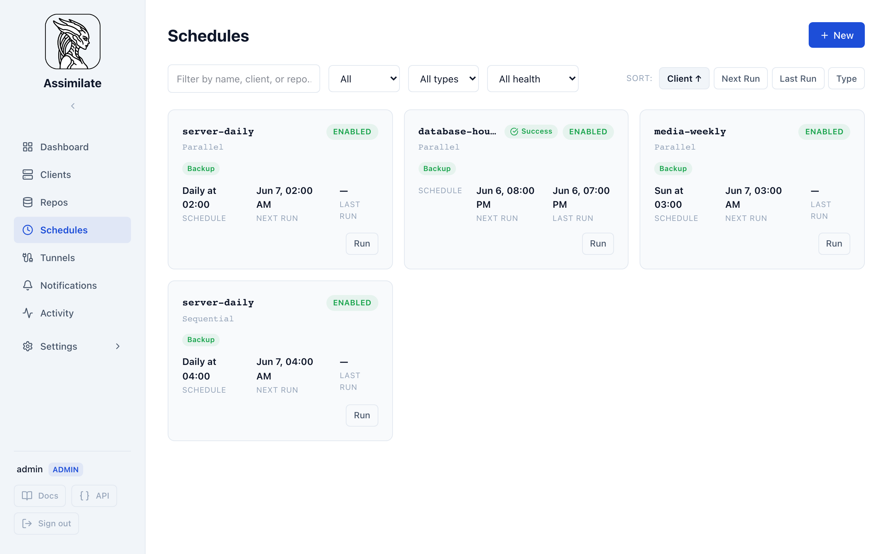
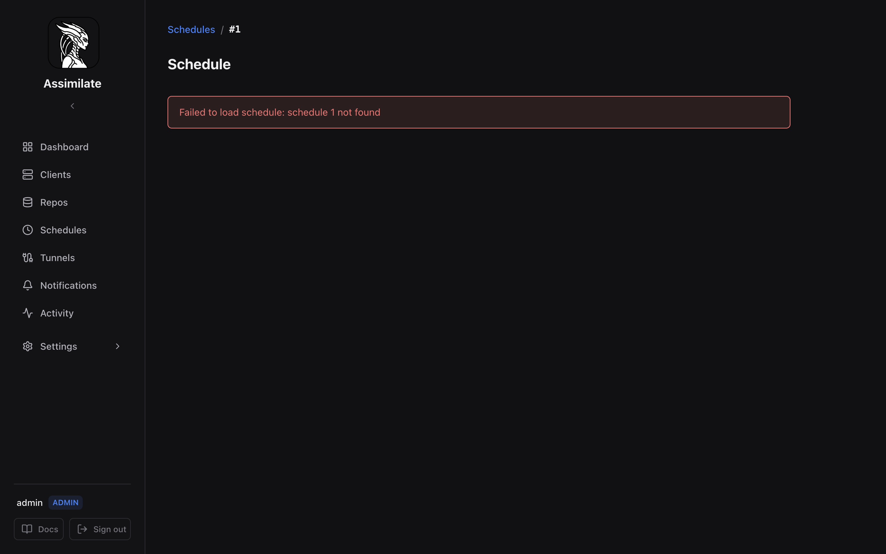
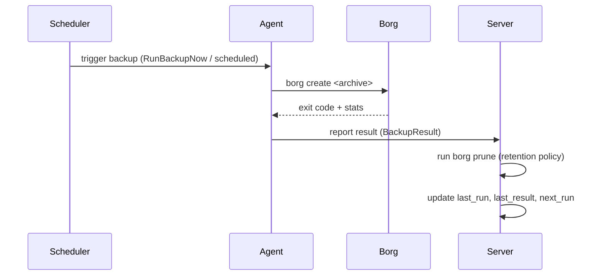

<!--
SPDX-License-Identifier: Apache-2.0
SPDX-FileCopyrightText: 2026 Alexander Mohr
-->

# Scheduling & Retention

Assimilate runs backups on a schedule you define per repository. Each schedule carries its own cron expression, retention policy, exclude patterns, optional pre/post commands (each bounded by a configurable timeout), and optional Borg bandwidth cap.

When set, the bandwidth cap is passed to Borg as `--upload-ratelimit` in kB/s.

## Creating a Schedule

1. Navigate to **Agents** and select the agent you want to back up.
2. Choose the repository to back up to (see [Repositories](repositories.md)).
3. Click **Add Schedule**.
4. Set the cron expression (see [Cron Expression Builder](#cron-expression-builder)).
5. Configure the retention policy (see [Retention Policy](#retention-policy)).
6. Optionally add exclude patterns, backup sources, pre/post commands, and a remote bandwidth limit.
7. Click **Save**. The server validates the cron expression and, if the schedule is enabled, verifies SSH connectivity to the repository before saving.

The Schedules list page shows all configured backup schedules with:

- **Text filter** — search by schedule name, agent, storage host, or repository name, with an optional field syntax (see [Filter syntax](#filter-syntax))
- **Status filter** — show All, Enabled only, or Disabled only
- **Type filter** — filter by Backup, Check, or Verify
- **Health filter** — filter by Passed only, Failed only, or Overdue only
- **Sort buttons** — sort by Agent, Next run, Last run, or Type

Schedules are grouped into sections by when they next run — Due now, Next 6 hours, Next 24 hours, This week, Later, Unscheduled, and Paused for disabled schedules — so schedules that need attention soon surface at the top regardless of sort order.

Above the groups, a 24-hour rail plots every enabled schedule due within the next day along a timeline from now. When two or more of those runs land within 30 minutes of each other **on the same repository**, the rail marks them and names the repository and time so you can stagger them before they contend for the same repository lock. Two runs that share a storage host but write to different repositories are not a collision — they don't block each other — and are not flagged.

Click the warning to expand the runs behind it: each cluster lists its runs with the time each is due, and clicking one opens that schedule so you can move it.

!!! note
    The rail only ever plots enabled schedules that match the current filters, so filtering the list also narrows the collision check.

Each schedule card shows the repository or schedule name, agent count, execution mode (Parallel/Sequential), enabled state, schedule type, a run-history strip, cadence, and next run time, plus a **Run** button for manual triggering. The run-history strip draws up to the ten most recent runs as bars — bar height reflects duration for a completed run, and a failed run always draws at full height so it never reads as the least significant bar in the strip. A run cancelled via the **Cancel** button below draws as a muted bar distinct from a failure, and isn't counted in the strip's failed-run tally. A disabled schedule tints the card and adds a **Disabled** pill; a **Failed**, **Warning**, or **Overdue** chip appears when a target needs attention, and an **N/threshold missed** chip appears once the schedule has missed at least one backup but hasn't yet crossed its [missed backup threshold](#missed-backup-threshold) — click a chip to jump to the filtered activity log (Failed/Warning) or the schedule detail page (Overdue/missed). While a backup for the schedule is currently running, the card also shows a **Running** pill and the **Run** button is replaced with **Cancel**.

Next to the **Run** button, an **Enabled**/**Disabled** switch lets you pause or resume the schedule directly from the list, without opening it. Flipping it saves immediately; enabling a schedule with no repository assigned, or whose repository's SSH connection can't be reached, shows an error toast instead.

Overdue is evaluated per host: a schedule can show Overdue even while its own next/last run times look on track, if one of its target hosts hasn't completed a backup within its cron interval plus a 30-minute grace period. Hover the Overdue chip to see which target host(s) are behind and when each last reported a backup; if a host's agent is currently disconnected, the tooltip also notes that ("Agent offline (last seen ...)") so you can tell at a glance whether the host is overdue because it's offline or because something else went wrong.

### Filter syntax

The text filter searches every field at once, so typing `borg-backup` matches a schedule whose name, agent, storage host, or repository contains it. To search one field only, prefix the term with the field name. The help button beside the filter box shows the same reference in the UI.

| Term | Matches |
|---|---|
| `name:nightly` | Schedule name |
| `agent:k3s` | Agent hostname or display name |
| `host:borg-backup` | Storage host the repository lives on |
| `repo:server-daily` | Repository name |

Terms combine:

| Example | Meaning |
|---|---|
| `borg-backup` | Bare text matches any of the fields above |
| `agent:k3s host:borg-backup` | A space means both must match (AND) |
| `agent:k3s \| agent:nas` | A pipe means either may match (OR) |
| `agent:"web server"` | Quote a value that contains spaces |

Matching ignores case and matches on part of a value, so `host:borg` finds `borg-backup.example.com`. `agent` and `host` are deliberately separate: the agent is the machine being backed up, the host is the machine the repository lives on. A prefix that names no field — a schedule called `db:primary`, say — is searched as plain text.

### Schedule Detail Tabs

A saved schedule's detail page opens on **Overview**: an at-a-glance summary (repository, on-failure behavior, next/last run, human-readable cron), the list of target agents with their health, and a preview of recent backups. Settings — name, cron, targets, retention, and (for backup-type schedules) the advanced options below — live under a **Settings** tab with its own sub-navigation, so editing a schedule no longer means scrolling past its status. Editing takes effect on save; nothing here is a live view of a running backup except the progress card described below.

On the Overview tab, a target that's behind shows an **Overdue** badge and a **Retry** button, both in the attention banner at the top and in its row further down. Retry re-runs the backup for just that host, without re-running the other targets in the schedule.

While a backup for the schedule is running, the Overview tab also shows live progress: elapsed time, an estimated time remaining (once enough history exists), files processed, data transferred, the archive name, and the current file being backed up.

### Backups Tab

For backup-type schedules, the schedule detail view includes a **Backups** tab. This tab lists all archives produced by the schedule, derived from successful and warning backup reports. Select an archive in the left panel to browse its file contents, navigate directories via breadcrumbs, and download individual files or directories — all without leaving the schedule view.

The Backups tab is only visible for backup-type schedules that have been saved (not in create mode).

## Cron Expression Builder

Schedules use standard five-field cron syntax: `minute hour day-of-month month day-of-week`.

The UI provides a visual builder with common presets:

| Preset | Expression | Description |
|--------|-----------|-------------|
| Hourly | `0 * * * *` | Every hour on the hour |
| Every 6 hours | `0 */6 * * *` | Four times a day |
| Daily | `0 2 * * *` | Every day at 02:00 |
| Weekly | `0 2 * * 0` | Every Sunday at 02:00 |
| Monthly | `0 2 1 * *` | First day of each month at 02:00 |

You can also type a custom expression directly. The builder validates the expression in real time and shows the next five scheduled run times.

For a full reference of cron syntax, see [crontab.guru](https://crontab.guru).

## Retention Policy

After each successful backup, Assimilate runs `borg prune` using the retention settings on the schedule. Archives that fall outside the policy are deleted automatically.

| Field | Default | Description |
|-------|---------|-------------|
| `keep_hourly` | 24 | Keep the most recent N hourly archives |
| `keep_daily` | 7 | Keep the most recent N daily archives |
| `keep_weekly` | 4 | Keep the most recent N weekly archives |
| `keep_monthly` | 6 | Keep the most recent N monthly archives |
| `keep_yearly` | 0 | Keep the most recent N yearly archives (0 = disabled) |

!!! tip "Sensible defaults"
    The defaults (24 hourly, 7 daily, 4 weekly, 6 monthly) give you roughly six months of recovery points without consuming excessive repository space. For critical data, increase `keep_monthly` or enable `keep_yearly`. For high-frequency backups, reduce `keep_hourly` or `keep_daily` to avoid accumulating too many archives.

Pruning runs immediately after the backup completes. Only archives created by this schedule are considered — archives from other schedules or manual runs are not affected.

## Exclude Patterns

Each schedule can carry its own list of exclude patterns. These are passed directly to `borg create --exclude` and follow [borg's pattern syntax](https://borgbackup.readthedocs.io/en/stable/usage/help.html#borg-patterns).

Patterns are configured per schedule in the **Exclude patterns** field. If **Ignore global excludes** is unchecked, any repository-level exclude patterns (see [Repositories](repositories.md)) are merged with the schedule's own patterns. Check **Ignore global excludes** to use only the schedule's patterns.

## Backup Paths

Backup paths determine which directories borg includes when creating an archive. There are three levels of configuration, resolved in priority order:

| Priority | Source | Description |
|----------|--------|-------------|
| 1 (highest) | Per-agent paths | Paths configured for a specific agent within this schedule |
| 2 | Schedule-level paths | Paths configured on the schedule (shared across all target agents) |
| 3 (lowest) | Agent default paths | Default backup paths configured on the agent itself |

### Schedule-Level Paths

When all agents in a schedule back up the same directories, enter the paths in the **Backup paths** textarea. These apply to every target agent unless overridden by per-agent paths.

### Per-Agent Paths

When a schedule targets multiple agents and each agent needs different directories, enable **Configure per agent** in the Backup Paths section. This reveals a textarea for each selected agent where you can specify agent-specific paths.

Per-agent paths completely override schedule-level paths for that agent. If an agent's per-agent paths field is left empty, the system falls back to schedule-level paths, then to the agent's default paths.

!!! tip
    Use per-agent paths when a single schedule targets agents with different roles (e.g., a web server backing up `/var/www` and a database server backing up `/var/lib/postgresql`). This avoids creating separate schedules for each agent while still customizing what gets backed up.

## Schedule Status

Each schedule row in the UI shows:

| Field | Description |
|-------|-------------|
| **Enabled** | Toggle to pause or resume the schedule without deleting it |
| **Next run** | UTC timestamp of the next scheduled execution |
| **Last run** | UTC timestamp of the most recent execution |
| **Last result** | `success`, `warning`, or `error` from the last run |

Disabling a schedule clears the next-run time. Re-enabling it recalculates the next occurrence from the current time.

### Missed Backup Threshold

Settings → General has a **Mark as failed after** field (`missed_backup_threshold`, default 3): how many consecutive missed backups — the agent or the backup's target being unreachable when the scheduler tries to trigger the run — this schedule tolerates before it's marked failed and automatically disabled. Below that count, a miss only shows as an **N/threshold missed** warning chip on the schedule card; once the threshold is reached, the schedule is disabled and its status pill reads "Auto-disabled" (see [Agent Status](agents.md#agent-status)). A single successful run resets the count back to zero.

## Manual Trigger

To run a backup immediately without waiting for the next scheduled time, click **Run now** on the schedule row. The server sends a `RunBackupNow` message to the connected agent. The agent starts the backup immediately and reports the result back to the server.

Manual runs follow the same retention policy and exclude patterns as scheduled runs.

## Backup Notifications

Assimilate sends notifications when backups succeed, fail, or produce warnings. Supported channels include **Email** (SMTP), **Webhooks**, and **Browser Push** (Web Push / VAPID).

Configure channels and rules under **Notifications** in the sidebar. See the [Notifications](notifications.md) page for full setup instructions.

You can also monitor outcomes passively:

- **Dashboard** — the activity feed shows recent backup results across all agents.
- **Activity log** — per-agent and per-repository views list every run with its result, duration, and archive size.
- **Schedule status** — the **Last result** column on the Schedules page turns red on failure.

## Pruning

Pruning is automatic and runs as part of the backup lifecycle:

1. `borg create` runs and creates a new archive.
2. On success, `borg prune` runs with the schedule's retention settings.
3. Pruned archives are removed from the repository.
4. If `compact_enabled` is set (default: true), `borg compact` runs to reclaim freed space.

Pruning only removes archives whose names match the prefix used by this schedule. Archives created outside Assimilate are not touched.

## Timezone Handling

All cron expressions are evaluated in the **timezone configured in system settings** (default `UTC`). This is a single server-wide value; there is no per-schedule timezone setting. With the default UTC, `0 2 * * *` fires at 02:00 UTC every day.

Change the timezone under **System → Settings** (the `timezone` setting, e.g. `Europe/Berlin`); see [Configuration](configuration.md#system-settings). The setting is independent of the server host's OS timezone or `TZ` variable.

## Rate Limiting

Each schedule can cap the bandwidth that borg uses when communicating with the repository server. This prevents backups from saturating network links during business hours.

Set the **Remote rate limit** field (in kB/s) when creating or editing a schedule. The value is passed to borg as `--upload-ratelimit`. Set to `0` to disable rate limiting on that schedule.

!!! tip
    For schedules that run during the day, set a low rate limit (e.g. 1000 kB/s) to avoid impacting other traffic. Remove the limit for overnight schedules where full bandwidth is available.

## Cloning a Schedule

To create a new schedule with the same settings as an existing one:

1. Open the schedule detail view.
2. Click **Clone**.
3. Adjust the cron expression, repository, or any other fields as needed.
4. Click **Save**.

The cloned schedule starts disabled. Enable it once you have verified its settings.

!!! note
    Cloning copies all fields including retention policy, exclude patterns, pre/post commands, and the rate limit. The clone is always created in the disabled state regardless of the source schedule's state.

## Dry-Run Preview

Before running a backup for real, you can preview what borg would do without writing any data to the repository.

1. Open the schedule detail view.
2. Click **Dry Run**.
3. The server sends a `DryRunBackup` message to the agent.
4. The agent runs `borg create --dry-run` and reports the result back.

The dry-run result shows:

| Field | Description |
|-------|-------------|
| **Files scanned** | Number of files that would be included |
| **Data volume** | Estimated uncompressed data volume |
| **New data** | Estimated new (non-deduplicated) data that would be written |
| **Output** | Full borg stdout/stderr for inspection |

!!! note
    Dry-run uses the same exclude patterns, backup sources, and pre-commands as the real backup. Post-commands are not executed during a dry run. No archive is created and no data is written to the repository.

## Browsing Archives from a Schedule

Each backup schedule's detail view includes a **Backups** tab that shows every archive created by that schedule. It renders the same archive selector and file browser as the repository's **Archives** tab, so from this tab you can:

1. Search, sort and group the schedule's archives by host — useful when the schedule targets several machines.
2. Select an archive to inspect its contents in the file browser panel on the right.
3. Browse directories and download individual files — see [Archive Browsing & Extraction](archives.md) for the full file browser reference.
4. Delete an archive, if you are an administrator.

The Backups tab is available only for schedules of type **Backup**.

## Editing and Deleting Schedules

**Editing:** Changes take effect on the next scheduled run. If a backup is already in progress when you save an edit, the running backup completes with the old settings. The updated cron expression and retention policy apply from the next run onward.

**Deleting:** Deleting a schedule removes it from the database and pushes an updated configuration to the agent. Any backup currently in progress is not interrupted — it runs to completion. Archives already created by the deleted schedule remain in the repository and must be pruned manually if desired.

## Backup Flow

```mermaid
sequenceDiagram
    participant Scheduler
    participant Agent
    participant Borg
    participant Server

    Scheduler->>Agent: trigger backup (RunBackupNow / scheduled)
    Agent->>Borg: borg create <archive>
    Borg-->>Agent: exit code + stats
    Agent->>Server: report result (BackupResult)
    Server->>Server: run borg prune (retention policy)
    Server->>Server: update last_run, last_result, next_run
```
