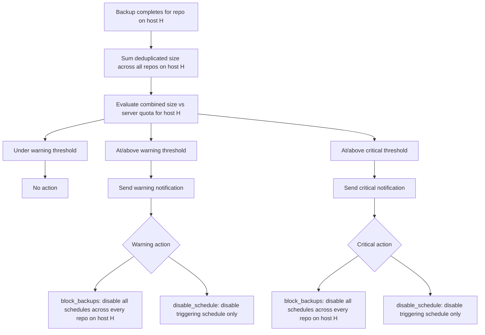

<!--
SPDX-License-Identifier: Apache-2.0
SPDX-FileCopyrightText: 2026 Alexander Mohr
-->

# Server Quotas

Server quotas apply a combined storage limit across every repository that shares the same SSH host, for the case where multiple repositories reside on one server with a shared disk quota. A per-repository [quota](quotas.md) can't see usage on sibling repositories, so a disk that's shared by several repos needs a limit evaluated against their *combined* size instead.

Server quotas are configured under **Settings → Server Quotas**, and require admin access.

## Configuring a Server Quota

1. Open **Settings → Server Quotas**.
2. Every SSH host that hosts at least one repository is listed, along with the number of repositories on it and their combined deduplicated size.
3. Click **Configure** (or **Edit** if already configured) next to the host.
4. Enter the **Warning** and **Critical** thresholds in GB.
5. Choose the **action** for each threshold — the same three actions available for repository quotas.
6. Toggle **Enabled** and click **Save**.

## Actions

| Action | Behaviour |
|--------|-----------|
| `notify_only` | Send a notification; all schedules keep running normally |
| `block_backups` | Disable every schedule for every repository on this host, in addition to notifying |
| `disable_schedule` | Disable only the schedule whose backup triggered the breach, in addition to notifying |

As with repository quotas, disabling a schedule immediately pushes an updated configuration to its assigned agents, and a disabled schedule can be re-enabled from the [Scheduling](scheduling.md) page.

## Enforcement Flow

Server quota status is evaluated after each backup completes, alongside the repository-level quota check for the repository that just backed up:

Combined usage is read from each repository's authoritative `borg info` statistics, not derived from individual backup reports.

## Removing a Server Quota

Click **Remove** next to the host on the **Server Quotas** page. The host's repositories remain listed (so a quota can be reconfigured later), but no threshold is enforced until one is set again.

## Related Pages

- [Storage Quotas](quotas.md) — per-repository warning/critical thresholds and actions
- [Repository Management](repositories.md) — configure repositories, including the shared SSH host
- [Scheduling & Retention](scheduling.md) — re-enable a schedule disabled by a quota action
- [Dashboard](dashboard.md) — storage overview across all repositories
