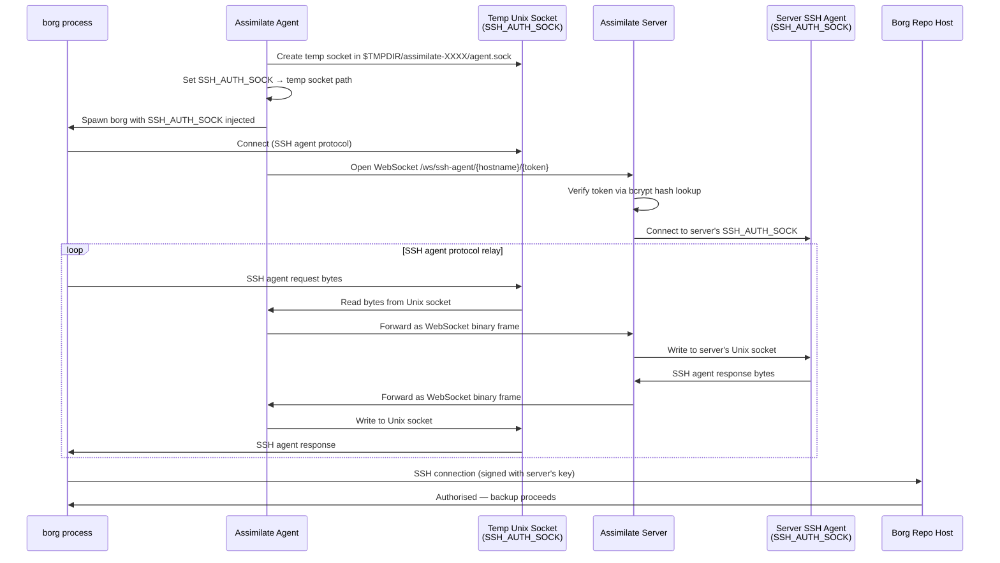

# SSH Agent Forwarding

SSH agent forwarding lets every agent machine authenticate to borg repositories using SSH keys held exclusively on the Assimilate server. No SSH private keys need to be distributed to or stored on agent machines.

## Overview

In a typical multi-host borg setup each backup machine needs its own copy of the SSH private key that authorises access to the borg repository server. This creates a key-management burden and a larger attack surface — a compromised agent machine exposes the repository key.

Assimilate eliminates this by relaying the SSH agent protocol over WebSocket. The server holds the key; agents borrow signing operations from it on demand. From borg's perspective it is talking to a local SSH agent — the relay is transparent.

See [Architecture](architecture.md) for the high-level component diagram.

## How It Works



Before each backup the agent creates a temporary Unix domain socket in a private directory under `$TMPDIR`. For every connection borg makes to that socket the agent opens a new WebSocket to the server's relay endpoint at `/ws/ssh-agent/{hostname}/{token}`. The server authenticates the request by verifying the token against the bcrypt hash stored in the database, then connects to its own `SSH_AUTH_SOCK` and relays bytes bidirectionally between the WebSocket and the local agent socket. When the backup finishes the temporary socket directory is removed automatically.

## Server Setup

### Systemd

Load the borg SSH private key into an ssh-agent on the server host and make `SSH_AUTH_SOCK` available to the Assimilate service process.

```bash
# Start an ssh-agent and load the key
eval $(ssh-agent)
ssh-add /path/to/borg_ed25519_key

# Print the socket path — you will need it below
echo $SSH_AUTH_SOCK
```

Add the socket path to the systemd unit file:

```ini
[Service]
Environment=SSH_AUTH_SOCK=/run/user/1000/gnupg/S.gpg-agent.ssh
```

If you use `gpg-agent` as your SSH agent the socket is typically at `/run/user/<uid>/gnupg/S.gpg-agent.ssh`. For a standalone `ssh-agent` started at login the path is printed by `echo $SSH_AUTH_SOCK` in the same session.

!!! warning
    The socket path must be readable by the user the Assimilate service runs as. If the service runs as a dedicated system user, ensure that user has access to the socket or use a system-level agent (e.g. `ssh-agent` started in the service unit itself).

After updating the unit file reload and restart the service:

```bash
systemctl daemon-reload
systemctl restart assimilate
```

### Docker

The official Docker image manages its own Ed25519 key pair — no host SSH agent or key mounting is required.

```yaml
services:
  server:
    image: assimilate-server
    volumes:
      - ssh_keys:/app/ssh

volumes:
  ssh_keys:
```

On first start the container generates an Ed25519 key pair in the `ssh_keys` volume, loads it into a container-local ssh-agent, and sets `SSH_AUTH_SOCK` automatically. The public key is:

- Printed to container logs at startup (`docker compose logs server | grep "Public key"`)
- Visible in the admin UI under **System → SSH Public Key**

Add the public key to `~/.ssh/authorized_keys` on the borg repository host to authorise backups.

!!! note
    The `ssh_keys` volume persists the key pair across container restarts. Do not delete it — if the key is lost you will need to re-authorise the new key on every borg repository host.

## Agent Setup

!!! note
    No configuration is required on the agent. SSH agent forwarding is automatic.

The agent uses the same `BORG_SERVER_URL` and `BORG_AGENT_TOKEN` environment variables it already needs to connect to the server. Before each backup it attempts to establish the SSH relay. If the relay succeeds, `SSH_AUTH_SOCK` is injected into the borg subprocess environment. If it fails for any reason the backup continues without forwarding and borg falls back to whatever SSH keys are available locally on the agent machine.

Assimilate records each repository server's SSH host key and sends that pin to assigned agents. Before running borg, the agent writes the pin to a private temporary `known_hosts` file and uses `StrictHostKeyChecking=yes`. The connection fails if the repository server presents a different key, and the temporary file is removed after the operation.

## Borg Repository Authorization

The borg repository host must trust the server's SSH public key. Retrieve the public key and add it to the authorised keys file on the repository host.

```bash
# Retrieve the server's public key (run on the server or via the admin UI)
ssh-add -L
```

On the borg repository host:

```bash
echo "<paste public key here>" >> ~/.ssh/authorized_keys
```

For tighter security, restrict the key to borg operations only using a `command=` prefix in `authorized_keys`:

```text
command="borg serve --restrict-to-path /backup/repos",restrict ssh-ed25519 AAAA... assimilate-server
```

!!! warning
    The `restrict` keyword disables port forwarding, agent forwarding, and X11 forwarding for this key. Combined with `command=`, it limits the key to running `borg serve` only — recommended for production repository hosts.

## Failure Modes

| Condition | Behaviour |
|-----------|-----------|
| `SSH_AUTH_SOCK` not set on server | Relay endpoint closes immediately; agent logs a warning; backup proceeds without forwarding |
| Server's ssh-agent socket unreachable | Same as above — relay closes, backup falls back to local keys |
| Token authentication fails | Server closes the WebSocket; agent logs a warning; backup proceeds without forwarding |
| Network interruption during relay | Active borg SSH connection drops; borg retries according to its own retry logic |
| Key not authorised on repo host | SSH authentication fails; borg exits with an error; backup is marked failed |
| Temp socket directory creation fails | Agent logs an error; backup proceeds without forwarding |

In all cases except the last two the backup can still succeed if the agent machine has its own SSH key authorised on the repository host.

## Troubleshooting

**Socket not found / `SSH_AUTH_SOCK` not set**

The server process does not have `SSH_AUTH_SOCK` in its environment. Check the systemd unit file or Docker configuration. For systemd, verify with:

```bash
systemctl show assimilate --property=Environment
```

For Docker, check container logs:

```bash
docker compose logs server | grep -i ssh
```

### Key not authorised on repository host

Verify the server's public key is in `~/.ssh/authorized_keys` on the repo host:

```bash
ssh-add -L  # on the server — copy this output
cat ~/.ssh/authorized_keys  # on the repo host — confirm it is present
```

Test the connection manually from the server:

```bash
ssh -i /path/to/borg_key borg@repo-host echo ok
```

### Repository host key rotated

If the repository host was reprovisioned or its SSH host key was intentionally replaced, backups fail until Assimilate refreshes the repository configuration. Save the repository again after verifying the new host-key fingerprint through a trusted channel; Assimilate records the currently presented key and distributes the new pin to assigned agents.

If the failure persists after the rotation, verify you are reaching the intended repository host and that no jump host or DNS override is pointing agents at the wrong machine.

### WebSocket connection refused or firewall blocking

The agent connects to the server on the same port and URL used for the main WebSocket connection. If the main agent connection works but SSH forwarding does not, check that the `/ws/ssh-agent/` path is not blocked by a reverse proxy or firewall rule.

For nginx, ensure the proxy passes WebSocket upgrade headers:

```nginx
location /ws/ {
    proxy_pass http://assimilate;
    proxy_http_version 1.1;
    proxy_set_header Upgrade $http_upgrade;
    proxy_set_header Connection "upgrade";
}
```

### Backup succeeds but uses wrong key

If the backup succeeds but you suspect it is using a local key rather than the server's key, check the agent logs for a line like `ssh relay: failed to connect to relay` or `SSH_AUTH_SOCK not set`. If forwarding is working correctly the agent logs will show `ssh relay connection opened` before the backup starts.

<!--
SPDX-License-Identifier: Apache-2.0
SPDX-FileCopyrightText: 2026 Alexander Mohr
-->
