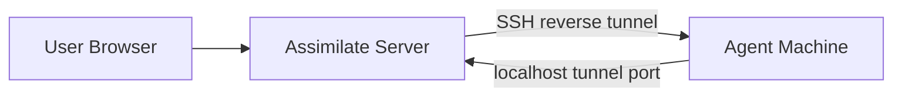
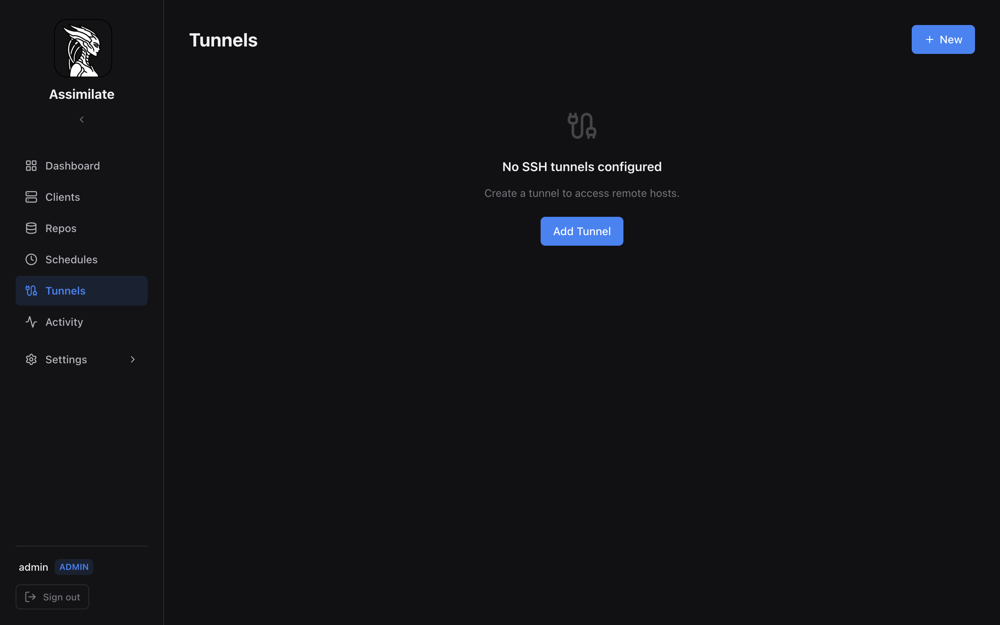

<!--
SPDX-License-Identifier: Apache-2.0
SPDX-FileCopyrightText: 2026 Alexander Mohr
-->

# SSH Tunnel Management

## Overview

SSH tunnels in Assimilate are **reverse SSH tunnels** initiated by the server to reach agent machines that are not directly reachable from the agent's side. This is distinct from [SSH Agent Forwarding](ssh-agent-forwarding.md), which relays SSH authentication credentials so agents can access borg repositories without holding private keys.

Use SSH tunnels when:

- The agent machine is on the public internet (e.g., a VPS) but the Assimilate server is on a private LAN or behind NAT.
- The agent cannot reach the server's address directly due to firewall policy.
- You want the server to initiate all outbound SSH connections rather than opening inbound ports on the agent machine.

The server opens a persistent SSH connection to the agent machine and requests remote port forwarding. The agent then connects to the server through a `localhost` port on its own machine — no inbound firewall rules required on the agent side.



## Creating a Tunnel

Tunnel management requires admin privileges. Navigate to the **Tunnels** page in the dashboard.



1. Click **Add Tunnel**.
2. Select the **Host** (agent machine) this tunnel is for.
3. Fill in the connection fields:

    | Field | Description |
    |-------|-------------|
    | SSH Host | Hostname or IP of the agent machine |
    | SSH User | SSH user on the agent machine |
    | SSH Port | SSH port on the agent machine (default: `22`) |
    | Tunnel Port | Port to bind on `127.0.0.1` of the agent machine |

4. Leave **Enabled** checked to activate the tunnel immediately after saving.
5. Click **Save**.

Once created, the server connects to the agent machine over SSH and requests remote port forwarding. On the agent machine, set:

```bash
BORG_SERVER_URL=ws://localhost:<tunnel_port>
BORG_AGENT_TOKEN=<token from server UI>
```

No other agent configuration is needed. The agent connects through the tunnel exactly as it would connect to the server directly.

### sshd requirement

The sshd on the agent machine must permit remote port forwarding. Verify `/etc/ssh/sshd_config` contains:

```text
AllowTcpForwarding yes
```

`AllowTcpForwarding local` also works. Without this, the tunnel will fail and show an error status in the UI.

### SSH key authorization

The server uses its Ed25519 key pair (the same key shown under **System** in the admin UI and used for [SSH Agent Forwarding](ssh-agent-forwarding.md)). Add the server's public key to `~/.ssh/authorized_keys` on the agent machine:

```bash
# On the server, print the public key:
ssh-add -L

# Add the output to ~/.ssh/authorized_keys on the agent machine.
```

## Tunnel Lifecycle

Each tunnel has one of the following statuses:

| Status | Meaning |
|--------|---------|
| **Connected** | SSH session is active; remote port forwarding is bound |
| **Reconnecting** | Session dropped; server is waiting before retrying |
| **Disconnected** | Tunnel is disabled or has not been started |
| **Error** | A non-recoverable error occurred (e.g., auth failure, invalid port) |

### Auto-reconnect

When a connected tunnel's SSH session drops, the server automatically attempts to reconnect. The retry delay starts at 1 second and doubles on each failure, capping at 120 seconds. The server sends keepalive packets every 15 seconds (up to 3 missed keepalives before treating the session as dead).

Tunnels in an **Error** state (e.g., public key authentication rejected) do **not** auto-reconnect — the error must be resolved and the tunnel re-enabled manually.

### Server startup

All enabled tunnels are started automatically when the server starts. A small random jitter (50–500 ms) is applied between tunnel starts to avoid thundering-herd reconnects after a server restart.

## Use Cases

Reverse SSH tunnels are useful when the network topology prevents the agent from reaching the server directly:

- **Agent on public internet, server on home network** — The server can SSH out to the VPS; the VPS agent cannot reach the server's private IP.
- **Strict egress firewall on agent** — Only outbound SSH (port 22) is allowed; the agent cannot open a WebSocket to the server's port.
- **Multi-site deployments** — Agents at remote sites connect back through tunnels without requiring VPN or firewall changes.

See [Hosts](hosts.md) for how to register agent machines, and [Repositories](repositories.md) for configuring borg repositories on those machines.

## Security Considerations

!!! warning "Tunnel ports are local-only"
    Tunnel ports bind to `127.0.0.1` only on the agent machine — never `0.0.0.0`. The forwarded port is not reachable from outside the agent machine. Any process running on the agent machine can connect to the tunnel port, so treat the agent machine as a trusted host.

- **Admin-only**: Creating, modifying, enabling, and deleting tunnels requires admin privileges. Regular users cannot manage tunnels.
- **Server SSH key**: The server authenticates to agent machines using its Ed25519 key pair. Protect this key — anyone with access to it can open SSH sessions to all machines that have authorized it.
- **Principle of least privilege**: Use a dedicated SSH user on the agent machine with minimal permissions. The user only needs to be able to log in and bind a local port; no shell access to sensitive resources is required.
- **Audit**: All tunnel state changes are broadcast to connected admin UI sessions in real time.

See [Security](security.md) for the broader security model.

## Viewing Active Tunnels

The **Tunnels** page lists all configured tunnels with their current status. The status indicator updates in real time via WebSocket — no page refresh needed.

Each row shows:

- Host and SSH connection details
- Tunnel port
- Current status (Connected / Reconnecting / Disconnected / Error)
- Enable/disable toggle

## Closing a Tunnel

### Manual disable

Toggle the **Enabled** switch on the tunnel row (or click **Disable** in the tunnel detail view). The server immediately cancels the SSH session and marks the tunnel as **Disconnected**. The tunnel configuration is preserved and can be re-enabled at any time.

### Delete

Click **Delete** to permanently remove the tunnel. The SSH session is cancelled before the record is deleted. This cannot be undone.

### Automatic behaviour

There is no automatic expiry. Tunnels remain active until explicitly disabled or deleted. If the server restarts, all enabled tunnels are reconnected automatically.
