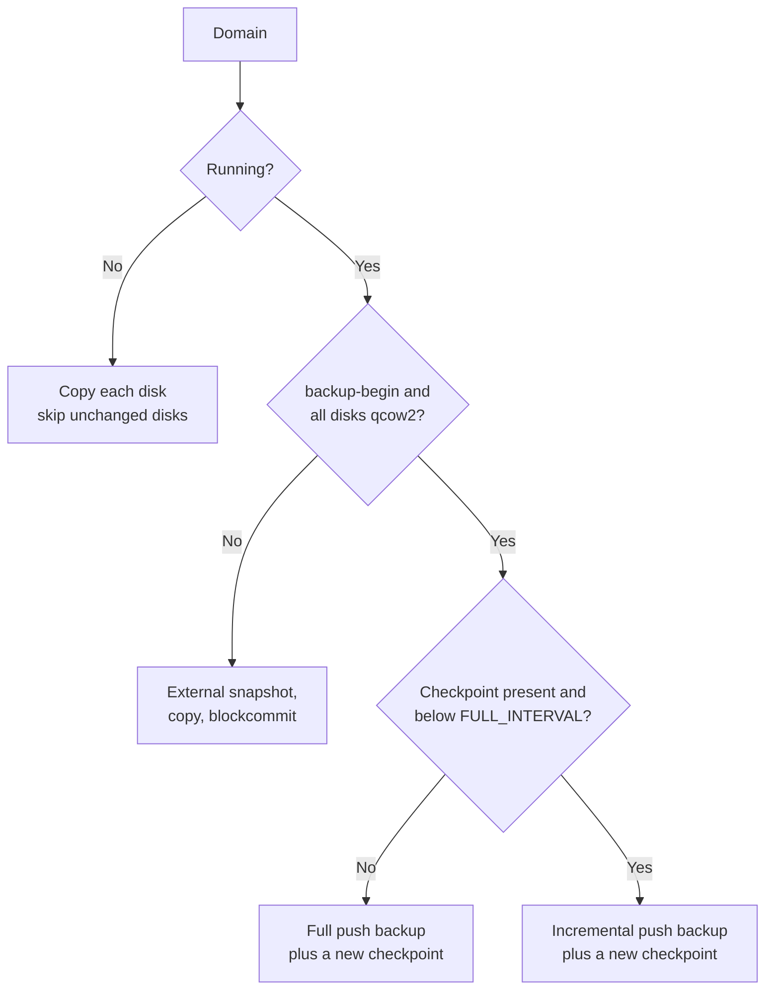

<!--
SPDX-License-Identifier: Apache-2.0
SPDX-FileCopyrightText: 2026 Alexander Mohr
-->

# VM Snapshots

`scripts/hooks/qemu-vm-snapshot.sh` is a pre-backup hook that stages libvirt/QEMU domains as plain files under `/home/virt/backups/<domain name>`, so a normal schedule can back the virtual machines up with borg. Running domains backed by qcow2 disks are captured through libvirt's incremental backup API: the first run writes a full image and creates a checkpoint, every later run writes only the clusters that changed since the previous checkpoint.

## Prerequisites

- An [agent](agents.md) on the virtualization host, running as a user that may talk to `qemu:///system` (normally `root`).
- `libvirt` with the backup API (`virsh backup-begin`, libvirt 7.6 or newer) and `qemu-img` on that host.
- qcow2 disk images for every domain that should get incremental backups. Domains on raw disks still work, but each run copies the whole disk.
- A target directory the QEMU process may write to. `virsh backup-begin` writes the image from inside QEMU, not from the hook.

## How a domain is captured

The hook picks one of three modes per domain:



Every mode also writes `domain.xml` (the persistent domain definition) and, for UEFI domains, `nvram.fd` next to the disk images. `chain.txt` records which files belong to the current chain, in the order they must be merged.

A directory after four runs of a qcow2 domain and one run of a shut off domain:

```text
/home/virt/backups/
├── web01
│   ├── chain.txt
│   ├── domain.xml
│   ├── vda.20260902T020112Z.qcow2
│   ├── vda.20260903T020049Z.qcow2
│   ├── vda.20260904T020207Z.qcow2
│   └── vda.full.qcow2
└── build01
    ├── chain.txt
    ├── domain.xml
    └── vda.img
```

## Install the hook

Copy the script to the virtualization host and make it executable:

```bash
install -m 0755 scripts/hooks/qemu-vm-snapshot.sh /usr/local/sbin/qemu-vm-snapshot.sh
```

Give the QEMU process access to the target directory. On distributions where QEMU drops to its own user, the directory must be owned by that user:

```bash
mkdir -p /home/virt/backups
chown qemu:qemu /home/virt/backups   # libvirt-qemu:kvm on Debian and Ubuntu
chmod 0700 /home/virt/backups
```

Run it once by hand to confirm the setup before wiring it into a schedule:

```bash
/usr/local/sbin/qemu-vm-snapshot.sh
```

!!! warning "Confined hosts"
    SELinux and AppArmor block QEMU from writing outside the paths it knows. On SELinux hosts label the directory with `semanage fcontext -a -t virt_image_t "/home/virt/backups(/.*)?" && restorecon -R /home/virt/backups`. On AppArmor hosts add `/home/virt/backups/** rwk,` to `/etc/apparmor.d/local/abstractions/libvirt-qemu` and reload AppArmor.

## Wire it into a schedule

On the [schedule](scheduling.md), set the following fields:

| Field | Value |
|-------|-------|
| `pre_backup_commands` | `/usr/local/sbin/qemu-vm-snapshot.sh` |
| `backup_sources` | `/home/virt/backups` |
| `hook_timeout_seconds` | Long enough for the slowest run, up to `3600` |

The script is a single POSIX shell script with no state outside the target directory, so it can also be pasted straight into the pre-backup command field instead of being installed as a file. See [`pre_backup_commands`](configuration.md#schedule-configuration) for how hook commands are executed.

A failing domain makes the hook exit non-zero, which aborts the backup and reports the error on the schedule's run. That is deliberate: an aborted run is preferable to an archive that silently contains a stale VM image.

!!! tip
    Keep `/home/virt/backups` out of any other schedule's sources. Borg deduplicates the full images across runs, so the repository grows by roughly the size of the increments even though a full image is rewritten every `FULL_INTERVAL` runs.

## Configuration reference

All options are environment variables, set in front of the command in the hook field (for example `FULL_INTERVAL=14 /usr/local/sbin/qemu-vm-snapshot.sh`).

| Variable | Default | Required | Description |
|----------|---------|----------|-------------|
| `DEST_ROOT` | `/home/virt/backups` | No | Directory that receives one subdirectory per domain |
| `FULL_INTERVAL` | `7` | No | Number of increments after which a new full image is written |
| `JOB_TIMEOUT` | `1800` | No | Seconds to wait for one domain's backup job before aborting it |
| `SKIP_DOMAINS` | — | No | Space separated domain names to leave out |
| `TARGET_OWNER` | — | No | Owner (`user` or `user:group`) applied to the per-domain directories |
| `LIBVIRT_DEFAULT_URI` | `qemu:///system` | No | libvirt connection URI |

Positional arguments limit the run to specific domains: `qemu-vm-snapshot.sh web01 db01`. Without arguments every defined domain is processed.

## Restore a domain

Restore the files from the archive first (see [Restoring Files](restore.md)), then merge the chain. Merging rewrites the full image, so work on the restored copy, never on the staging directory of a live host.

```bash
cd <restored>/web01
# In the order chain.txt lists them for that disk, oldest increment first:
qemu-img rebase -u -F qcow2 -b vda.full.qcow2 vda.20260902T020112Z.qcow2
qemu-img commit vda.20260902T020112Z.qcow2
qemu-img rebase -u -F qcow2 -b vda.full.qcow2 vda.20260903T020049Z.qcow2
qemu-img commit vda.20260903T020049Z.qcow2
```

`vda.full.qcow2` now holds the state of the last merged increment. Copy it to the image directory, then define the domain again:

```bash
cp vda.full.qcow2 /var/lib/libvirt/images/web01.qcow2
virsh define domain.xml
```

!!! warning "Restore the whole chain"
    An increment is only usable together with its full image and every increment before it. Restore the complete directory for the point in time you want, not a single file.

## Caveats

- The checkpoints live in libvirt, the chain lives in the target directory. Deleting the target directory by hand leaves stale checkpoints behind; the next run detects the missing `chain.txt`, drops those checkpoints and writes a new full image.
- Domains that fall back to copies are captured crash consistent unless the QEMU guest agent is installed, in which case the file systems are frozen for the snapshot.
- If the hook is killed by `hook_timeout_seconds` during a fallback copy, the domain keeps running on the snapshot overlay. Commit it manually with `virsh blockcommit <domain> <target> --active --pivot --wait`.

## Related pages

- [Scheduling & Retention](scheduling.md)
- [Configuration](configuration.md)
- [Restoring Files](restore.md)
