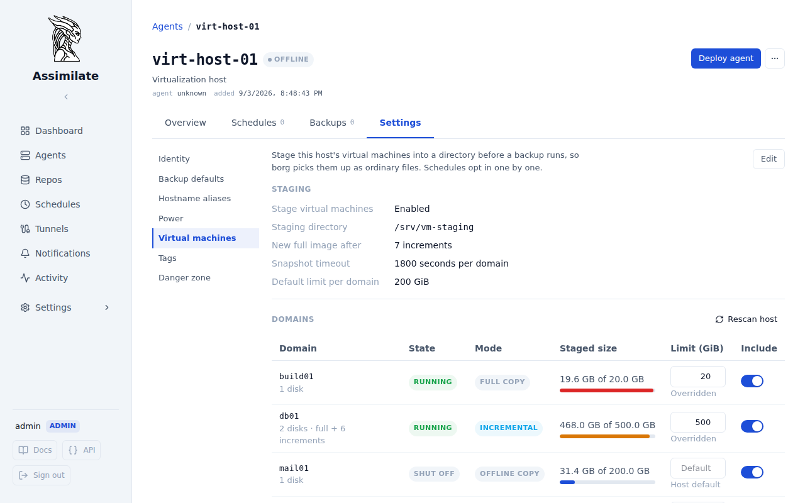
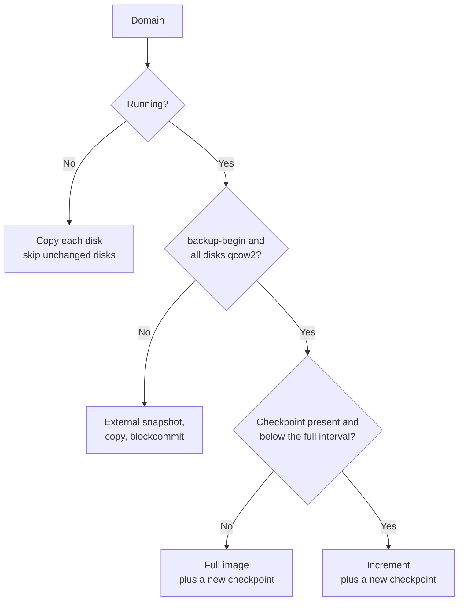
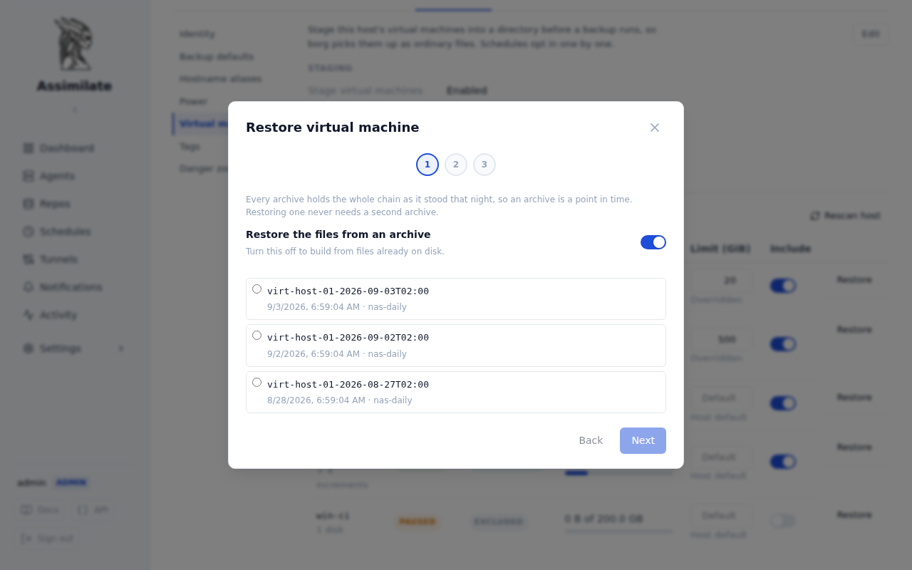

<!--
SPDX-License-Identifier: Apache-2.0
SPDX-FileCopyrightText: 2026 Alexander Mohr
-->

# VM Snapshots

An agent can stage the libvirt/QEMU domains of its host into a directory before a backup runs, so the virtual machines end up in the archive as ordinary files. Running domains backed by qcow2 disks are captured through libvirt's incremental backup API: the first run writes a full image and creates a checkpoint, every later run writes only the clusters that changed since the previous checkpoint.

The settings belong to the **host**, because the staging directory is shared by every schedule that targets it. A schedule only opts in.

## Prerequisites

- An [agent](agents.md) on the virtualization host, running as a user that may talk to `qemu:///system` (normally `root`).
- `libvirt` with the backup API (`virsh backup-begin`, libvirt 7.6 or newer) and `qemu-img` on that host.
- qcow2 disk images for the domains that should get incremental snapshots. Domains on raw disks still work, but each run copies the whole disk.
- A staging directory the QEMU process may write to. `virsh backup-begin` writes the image from inside QEMU, not from the agent.

## Configure a host

Open the agent, then **Settings → Virtual machines**.



1. Turn on **Stage virtual machines**.
2. Set the **staging directory**. It must be an absolute path; the agent creates one subdirectory per domain below it. Nothing about this path is assumed anywhere else in Assimilate.
3. Set **new full image after** (increments per chain), the **snapshot timeout** per domain, and the **default limit per domain**.
4. Click **Rescan host**. The agent enumerates the domains and reports what it found: their state, how each would be captured, and how much their disks occupy.

Give the QEMU process access to the staging directory first. On distributions where QEMU drops to its own user, the directory must be owned by that user:

```bash
mkdir -p /srv/vm-staging
chown qemu:qemu /srv/vm-staging   # libvirt-qemu:kvm on Debian and Ubuntu
chmod 0700 /srv/vm-staging
```

!!! warning "Confined hosts"
    SELinux and AppArmor block QEMU from writing outside the paths it knows. On SELinux hosts label the directory with `semanage fcontext -a -t virt_image_t "/srv/vm-staging(/.*)?" && restorecon -R /srv/vm-staging`. On AppArmor hosts add `/srv/vm-staging/** rwk,` to `/etc/apparmor.d/local/abstractions/libvirt-qemu` and reload AppArmor.

## Per-domain settings

The domain table lists what the agent last reported, plus the settings you make:

| Column | Meaning |
|--------|---------|
| Domain | libvirt domain name, its disks and the length of its current chain |
| State | Run state at the last scan |
| Mode | How the domain is captured, decided by the agent from its state and disk formats |
| Staged size | What the domain occupies now, against the limit that applies to it |
| Limit | This domain's own budget in GiB. Empty inherits the host's default |
| Include | Whether the domain is staged at all |

A domain the operator has never touched is included, so a machine created after the last scan is backed up rather than silently missed. Removing a domain from the host drops it from the table, unless you gave it settings, in which case it stays with an unknown state so your settings are not lost.

## How a domain is captured



Every mode also writes `domain.xml` (the persistent domain definition) and, for UEFI domains, `nvram.fd`. `chain.txt` records which files belong to the current chain, in the order they must be merged to restore the domain.

A directory after four runs of a qcow2 domain and one run of a shut off domain:

```text
/srv/vm-staging/
├── web01
│   ├── chain.txt
│   ├── domain.xml
│   ├── vda.20260902T020112123Z.qcow2
│   ├── vda.20260903T020049881Z.qcow2
│   ├── vda.20260904T020207457Z.qcow2
│   └── vda.full.qcow2
└── build01
    ├── chain.txt
    ├── domain.xml
    └── vda.img
```

## Let a schedule stage them

On the [schedule](scheduling.md), open **Settings → Advanced** and turn on **Stage virtual machines**. The staging directory joins that schedule's sources automatically, so it never has to be listed by hand.

Both halves are required: a schedule that opts in stages nothing on a host that has staging switched off, which is what lets one host serve schedules that want the virtual machines and schedules that do not.

Staging runs before `borg create`. A domain that cannot be staged fails the run and the reason is reported against the schedule, because an archive that quietly holds last night's image is worse than a run you are told about.

## Storage limits

A limit caps what one domain may occupy below the staging directory, counted as allocated blocks rather than apparent size. The host's **default limit per domain** applies unless the domain carries its own. Zero means no limit.

The limit is enforced at three points:

1. **Before an increment.** When the chain plus the expected next increment would cross the limit, the run writes a new full image instead. That drops the whole chain first, so the domain falls back to a single image and the space is reclaimed.
2. **Before a full image.** A full image that cannot fit is refused before anything is deleted or written, so the previous chain stays restorable. The domain's row shows why.
3. **After the run.** The directory is measured again. An overshoot fails the domain, because the estimate in step 1 can only ever be a guess.

A domain whose disks alone are larger than its limit can never be staged, and every run says so. Raise its limit, or lower the full-image interval so the chain stays shorter.

!!! note
    The limit governs the staging directory on the host, not the borg repository. Use [Storage Quotas](quotas.md) to bound what a repository may consume. Borg deduplicates the full images across runs, so the repository grows by roughly the size of the increments even though a full image is rewritten every few runs.

## Restore a domain

Restoring happens in two stages, in the order they actually occur: borg puts the staged files back on disk, then the agent builds a domain out of them. Open the agent's **Virtual machines** section and click **Restore** on the domain's row.



1. **Which point in time.** Every archive holds the whole chain as it stood that night, so an archive is a point in time and restoring one never needs a second archive. Turn off **Restore the files from an archive** to build from files that are already on disk.
2. **Where the files land.** This is the ordinary [agent-side restore](restore.md#agent-side-restore): `borg extract` runs on the host and no data passes through the server. The files land under the staging path they were archived with, and the wizard shows the exact directory. Stage two reads that directory and leaves it alone, so a failed build can be retried without fetching from borg again.
3. **What to build.** A name for the restored domain (defaulted to `<domain>-restored`, so it can be defined beside the one it came from), the image directory, and what to do once the images are in place: leave the images only, define the domain shut off, or define and start it.

The build merges each disk's chain in the order `chain.txt` records, moves the merged image into the image directory as `<name>-<target>.<format>`, and defines the domain from the restored definition with its disk paths rewritten. The definition keeps everything else the machine had, including its MAC address, and loses its UUID so libvirt issues a fresh one.

!!! warning "Two machines, one MAC"
    A restored domain keeps the MAC address of the domain it came from. Starting both at once puts two machines with the same MAC on the network. Restore shut off unless the original is gone.

### Build from files restored earlier

The second stage stands on its own: it reads any directory holding a staged domain (`chain.txt`, the images and `domain.xml`), however those files got there. Restore them with the [file restore](restore.md) or from a copy you already have, then run the wizard with **Restore the files from an archive** switched off and point it at the directory.

### By hand

The wizard does what an operator would do with `qemu-img`. To do it by hand, restore the domain's directory and then, in the order `chain.txt` lists them for that disk, oldest increment first:

```bash
cd <restored>/web01
qemu-img rebase -u -F qcow2 -b vda.full.qcow2 vda.20260902T020112123Z.qcow2
qemu-img commit vda.20260902T020112123Z.qcow2
qemu-img rebase -u -F qcow2 -b vda.full.qcow2 vda.20260903T020049881Z.qcow2
qemu-img commit vda.20260903T020049881Z.qcow2
```

`vda.full.qcow2` now holds the state of the last merged increment. Copy it to the image directory, edit the domain name and disk paths in `domain.xml`, then `virsh define domain.xml`.

!!! warning "Restore the whole chain"
    An increment is only usable together with its full image and every increment before it. Restore the complete directory for the point in time you want, not a single file. Merging rewrites the full image, so always work on the restored copy, never on the staging directory of a live host.

## Caveats

- Checkpoints live in libvirt, the chain lives in the staging directory. Deleting the staging directory by hand leaves stale checkpoints behind; the next run notices the missing `chain.txt`, drops those checkpoints and writes a new full image.
- Domains that fall back to copies are captured crash consistent unless the QEMU guest agent is installed, in which case the file systems are frozen for the snapshot.
- A domain killed by the snapshot timeout during a fallback copy keeps running on the snapshot overlay. Commit it manually with `virsh blockcommit <domain> <target> --active --pivot --wait`.

## Related pages

- [Agent Management](agents.md)
- [Scheduling & Retention](scheduling.md)
- [Restoring Files](restore.md)
- [Storage Quotas](quotas.md)
